# Technical Specifications

# 1. Introduction

## 1.1 Executive Summary

### 1.1.1 Brief Overview of the Project

ShipLedger represents a revolutionary blockchain-powered digital shipping and trade finance platform designed to transform the global maritime trade ecosystem. Built on BlockDAG's fully EVM-compatible infrastructure, the platform enables developers familiar with Ethereum's toolset, including Solidity and other Ethereum-compatible programming languages, to easily build and deploy decentralized applications (dApps) on the network. The platform leverages BlockDAG's superior speed (1400 TPS and higher) and much lower transaction fees, while achieving full Ethereum Virtual Machine (EVM) compatibility to effectively build a high-speed bridge to Ethereum's massive $500 billion economy.

### 1.1.2 Core Business Problem Being Solved

The global maritime trade industry faces critical inefficiencies that significantly impact operational costs and trade flow. The shipping industry has long been plagued by complex processes, data opacity, inefficiencies, and high operational costs. Traditional shipping processes involve multiple parties and extensive paperwork, leading to slow information transfer, coordination difficulties, and even fraud. For instance, a shipping trade from Kenya to the Netherlands typically requires over 30 parties, more than 200 interactions, and up to 10 days to process shipping documents.

Transactions involving paper documentation often require physical inspection of documents, resulting in high transaction costs for shipments, and an estimated 20% of operational budgets are due to poor information management. The system inefficiencies associated with these transactions, including transaction costs and payment terms such as "Cash Against Documents", are estimated to cost over $34 billion.

### 1.1.3 Key Stakeholders and Users

| Stakeholder Category | Primary Users | Role in Platform |
|---------------------|---------------|------------------|
| **Shipping Operations** | Shippers, Carriers, Freight Forwarders | Document creation, cargo tracking, route management |
| **Financial Services** | Banks, Trade Finance Providers, Insurance Companies | Payment processing, trade finance, risk management |
| **Regulatory Bodies** | Customs Authorities, Port Authorities, Maritime Regulators | Compliance verification, clearance processing |
| **Technology Partners** | Blockchain Developers, System Integrators | Platform development, maintenance, integration |

### 1.1.4 Expected Business Impact and Value Proposition

ShipLedger addresses the maritime industry's core challenges through measurable improvements:

- **Cost Reduction**: Blockchain implementation reduces costs by 6%, highlighting blockchain's potential to revolutionize maritime trade
- **Process Efficiency**: The cost of a blockchain-based electronic Bill of Lading is only $15, approximately 15% of the price of a traditional paper BoL
- **Payment Acceleration**: Addresses the issue where hundreds of billions of dollars are left unpaid as payments take an average of 42 days to reach the invoicing organization
- **Transparency Enhancement**: Ensures that all stakeholders have real-time access to accurate and immutable data, with platforms like TradeLens demonstrating significant efficiency improvements by digitizing trade documentation and providing end-to-end visibility

## 1.2 System Overview

### 1.2.1 Project Context

#### Business Context and Market Positioning

Maritime shipping, as the primary mode of international trade, handles approximately 90% of global trade volume. According to the United Nations Conference on Trade and Development (UNCTAD), global maritime trade is expected to grow by 2% in 2024 and continue to expand at an average annual rate of 2.4% until 2029. In this context, the application of blockchain technology will provide critical technical support to the shipping industry.

ShipLedger positions itself within this expanding market by leveraging BlockDAG's EVM-compatible account-based subsystem that supports standardized smart contracts, enabling seamless integration with existing Ethereum-based financial and logistics applications.

#### Current System Limitations

The maritime industry operates under significant technological constraints:

- **Information Asymmetry**: Extant operation systems in the industry are characterized by bureaucracy, centralization, lack of bias, and information asymmetry. Information asymmetry is a complication caused by intermediate participants in the operating process
- **Documentation Inefficiencies**: A single international shipment can involve more than 40 organizations, generating a large volume of documents in various formats. This inefficient operational model not only increases time costs
- **Security Vulnerabilities**: Cybersecurity is an increasing concern in the maritime sector, with intentional cyber-attacks or unintentional errors having the potential to result in operational, safety or security failures

#### Integration with Existing Enterprise Landscape

ShipLedger's architecture supports comprehensive integration through:

| Integration Layer | Technology Stack | Compatibility Features |
|------------------|------------------|----------------------|
| **Blockchain Layer** | BlockDAG with EVM compatibility | Supports popular Ethereum development tools, such as Truffle, Remix, MetaMask, and Hardhat |
| **Smart Contracts** | Solidity-based contracts | Supports Ethereum token standards like ERC-20 (fungible tokens) and ERC-721 (non-fungible tokens) |
| **Development Tools** | Standard Ethereum toolchain | Existing dApps can move to BlockDAG with minimal adjustments, while teams continue to work with familiar resources |

### 1.2.2 High-Level Description

#### Primary System Capabilities

ShipLedger delivers comprehensive maritime trade digitalization through:

1. **Digital Document Management**: Automated creation, verification, and sharing of Bills of Lading and shipping instructions
2. **Real-Time Tracking**: Recording critical data such as cargo transportation information, vessel locations, and port handling records on the blockchain, enabling all parties to access and verify information in real time
3. **Smart Contract Automation**: Smart contract functionality enables the automation of complex business processes
4. **Permission-Based Access Control**: Granular control over data visibility and editing rights across stakeholders

#### Major System Components

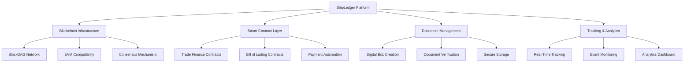

#### Core Technical Approach

The platform utilizes BlockDAG's hybrid architecture that achieves a throughput of 10 blocks per second (10 TPS) for foundational operations, while supporting 2,000–15,000 TPS in high-load scenarios. This is achieved through a DAG layer that allows transactions to reference multiple predecessors for parallel validation, eliminating the bottlenecks of linear blockchains.

### 1.2.3 Success Criteria

#### Measurable Objectives

| Objective Category | Target Metrics | Measurement Timeline |
|-------------------|----------------|---------------------|
| **Operational Efficiency** | 50% reduction in document processing time | 6 months post-deployment |
| **Cost Optimization** | 30% reduction in administrative costs | 12 months post-deployment |
| **Transaction Speed** | 95% of transactions processed within 24 hours | Ongoing operational metric |
| **User Adoption** | 100+ active shipping companies within first year | 12 months post-launch |

#### Critical Success Factors

1. **Technical Performance**: Superior speed and much lower transaction fees compared to traditional blockchain networks
2. **Regulatory Compliance**: Full adherence to international maritime and trade finance regulations
3. **Stakeholder Integration**: Seamless onboarding of existing maritime ecosystem participants
4. **Security Assurance**: Zero tolerance for data breaches or unauthorized access incidents

#### Key Performance Indicators (KPIs)

- **Platform Utilization**: Number of Bills of Lading processed monthly
- **Network Performance**: Average transaction confirmation time
- **Cost Savings**: Percentage reduction in operational expenses for participating organizations
- **Error Reduction**: Decrease in documentation errors and disputes
- **Compliance Rate**: Percentage of transactions meeting regulatory requirements

## 1.3 Scope

### 1.3.1 In-Scope

#### Core Features and Functionalities

**Digital Shipping Documentation**
- Electronic Bill of Lading (eBL) creation and management
- Automated shipping instruction processing
- Digital certificate and permit handling
- Smart contract-based document verification

**Real-Time Tracking and Monitoring**
- Container and cargo tracking across 120+ planned, estimated, and actual events
- Vessel location and status monitoring
- Port operation visibility
- Supply chain event logging and timestamping

**Trade Finance Integration**
- Automated payment processing through smart contracts
- Letter of credit digitalization
- Trade finance workflow automation
- Multi-currency transaction support

**Stakeholder Collaboration Platform**
- Permission-based data access control
- Real-time notification system
- Collaborative workflow management
- Dispute resolution mechanisms

#### Implementation Boundaries

| Boundary Category | Included Elements | Coverage Scope |
|------------------|------------------|----------------|
| **Geographic Coverage** | Global maritime trade routes | All major shipping corridors and ports |
| **User Groups** | Shippers, carriers, freight forwarders, banks, customs, ports | Complete maritime trade ecosystem |
| **Document Types** | Bills of Lading, shipping instructions, customs declarations, certificates | Core trade documentation |
| **Transaction Types** | Shipping payments, trade finance, insurance claims | Primary financial transactions |

#### Essential Integrations

- **Port Management Systems**: Integration with major port authorities' existing systems
- **Customs Platforms**: Direct connectivity with customs clearance systems
- **Banking Networks**: Integration with trade finance and payment systems
- **ERP Systems**: Connectivity with shippers' and freight forwarders' enterprise systems

#### Key Technical Requirements

- Full Ethereum Virtual Machine (EVM) compatibility, allowing for seamless integration and deployment of Ethereum-based smart contracts, ensuring that developers familiar with Ethereum's toolset can easily build and deploy decentralized applications
- High-throughput transaction processing capability
- Enterprise-grade security and data protection
- Regulatory compliance framework integration
- Multi-language and multi-currency support

### 1.3.2 Out-of-Scope

#### Explicitly Excluded Features/Capabilities

- **Physical Asset Management**: Warehouse management, inventory control systems
- **Vessel Operations**: Ship navigation systems, crew management, maintenance scheduling
- **Commodity Trading**: Spot market trading, commodity price discovery, futures contracts
- **Insurance Underwriting**: Risk assessment algorithms, premium calculation engines
- **Regulatory Reporting**: Automated generation of regulatory reports beyond trade documentation

#### Future Phase Considerations

- **Advanced Analytics**: Predictive analytics for trade route optimization
- **IoT Integration**: Direct sensor data integration for cargo condition monitoring
- **AI-Powered Insights**: Machine learning algorithms for trade pattern analysis
- **Cross-Border Regulatory Harmonization**: Automated compliance across multiple jurisdictions

#### Integration Points Not Covered

- **Legacy System Migration**: Full data migration from existing proprietary systems
- **Third-Party Logistics Providers**: Integration with specialized logistics service providers
- **Commodity Exchanges**: Direct integration with commodity trading platforms
- **Weather and Route Optimization Services**: Integration with maritime weather and routing services

#### Unsupported Use Cases

- **Passenger Shipping**: Cruise lines and passenger ferry operations
- **Inland Waterway Transport**: River and canal transportation systems
- **Military and Defense Shipping**: Government and defense-related maritime operations
- **Recreational Boating**: Private yacht and recreational vessel documentation

# 2. Product Requirements

## 2.1 Feature Catalog

### 2.1.1 Digital Document Management Features

| Feature ID | Feature Name | Category | Priority | Status |
|------------|--------------|----------|----------|---------|
| F-001 | Electronic Bill of Lading Creation | Document Management | Critical | Proposed |
| F-002 | Digital Shipping Instructions Processing | Document Management | Critical | Proposed |
| F-003 | Smart Document Verification | Document Management | High | Proposed |
| F-004 | Permission-Based Document Access | Security | Critical | Proposed |

#### F-001: Electronic Bill of Lading Creation

**Description**
- **Overview**: BlockDAG is fully Ethereum Virtual Machine (EVM) compatible, allowing for seamless integration and deployment of Ethereum-based smart contracts. This compatibility ensures that developers familiar with Ethereum's toolset, including Solidity and other Ethereum-compatible programming languages, can easily build and deploy decentralized applications (dApps) on the BlockDAG network. The platform enables automated creation of blockchain-based electronic Bills of Lading using smart contracts.
- **Business Value**: Bill of Lading cost $15, approximately 15% of the estimated typical cost for a document to be delivered such long-distance using courier services
- **User Benefits**: Eliminates paper-based processes, reduces document transfer time from days to minutes, and provides tamper-proof documentation
- **Technical Context**: CargoX has created a blockchain-based platform for sharing smart B/L. The system is paperless and is reported to cut transfer time from several days to minutes or seconds.

**Dependencies**
- **Prerequisite Features**: None (foundational feature)
- **System Dependencies**: BlockDAG blockchain infrastructure, EVM compatibility layer
- **External Dependencies**: BlockDAG also supports popular Ethereum development tools, such as Truffle, Remix, MetaMask, and Hardhat
- **Integration Requirements**: Maritime regulatory compliance systems, carrier management systems

#### F-002: Digital Shipping Instructions Processing

**Description**
- **Overview**: Automated processing and validation of shipping instructions through smart contracts
- **Business Value**: Streamlines carrier operations and reduces manual processing errors
- **User Benefits**: Real-time instruction processing, automated carrier notifications, reduced administrative overhead
- **Technical Context**: Integration with existing carrier systems through API endpoints

**Dependencies**
- **Prerequisite Features**: F-001 (Electronic Bill of Lading Creation)
- **System Dependencies**: Smart contract execution environment, document storage system
- **External Dependencies**: Carrier management systems, port authority systems
- **Integration Requirements**: EDI systems, freight forwarder platforms

#### F-003: Smart Document Verification

**Description**
- **Overview**: Any validated record in a blockchain is irreversible and cannot be changed. The documents exchanged in real-time on the blockchain cannot be altered, which reduces the risk of fraud.
- **Business Value**: The use of cryptography will reduce the risk of fraud in its traditional sense. Disputes arising from fraudulent presentation of Bills of Lading should decline.
- **User Benefits**: Instant document authenticity verification, reduced fraud risk, automated compliance checking
- **Technical Context**: Cryptographic hash verification, digital signature validation

**Dependencies**
- **Prerequisite Features**: F-001, F-002
- **System Dependencies**: Cryptographic libraries, digital signature infrastructure
- **External Dependencies**: Certificate authorities, regulatory compliance databases
- **Integration Requirements**: Customs systems, port authority verification systems

#### F-004: Permission-Based Document Access

**Description**
- **Overview**: For example, a Bill of Lading is exchanged between participants in the network, whose rights are coded. Each transaction is encrypted using a key which links relevant participants.
- **Business Value**: Ensures data privacy while enabling necessary stakeholder access
- **User Benefits**: Granular access control, secure data sharing, audit trail maintenance
- **Technical Context**: Role-based access control (RBAC) implementation using smart contracts

**Dependencies**
- **Prerequisite Features**: F-001, F-003
- **System Dependencies**: Identity management system, encryption infrastructure
- **External Dependencies**: Enterprise authentication systems
- **Integration Requirements**: Single sign-on (SSO) systems, directory services

### 2.1.2 Real-Time Tracking Features

| Feature ID | Feature Name | Category | Priority | Status |
|------------|--------------|----------|----------|---------|
| F-005 | Container Tracking System | Tracking | Critical | Proposed |
| F-006 | Shipment Event Monitoring | Tracking | High | Proposed |
| F-007 | Real-Time Status Updates | Tracking | High | Proposed |
| F-008 | Multi-Party Visibility Dashboard | Analytics | Medium | Proposed |

#### F-005: Container Tracking System

**Description**
- **Overview**: Comprehensive tracking system supporting 120+ planned, estimated, and actual events per shipment
- **Business Value**: Thankfully, blockchain in shipping can track cargo more efficiently in real-time. Thankfully, blockchain in shipping can track cargo more efficiently in real-time.
- **User Benefits**: End-to-end visibility, proactive issue identification, improved customer service
- **Technical Context**: Integration with IoT sensors, GPS tracking, and port management systems

**Dependencies**
- **Prerequisite Features**: F-001 (Electronic Bill of Lading Creation)
- **System Dependencies**: Event logging system, real-time data processing infrastructure
- **External Dependencies**: Port management systems, carrier tracking systems, IoT sensor networks
- **Integration Requirements**: AIS (Automatic Identification System), port terminal systems

#### F-006: Shipment Event Monitoring

**Description**
- **Overview**: Automated monitoring and logging of critical shipment events on the blockchain
- **Business Value**: Provides immutable audit trail and enables proactive issue resolution
- **User Benefits**: Automated notifications, exception handling, compliance monitoring
- **Technical Context**: Event-driven architecture with smart contract triggers

**Dependencies**
- **Prerequisite Features**: F-005 (Container Tracking System)
- **System Dependencies**: Event processing engine, notification system
- **External Dependencies**: Carrier systems, port operations systems
- **Integration Requirements**: EDI messaging, API integrations with logistics providers

### 2.1.3 Smart Contract Automation Features

| Feature ID | Feature Name | Category | Priority | Status |
|------------|--------------|----------|----------|---------|
| F-009 | Trade Finance Smart Contracts | Financial | Critical | Proposed |
| F-010 | Payment Automation | Financial | Critical | Proposed |
| F-011 | Letter of Credit Processing | Financial | High | Proposed |
| F-012 | Automated Compliance Checking | Compliance | High | Proposed |

#### F-009: Trade Finance Smart Contracts

**Description**
- **Overview**: facilitates the use of smart contracts, programmable automata that can control and manage assets. Smart contracts lie at the heart of decentralized finance (DeFI) and other sophisticated decentralized applications (dApps).
- **Business Value**: Every day, hundreds of billions of dollars are left unpaid as payments take an average of 42 days to reach the invoicing organization.
- **User Benefits**: Automated payment processing, reduced settlement times, lower transaction costs
- **Technical Context**: BlockDAG's EVM-compatible account-based subsystem supports standardized smart contracts

**Dependencies**
- **Prerequisite Features**: F-001, F-003
- **System Dependencies**: BlockDAG supports Ethereum coin standards like ERC-20 (fungible coins) and ERC-721 (non-fungible coins)
- **External Dependencies**: Banking systems, trade finance platforms
- **Integration Requirements**: SWIFT network, correspondent banking systems

#### F-010: Payment Automation

**Description**
- **Overview**: Smart contracts automate customer contracts using blockchain technology. These contracts are machines based on blockchain programmed with rules composing the legal agreement.
- **Business Value**: Reduces payment processing time and eliminates manual intervention
- **User Benefits**: Payments, for example, can be held until delivery is validated or until some inspections are carried out.
- **Technical Context**: Integration with multi-currency payment systems and escrow mechanisms

**Dependencies**
- **Prerequisite Features**: F-009 (Trade Finance Smart Contracts)
- **System Dependencies**: Payment processing infrastructure, multi-currency support
- **External Dependencies**: Banking APIs, payment gateways
- **Integration Requirements**: Treasury management systems, accounting platforms

### 2.1.4 Stakeholder Collaboration Features

| Feature ID | Feature Name | Category | Priority | Status |
|------------|--------------|----------|----------|---------|
| F-013 | Multi-Party Workflow Management | Collaboration | High | Proposed |
| F-014 | Real-Time Notification System | Communication | High | Proposed |
| F-015 | Dispute Resolution Framework | Legal | Medium | Proposed |
| F-016 | Regulatory Compliance Portal | Compliance | High | Proposed |

#### F-013: Multi-Party Workflow Management

**Description**
- **Overview**: Coordinated workflow management across all maritime trade stakeholders
- **Business Value**: All parties to the contract will have copies of it on the distributive ledger. This will eliminate delays in the delivery of cargo upon arrival at the destination port.
- **User Benefits**: Streamlined operations, reduced coordination overhead, improved transparency
- **Technical Context**: Workflow engine with role-based task assignment and approval processes

**Dependencies**
- **Prerequisite Features**: F-004 (Permission-Based Document Access)
- **System Dependencies**: Workflow management engine, user management system
- **External Dependencies**: Enterprise systems of participating organizations
- **Integration Requirements**: ERP systems, CRM platforms

## 2.2 Functional Requirements Table

### 2.2.1 Electronic Bill of Lading Creation (F-001)

| Requirement ID | Description | Acceptance Criteria | Priority | Complexity |
|----------------|-------------|-------------------|----------|------------|
| F-001-RQ-001 | Smart contract-based eBL creation | System creates tamper-proof eBL using Solidity smart contracts | Must-Have | High |
| F-001-RQ-002 | Multi-party digital signatures | Support for carrier, shipper, and consignee digital signatures | Must-Have | Medium |
| F-001-RQ-003 | Document template management | Configurable eBL templates for different trade routes | Should-Have | Medium |
| F-001-RQ-004 | Regulatory compliance validation | Automatic validation against international maritime regulations | Must-Have | High |

**Technical Specifications**
- **Input Parameters**: Shipment details, cargo information, party identities, route data
- **Output/Response**: Blockchain-verified eBL with unique token ID, cryptographic hash
- **Performance Criteria**: superior speed (1400 TPS and higher) and much lower transaction fees
- **Data Requirements**: Structured shipment data, digital certificates, regulatory compliance data

**Validation Rules**
- **Business Rules**: eBL must contain all mandatory fields per international standards
- **Data Validation**: Cargo weight, dimensions, and hazardous material classifications
- **Security Requirements**: Multi-signature validation, encrypted data storage
- **Compliance Requirements**: IMO regulations, customs requirements, port authority standards

### 2.2.2 Container Tracking System (F-005)

| Requirement ID | Description | Acceptance Criteria | Priority | Complexity |
|----------------|-------------|-------------------|----------|------------|
| F-005-RQ-001 | Real-time location tracking | GPS coordinates updated every 15 minutes during transit | Must-Have | Medium |
| F-005-RQ-002 | Event milestone recording | 120+ predefined events tracked and recorded on blockchain | Must-Have | High |
| F-005-RQ-003 | Multi-container shipment support | Track multiple containers within single shipment | Should-Have | Medium |
| F-005-RQ-004 | Historical tracking data | Immutable history of all tracking events | Must-Have | Low |

**Technical Specifications**
- **Input Parameters**: Container ID, GPS coordinates, event type, timestamp, sensor data
- **Output/Response**: Real-time tracking dashboard, event notifications, historical reports
- **Performance Criteria**: Sub-second query response time, 99.9% uptime
- **Data Requirements**: Geolocation data, sensor readings, event metadata

**Validation Rules**
- **Business Rules**: Location updates must be sequential and logical
- **Data Validation**: GPS coordinate format validation, timestamp verification
- **Security Requirements**: Encrypted data transmission, authenticated data sources
- **Compliance Requirements**: Data retention policies, privacy regulations

### 2.2.3 Trade Finance Smart Contracts (F-009)

| Requirement ID | Description | Acceptance Criteria | Priority | Complexity |
|----------------|-------------|-------------------|----------|------------|
| F-009-RQ-001 | Automated payment triggers | Payments released upon document verification | Must-Have | High |
| F-009-RQ-002 | Multi-currency support | Support for major trade currencies (USD, EUR, GBP, JPY) | Must-Have | Medium |
| F-009-RQ-003 | Escrow functionality | Secure holding of funds until conditions met | Must-Have | High |
| F-009-RQ-004 | Interest calculation | Automatic calculation of interest and fees | Should-Have | Medium |

**Technical Specifications**
- **Input Parameters**: Payment amount, currency, conditions, party addresses
- **Output/Response**: Transaction confirmation, payment receipt, audit trail
- **Performance Criteria**: Initially, there will be a per-transaction fee of about $0.01 per transaction
- **Data Requirements**: Financial data, exchange rates, regulatory compliance data

**Validation Rules**
- **Business Rules**: Payment conditions must be verifiable on-chain
- **Data Validation**: Currency amount limits, exchange rate validation
- **Security Requirements**: Multi-signature wallets, encrypted financial data
- **Compliance Requirements**: AML/KYC requirements, financial regulations

## 2.3 Feature Relationships

### 2.3.1 Feature Dependencies Map

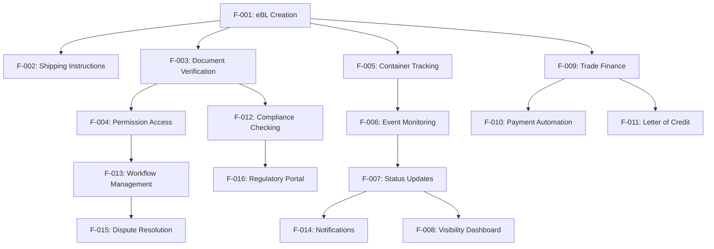

### 2.3.2 Integration Points

| Integration Category | Features Involved | Shared Components | Common Services |
|---------------------|------------------|-------------------|-----------------|
| **Document Management** | F-001, F-002, F-003, F-004 | Document storage, Cryptographic services | Identity management, Audit logging |
| **Tracking & Monitoring** | F-005, F-006, F-007, F-008 | Event processing engine, Real-time data pipeline | Notification service, Analytics engine |
| **Financial Processing** | F-009, F-010, F-011 | Payment gateway, Currency conversion | Compliance validation, Transaction logging |
| **Stakeholder Collaboration** | F-013, F-014, F-015, F-016 | Workflow engine, Communication hub | User management, Role-based access |

### 2.3.3 Shared Components

| Component Name | Description | Used By Features | Technical Requirements |
|----------------|-------------|------------------|----------------------|
| **Smart Contract Engine** | The BlockDAG network supports both UTXO and account models. BlockDAG's EVM-compatible account-based subsystem supports standardized smart contracts. | F-001, F-003, F-009, F-010, F-011 | Solidity compiler, Gas optimization |
| **Document Storage** | Distributed storage for shipping documents | F-001, F-002, F-003, F-004 | IPFS integration, Encryption at rest |
| **Event Processing** | Real-time event handling and notification | F-005, F-006, F-007, F-014 | Message queuing, Event streaming |
| **Identity Management** | User authentication and authorization | F-004, F-013, F-015, F-016 | Multi-factor authentication, SSO |

## 2.4 Implementation Considerations

### 2.4.1 Technical Constraints

| Constraint Category | Description | Impact | Mitigation Strategy |
|-------------------|-------------|---------|-------------------|
| **Blockchain Performance** | throughput of 10 blocks per second (10 TPS) for foundational operations, while supporting 2,000–15,000 TPS in high-load scenarios | Transaction throughput limitations | Layer 2 scaling solutions, Transaction batching |
| **EVM Compatibility** | For EVM transactions, the fee structure is similar to Ethereum's. BlockDAG prices gas the same as Ethereum | Gas cost optimization required | Smart contract optimization, Efficient algorithms |
| **Regulatory Compliance** | First, not all countries accept electronic documents. Even worse, not all countries recognise electronic contracts, digital signatures and digital transactions. | Limited global adoption | Phased rollout, Regulatory engagement |
| **Integration Complexity** | Legacy system integration challenges | Development timeline impact | API-first design, Middleware solutions |

### 2.4.2 Performance Requirements

| Performance Metric | Target Value | Measurement Method | Critical Features |
|-------------------|--------------|-------------------|------------------|
| **Transaction Throughput** | 1,400+ TPS | Blockchain network monitoring | F-009, F-010 |
| **Document Processing Time** | <30 seconds | End-to-end timing | F-001, F-002 |
| **Query Response Time** | <2 seconds | API response monitoring | F-005, F-008 |
| **System Availability** | 99.9% uptime | Infrastructure monitoring | All features |

### 2.4.3 Security Implications

| Security Domain | Requirements | Implementation | Affected Features |
|-----------------|-------------|----------------|------------------|
| **Data Encryption** | End-to-end encryption for all documents | AES-256 encryption, TLS 1.3 | F-001, F-002, F-003, F-004 |
| **Access Control** | Role-based permissions with audit trails | Smart contract-based RBAC | F-004, F-013, F-016 |
| **Transaction Security** | Multi-signature validation for critical operations | Hardware security modules | F-009, F-010, F-011 |
| **Network Security** | DDoS protection and intrusion detection | Cloud-based security services | All network-facing features |

### 2.4.4 Scalability Considerations

| Scalability Factor | Current Capacity | Growth Planning | Technical Solution |
|-------------------|------------------|-----------------|-------------------|
| **User Base** | 100+ shipping companies | 1,000+ companies within 3 years | Horizontal scaling, Load balancing |
| **Document Volume** | 10,000 eBLs/month | 100,000 eBLs/month | Document sharding, Compression |
| **Transaction Volume** | 50,000 transactions/day | 500,000 transactions/day | DAG layer that allows transactions to reference multiple predecessors for parallel validation |
| **Geographic Coverage** | Major trade routes | Global coverage | Regional node deployment |

### 2.4.5 Maintenance Requirements

| Maintenance Category | Frequency | Scope | Resource Requirements |
|---------------------|-----------|-------|----------------------|
| **Smart Contract Updates** | Quarterly | Bug fixes, feature enhancements | Blockchain developers, Security auditors |
| **System Monitoring** | 24/7 | Performance, security, availability | DevOps team, Monitoring tools |
| **Regulatory Updates** | As needed | Compliance rule changes | Legal team, Compliance officers |
| **Integration Maintenance** | Monthly | API updates, partner system changes | Integration specialists, QA team |

## 2.5 Traceability Matrix

| Business Requirement | Feature ID | Functional Requirements | Acceptance Criteria | Test Cases |
|----------------------|------------|------------------------|-------------------|------------|
| **Digital eBL Creation** | F-001 | F-001-RQ-001 to F-001-RQ-004 | Smart contract deployment, Multi-party signatures | TC-001 to TC-015 |
| **Real-time Tracking** | F-005, F-006 | F-005-RQ-001 to F-005-RQ-004 | GPS tracking, Event recording | TC-016 to TC-030 |
| **Payment Automation** | F-009, F-010 | F-009-RQ-001 to F-009-RQ-004 | Automated triggers, Multi-currency | TC-031 to TC-045 |
| **Stakeholder Collaboration** | F-013, F-014 | Multi-party workflows, Notifications | Workflow completion, Real-time alerts | TC-046 to TC-060 |

# 3. Technology Stack

## 3.1 Programming Languages

### 3.1.1 Blockchain Development

| Language | Version | Platform/Component | Justification |
|----------|---------|-------------------|---------------|
| **Solidity** | ^0.8.30 | Smart Contracts | Latest version is a maintenance release in light of the Pectra Ethereum network upgrade scheduled for May 7, 2025 and changes the default EVM version from cancun to prague. BlockDAG is fully Ethereum Virtual Machine (EVM) compatible, allowing for seamless integration and deployment of Ethereum-based smart contracts. This compatibility ensures that developers familiar with Ethereum's toolset, including Solidity and other Ethereum-compatible programming languages, can easily build and deploy decentralized applications (dApps) on the BlockDAG network. |
| **Go (Golang)** | 1.21+ | BlockDAG Core Development | Programming Languages: Go (Golang): Core blockchain development, Solidity: For smart contract development, leveraging existing Ethereum-based libraries and frameworks. Go provides excellent performance for blockchain infrastructure and is the standard for BlockDAG development. |

### 3.1.2 Backend Development

| Language | Version | Platform/Component | Justification |
|----------|---------|-------------------|---------------|
| **Python** | 3.11+ | Flask Backend, API Services | Python offers extensive libraries for blockchain integration, maritime industry APIs, and rapid development. Flask provides lightweight, flexible web framework capabilities ideal for microservices architecture. |
| **TypeScript** | 5.0+ | Node.js Services, Type Safety | TypeScript ensures type safety across the application stack and provides excellent developer experience with modern IDE support. Essential for maintaining code quality in complex maritime trade workflows. |

### 3.1.3 Frontend Development

| Language | Version | Platform/Component | Justification |
|----------|---------|-------------------|---------------|
| **TypeScript** | 5.0+ | React Frontend, Mobile Apps | React 19.0.0 with TypeScript 4.9.5+ support. TypeScript provides type safety and enhanced developer experience for complex maritime trade interfaces. |
| **JavaScript** | ES2022+ | Legacy Integration, Browser Compatibility | Required for integration with existing maritime industry systems and browser-based wallet interactions like MetaMask. |

## 3.2 Frameworks & Libraries

### 3.2.1 Blockchain & Smart Contract Frameworks

| Framework/Library | Version | Purpose | Justification |
|------------------|---------|---------|---------------|
| **Hardhat** | 2.19+ | Smart Contract Development | BlockDAG also supports popular Ethereum development tools, such as Truffle, Remix, MetaMask, and Hardhat, simplifying the development and deployment processes. Hardhat provides comprehensive testing and deployment capabilities for Solidity contracts. |
| **Truffle Suite** | 5.11+ | Smart Contract Testing | Truffle is a development framework that simplifies the process of building, testing, and deploying smart contracts. It provides a suite of tools, including a development console, testing framework, and asset pipeline, to make smart contract development more efficient. |
| **OpenZeppelin Contracts** | 5.0+ | Secure Smart Contract Libraries | OpenZeppelin Contracts helps you minimize risk by using battle-tested libraries of smart contracts for Ethereum and other blockchains. It includes the most used implementations of ERC standards. |
| **Web3.js** | 4.0+ | Blockchain Interaction | Provides JavaScript interface for interacting with BlockDAG network and smart contracts from frontend applications. |
| **Ethers.js** | 6.0+ | Ethereum-Compatible Interactions | Modern library for blockchain interactions with better TypeScript support and modular architecture. |

### 3.2.2 Backend Frameworks

| Framework/Library | Version | Purpose | Justification |
|------------------|---------|---------|---------------|
| **Flask** | 3.0+ | Python Web Framework | Flask is a lightweight Python web framework that provides useful tools and features for creating web applications in the Python Language. It gives developers flexibility and is an accessible framework for new developers. Ideal for microservices and API development. |
| **Flask-PyMongo** | 3.0+ | MongoDB Integration | PyMongo support for Flask applications. Flask-PyMongo bridges Flask and PyMongo and provides some convenience helpers. |
| **Pydantic** | 2.5+ | Data Validation | Provides robust data validation and serialization for API endpoints and blockchain data structures. |
| **Celery** | 5.3+ | Asynchronous Task Processing | Handles background tasks like blockchain transaction monitoring and document processing workflows. |

### 3.2.3 Frontend Frameworks

| Framework/Library | Version | Purpose | Justification |
|------------------|---------|---------|---------------|
| **React** | 19.0+ | Web Frontend | React 19.0.0 provides the latest features and performance improvements. React's component-based architecture is ideal for complex maritime trade interfaces. |
| **TailwindCSS** | 4.0+ | CSS Framework | Tailwind v4 launched in late 2024 with a fundamental architectural change. The team rebuilt the engine in Rust, which makes everything faster. Tailwind now includes its own lightning-fast engine written in Rust, making setup simpler and builds faster. |
| **React Router** | 6.20+ | Client-Side Routing | Provides declarative routing for single-page application navigation across maritime trade workflows. |
| **React Query** | 5.0+ | Server State Management | Manages API calls, caching, and synchronization with blockchain data and maritime trade information. |

### 3.2.4 Mobile Development

| Framework/Library | Version | Purpose | Justification |
|------------------|---------|---------|---------------|
| **React Native** | 0.73+ | Cross-Platform Mobile | Enables code sharing between web and mobile platforms while providing native performance for maritime trade mobile applications. |
| **Expo** | 50.0+ | Mobile Development Platform | Simplifies React Native development and deployment process with managed workflow and over-the-air updates. |

## 3.3 Open Source Dependencies

### 3.3.1 Blockchain & Cryptocurrency Libraries

| Package | Version | Registry | Purpose |
|---------|---------|----------|---------|
| `@openzeppelin/contracts` | ^5.0.0 | npm | Secure smart contract implementations |
| `@chainlink/contracts` | ^0.8.0 | npm | Oracle integration for external data |
| `web3` | ^4.0.0 | npm | BlockDAG network interaction |
| `ethers` | ^6.0.0 | npm | Blockchain utilities and wallet integration |
| `@metamask/sdk` | ^0.14.0 | npm | MetaMask wallet integration |

### 3.3.2 Backend Dependencies

| Package | Version | Registry | Purpose |
|---------|---------|----------|---------|
| `flask` | ^3.0.0 | PyPI | Web framework |
| `flask-pymongo` | ^3.0.0 | PyPI | MongoDB integration |
| `pymongo` | ^4.6.0 | PyPI | MongoDB driver |
| `pydantic` | ^2.5.0 | PyPI | Data validation |
| `celery` | ^5.3.0 | PyPI | Task queue |
| `redis` | ^5.0.0 | PyPI | Caching and message broker |
| `cryptography` | ^41.0.0 | PyPI | Encryption and digital signatures |
| `requests` | ^2.31.0 | PyPI | HTTP client for external APIs |

### 3.3.3 Frontend Dependencies

| Package | Version | Registry | Purpose |
|---------|---------|----------|---------|
| `react` | ^19.0.0 | npm | UI framework |
| `react-dom` | ^19.0.0 | npm | React DOM rendering |
| `@types/react` | ^19.0.0 | npm | TypeScript definitions |
| `tailwindcss` | ^4.0.0 | npm | CSS framework |
| `@tailwindcss/vite` | ^4.0.0 | npm | Vite integration |
| `react-router-dom` | ^6.20.0 | npm | Client-side routing |
| `@tanstack/react-query` | ^5.0.0 | npm | Server state management |
| `axios` | ^1.6.0 | npm | HTTP client |
| `date-fns` | ^3.0.0 | npm | Date manipulation |

### 3.3.4 Development & Testing Dependencies

| Package | Version | Registry | Purpose |
|---------|---------|----------|---------|
| `hardhat` | ^2.19.0 | npm | Smart contract development |
| `@nomicfoundation/hardhat-toolbox` | ^4.0.0 | npm | Hardhat plugins bundle |
| `pytest` | ^7.4.0 | PyPI | Python testing framework |
| `pytest-asyncio` | ^0.21.0 | PyPI | Async testing support |
| `jest` | ^29.7.0 | npm | JavaScript testing framework |
| `@testing-library/react` | ^14.0.0 | npm | React testing utilities |
| `eslint` | ^8.55.0 | npm | Code linting |
| `prettier` | ^3.1.0 | npm | Code formatting |

## 3.4 Third-Party Services

### 3.4.1 Blockchain Infrastructure

| Service | Purpose | Integration Method | Justification |
|---------|---------|-------------------|---------------|
| **BlockDAG Network** | Primary Blockchain | Direct RPC Connection | BlockDAG's superior speed (1400 TPS and higher) and much lower transaction fees. BlockDAG is fully Ethereum Virtual Machine (EVM) compatible. |
| **MetaMask** | Wallet Integration | Web3 Provider | Because BlockDAG is EVM-compatible, you can use popular Ethereum wallets like MetaMask and Trust Wallet to manage your BDAG coins and interact with dApps on the network. |
| **IPFS** | Distributed Storage | HTTP API | Decentralized storage for shipping documents and metadata. |

### 3.4.2 Authentication & Security

| Service | Purpose | Integration Method | Justification |
|---------|---------|-------------------|---------------|
| **Auth0** | User Authentication | REST API / SDK | Enterprise-grade authentication with support for multiple identity providers and compliance requirements. |
| **AWS KMS** | Key Management | AWS SDK | Secure key storage and cryptographic operations for sensitive maritime trade data. |
| **HashiCorp Vault** | Secrets Management | REST API | Centralized secrets management for API keys and database credentials. |

### 3.4.3 External APIs & Integrations

| Service | Purpose | Integration Method | Justification |
|---------|---------|-------------------|---------------|
| **Port Authority APIs** | Port Operations Data | REST API | Real-time port status and vessel tracking information. |
| **Customs APIs** | Regulatory Compliance | REST API / EDI | Automated customs clearance and compliance verification. |
| **Banking APIs** | Trade Finance | REST API / SWIFT | Integration with trade finance and payment systems. |
| **Weather APIs** | Maritime Conditions | REST API | Weather data for route planning and risk assessment. |
| **AIS (Automatic Identification System)** | Vessel Tracking | TCP/UDP Protocols | Real-time vessel position and movement data. |

### 3.4.4 Monitoring & Analytics

| Service | Purpose | Integration Method | Justification |
|---------|---------|-------------------|---------------|
| **AWS CloudWatch** | Infrastructure Monitoring | AWS SDK | Comprehensive monitoring for AWS resources and custom metrics. |
| **Datadog** | Application Performance Monitoring | Agent / API | Real-time performance monitoring and alerting for maritime trade operations. |
| **Sentry** | Error Tracking | SDK Integration | Error monitoring and performance tracking for both frontend and backend applications. |
| **Google Analytics** | User Analytics | JavaScript SDK | User behavior tracking and business intelligence for platform optimization. |

## 3.5 Databases & Storage

### 3.5.1 Primary Databases

| Database | Version | Purpose | Justification |
|----------|---------|---------|---------------|
| **MongoDB** | 7.0+ | Document Storage | MongoDB is a general-purpose, document-oriented, NoSQL database program that uses JSON-like documents to store data. Unlike tabular relations used in relational databases, JSON-like documents allow for flexible and dynamic schemas while maintaining simplicity. Ideal for maritime trade documents with varying structures. |
| **BlockDAG** | Latest | Blockchain Data | Distributed, decentralized storage system for transaction history, DAG structure, and state databases. Primary storage for immutable shipping records and smart contracts. |

### 3.5.2 Caching & Session Storage

| Technology | Version | Purpose | Justification |
|------------|---------|---------|---------------|
| **Redis** | 7.2+ | Caching & Session Management | High-performance in-memory data structure store for caching frequently accessed maritime trade data and managing user sessions. |
| **MongoDB GridFS** | 7.0+ | Large File Storage | MongoDB allows us to save binary data to its database using the GridFS specification. Flask-PyMongo provides the save_file() method for saving a file to GridFS and the send_file() method for retrieving files from GridFS. |

### 3.5.3 Data Persistence Strategies

| Strategy | Implementation | Use Case |
|----------|----------------|----------|
| **Document-Based Storage** | MongoDB Collections | Shipping documents, user profiles, trade records |
| **Blockchain Storage** | Smart Contracts | Immutable trade transactions, Bills of Lading, compliance records |
| **File Storage** | GridFS + IPFS | Large documents, images, certificates |
| **Cache-First Strategy** | Redis + MongoDB | Frequently accessed trade data, user sessions |
| **Event Sourcing** | MongoDB + Blockchain | Audit trails, transaction history |

### 3.5.4 Storage Services

| Service | Purpose | Configuration | Justification |
|---------|---------|---------------|---------------|
| **AWS S3** | Object Storage | Standard IA for documents, Glacier for archives | Cost-effective storage for maritime documents with different access patterns. |
| **AWS EFS** | Shared File System | General Purpose mode | Shared storage for containerized applications across multiple availability zones. |
| **IPFS** | Distributed Storage | Public and private networks | Decentralized storage ensuring document availability and integrity. |

## 3.6 Development & Deployment

### 3.6.1 Development Tools

| Tool | Version | Purpose | Justification |
|------|---------|---------|---------------|
| **Visual Studio Code** | Latest | Primary IDE | Visual Studio Code (VS Code) is a popular open-source code editor developed by Microsoft. It is widely used by developers for its versatility and extensive features. Excellent support for TypeScript, Python, and blockchain development. |
| **Remix IDE** | Latest | Smart Contract Development | Remix IDE is one of the most popular tools for developing smart contracts, particularly for Ethereum. It is a web-based IDE that provides a comprehensive suite of tools for writing, testing, and deploying smart contracts. |
| **Git** | 2.40+ | Version Control | Industry standard for source code management and collaboration. |
| **Node.js** | 20.0+ | JavaScript Runtime | Required for frontend development and blockchain tooling. |
| **Python** | 3.11+ | Backend Runtime | Primary runtime for Flask applications and blockchain integration scripts. |

### 3.6.2 Build System

| Tool | Version | Purpose | Justification |
|------|---------|---------|---------------|
| **Vite** | 5.0+ | Frontend Build Tool | Instead of PostCSS configuration, you integrate Tailwind directly into your Vite setup. Fast build times and excellent development experience. |
| **Webpack** | 5.89+ | Module Bundling | Advanced bundling for complex maritime trade applications with code splitting. |
| **Poetry** | 1.7+ | Python Dependency Management | Modern dependency management and packaging for Python projects. |
| **npm** | 10.0+ | Node.js Package Management | Standard package manager for JavaScript dependencies. |

### 3.6.3 Containerization

| Technology | Version | Purpose | Justification |
|------------|---------|---------|---------------|
| **Docker** | 24.0+ | Application Containerization | Containerization ensured consistent behavior across dev and prod. Ensures consistent deployment across different environments. |
| **Docker Compose** | 2.23+ | Multi-Container Orchestration | Simplifies development environment setup with multiple services (MongoDB, Redis, Flask, React). |

### 3.6.4 CI/CD Pipeline

| Tool | Version | Purpose | Justification |
|------|---------|---------|---------------|
| **GitHub Actions** | Latest | Continuous Integration/Deployment | GitHub Actions is integrated into the GitHub platform to help you create, share, and run workflows within your GitHub repositories. You can use GitHub Actions to automate tasks such as building, testing, and deploying your code. |
| **Terraform** | 1.6+ | Infrastructure as Code | Terraform is an infrastructure as code (IaC) tool from HashiCorp that helps you create and manage cloud and on-premises infrastructure. |
| **AWS CLI** | 2.15+ | AWS Resource Management | Command-line interface for AWS service interactions and deployment automation. |

### 3.6.5 Infrastructure Components

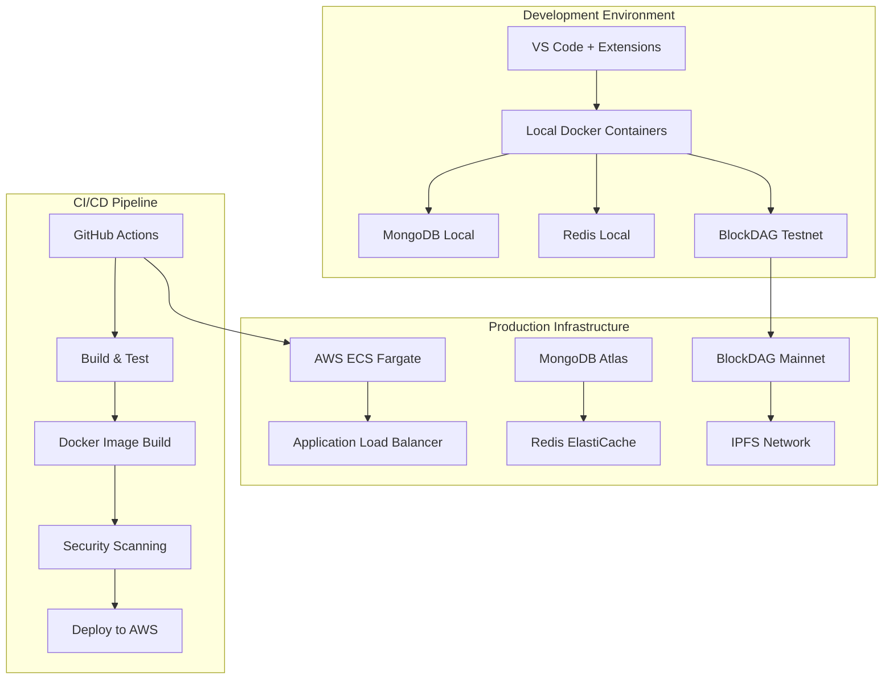

### 3.6.6 Deployment Configuration

| Environment | Configuration | Justification |
|-------------|---------------|---------------|
| **Development** | Local Docker + BlockDAG Testnet | Fast iteration and testing without blockchain costs |
| **Staging** | AWS ECS + MongoDB Atlas + BlockDAG Testnet | Production-like environment for integration testing |
| **Production** | AWS ECS + MongoDB Atlas + BlockDAG Mainnet | Scalable, secure production deployment |

### 3.6.7 Security & Compliance

| Tool/Practice | Implementation | Purpose |
|---------------|----------------|---------|
| **SAST (Static Analysis)** | ESLint, Bandit, Slither | Code security scanning for vulnerabilities |
| **DAST (Dynamic Analysis)** | OWASP ZAP | Runtime security testing |
| **Container Scanning** | Trivy, Snyk | Docker image vulnerability assessment |
| **Secrets Management** | AWS Secrets Manager | Secure storage of API keys and credentials |
| **Compliance Monitoring** | AWS Config, CloudTrail | Regulatory compliance and audit trails |

### 3.6.8 Performance & Monitoring

| Tool | Purpose | Integration |
|------|---------|-------------|
| **Application Monitoring** | Datadog APM | Real-time performance tracking |
| **Log Management** | AWS CloudWatch Logs | Centralized logging and analysis |
| **Metrics Collection** | Prometheus + Grafana | Custom metrics and dashboards |
| **Uptime Monitoring** | Pingdom | Service availability monitoring |
| **Blockchain Monitoring** | Custom BlockDAG monitoring | Transaction and smart contract monitoring |

# 4. Process Flowchart

## 4.1 System Workflows

### 4.1.1 Core Business Processes

#### 4.1.1.1 End-to-End Digital Shipping Process

The ShipLedger platform orchestrates a comprehensive digital shipping workflow that transforms traditional paper-based processes into blockchain-powered operations. Traditional shipping processes involve multiple parties and extensive paperwork, leading to slow information transfer, coordination difficulties, and even fraud. For instance, a shipping trade from Kenya to the Netherlands typically requires over 30 parties, more than 200 interactions, and up to 10 days to process shipping documents.

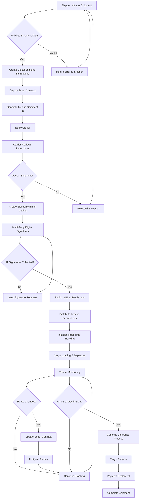

#### 4.1.1.2 Electronic Bill of Lading Creation Workflow

BlockDAG is fully Ethereum Virtual Machine (EVM) compatible, allowing for seamless integration and deployment of Ethereum-based smart contracts. This compatibility ensures that developers familiar with Ethereum's toolset, including Solidity and other Ethereum-compatible programming languages, can easily build and deploy decentralized applications (dApps) on the BlockDAG network.

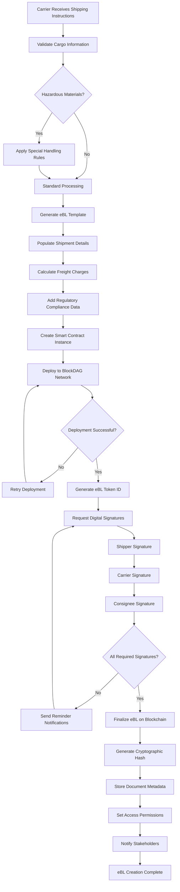

#### 4.1.1.3 Real-Time Tracking and Event Processing

The TradeLens system records transactions and tracks assets such as containers. Documents can be digitized and electronically signed. Over one hundred types of events can be tracked and recorded, including starting consignment tracking; planned loading on vessel; planned, estimated, and actual vessel departure and arrival times; submission of dangerous goods declarations.

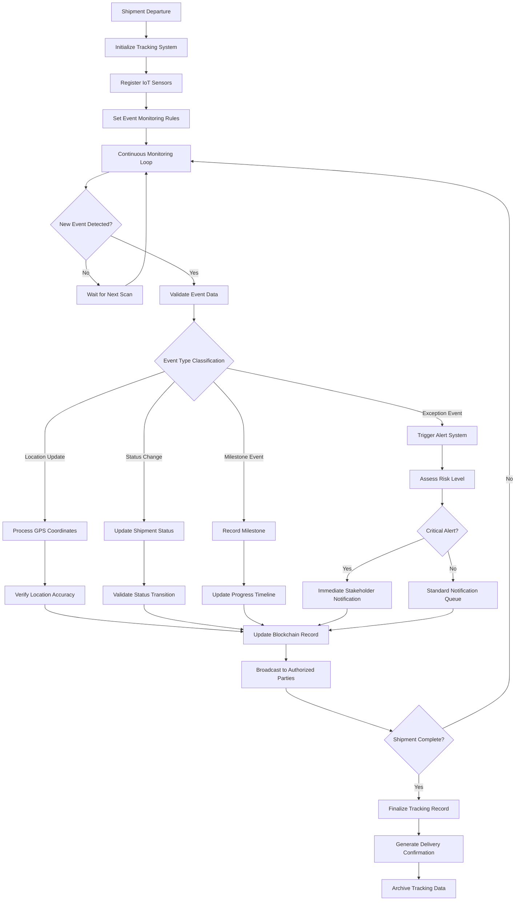

### 4.1.2 Integration Workflows

#### 4.1.2.1 Port Authority Integration Process

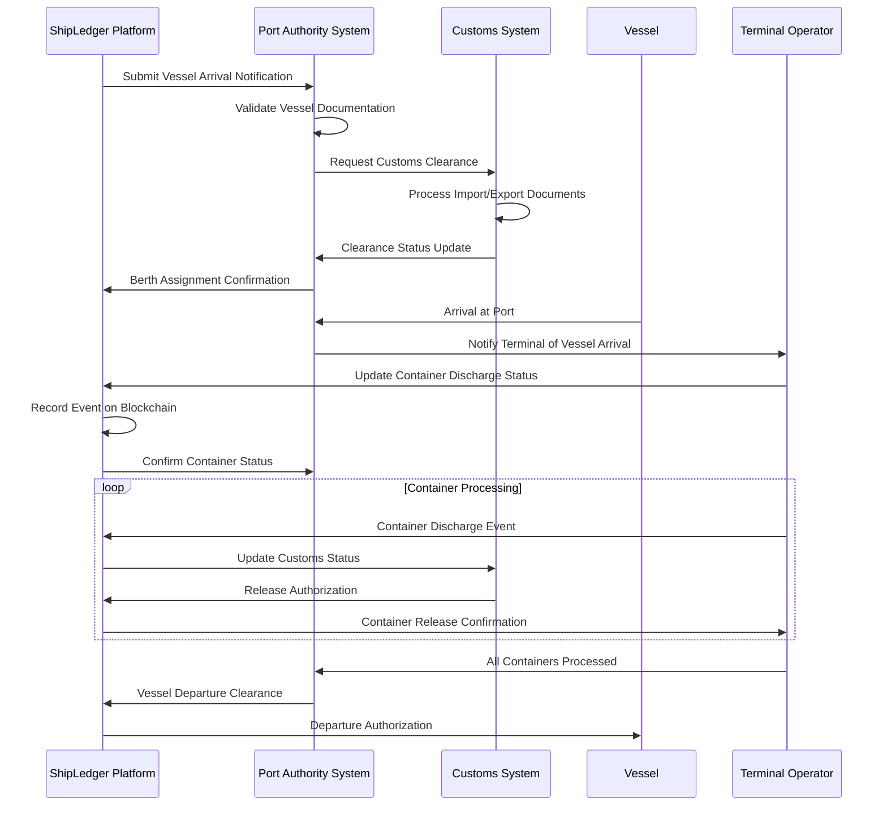

#### 4.1.2.2 Banking and Trade Finance Integration

facilitates the use of smart contracts, programmable automata that can control and manage assets. Smart contracts lie at the heart of decentralized finance (DeFI) and other sophisticated decentralized applications (dApps).

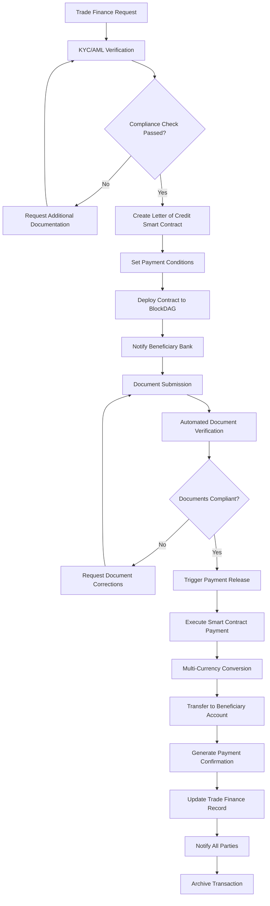

#### 4.1.2.3 Customs and Regulatory Compliance Workflow

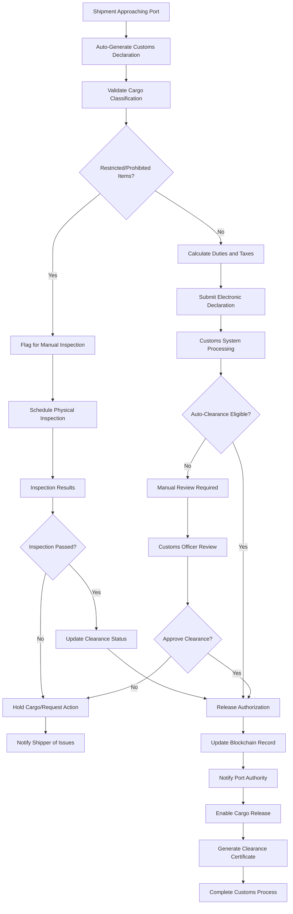

## 4.2 State Management and Data Flow

### 4.2.1 Blockchain State Transitions

The BlockDAG network supports both UTXO and account models. BlockDAG's UTXOs support fast, scalable payments, while BlockDAG's EVM-compatible account-based subsystem supports standardized smart contracts.

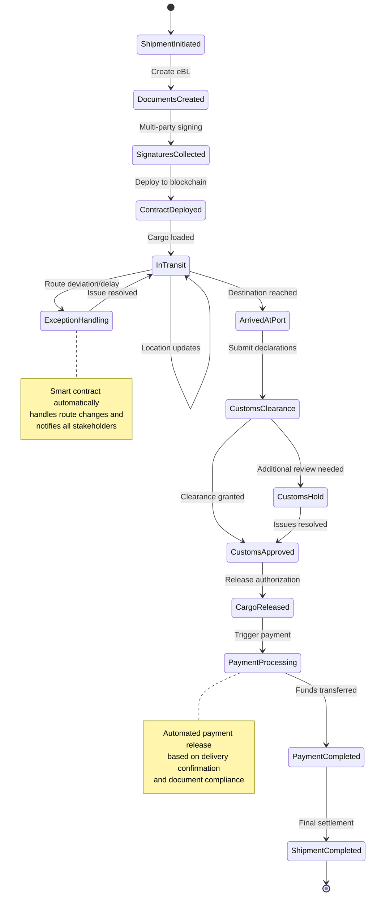

### 4.2.2 Data Persistence and Caching Strategy

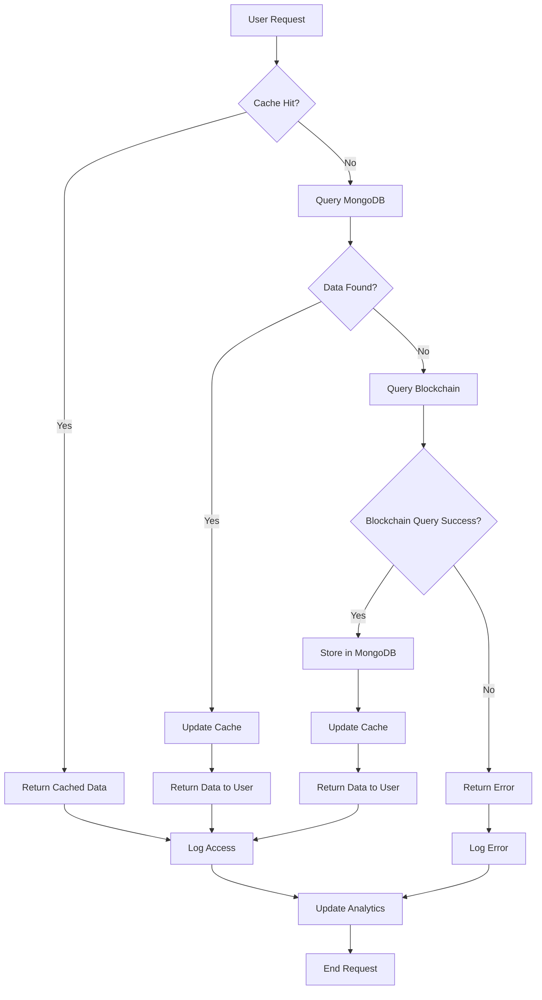

## 4.3 Error Handling and Recovery Procedures

### 4.3.1 Smart Contract Error Handling

For EVM transactions, the fee structure is similar to Ethereum's. As in the UTXO domain, the user attaches a fee to each transaction: the higher the fee, the more attractive that transaction to validators, and the higher that transaction's priority. When a user calls a smart contract, that user is also charged a certain amount of gas for each computational step the contract executes. BlockDAG prices gas the same as Ethereum: all transactions in a block pay the same price, which rises in periods of high demand, and falls in periods of low demand.

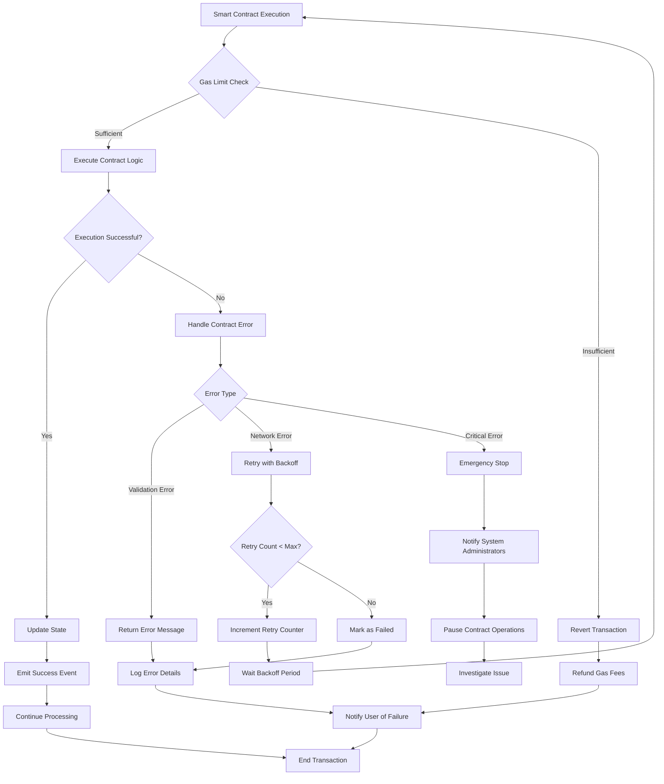

### 4.3.2 Network Connectivity and Failover

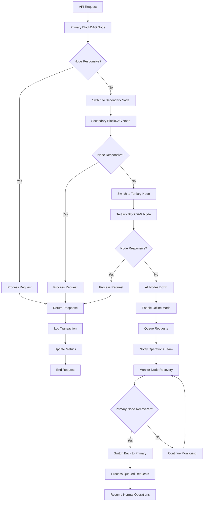

### 4.3.3 Data Consistency and Recovery

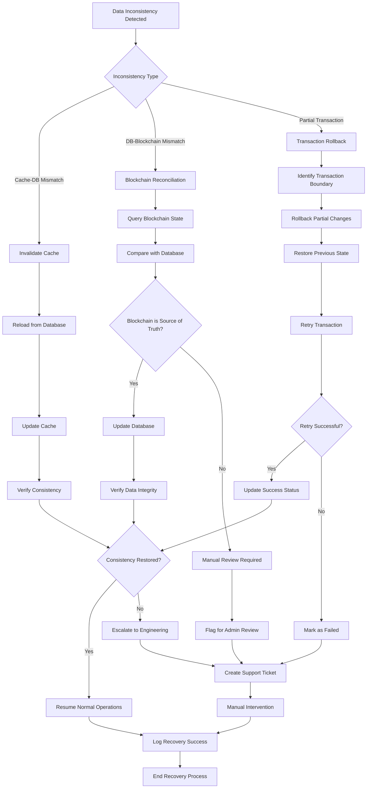

## 4.4 Performance and Scalability Considerations

### 4.4.1 Transaction Processing Optimization

By combining the asynchronous, parallel processing of DAG with the security of PoW, it achieves a throughput of 10 blocks per second (10 TPS) for foundational operations, while supporting 2,000–15,000 TPS in high-load scenarios. This is achieved through a DAG layer that allows transactions to reference multiple predecessors for parallel validation, eliminating the bottlenecks of linear blockchains.

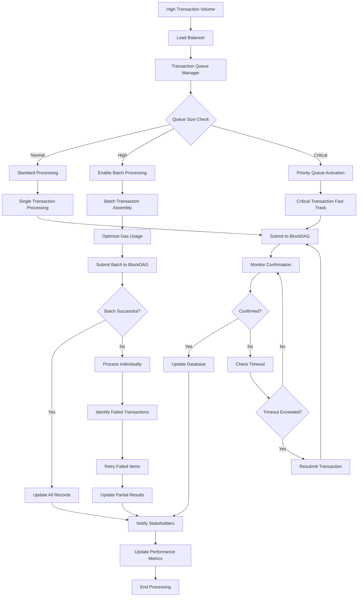

### 4.4.2 Caching and Data Access Optimization

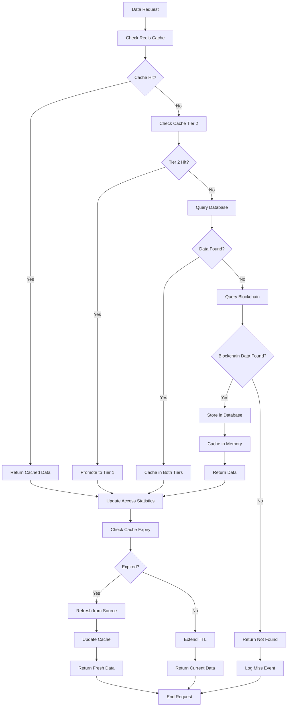

## 4.5 Security and Compliance Workflows

### 4.5.1 Multi-Signature Authorization Process

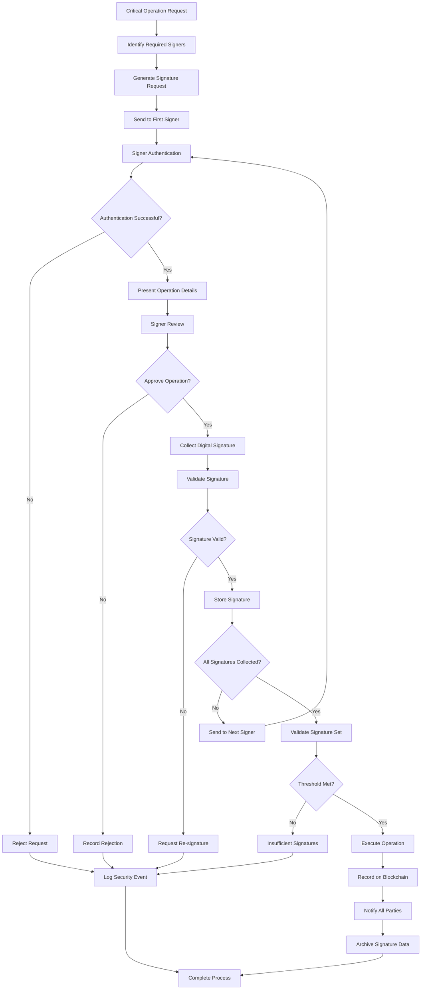

### 4.5.2 Regulatory Compliance Monitoring

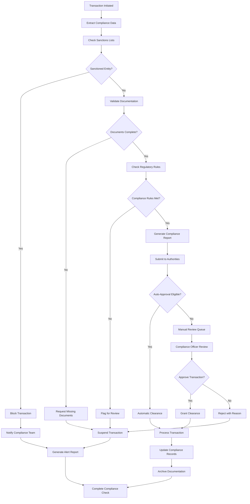

## 4.6 Monitoring and Analytics Workflows

### 4.6.1 Real-Time System Monitoring

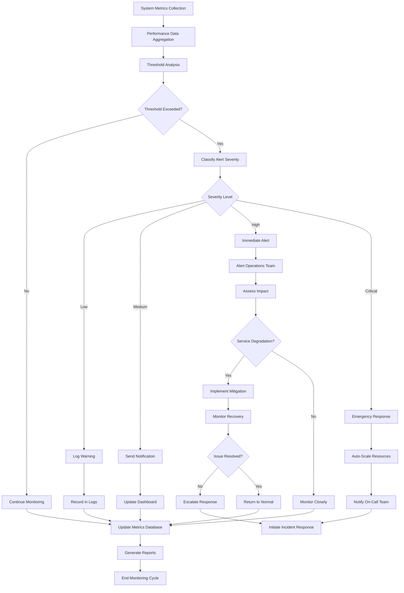

### 4.6.2 Business Intelligence and Reporting

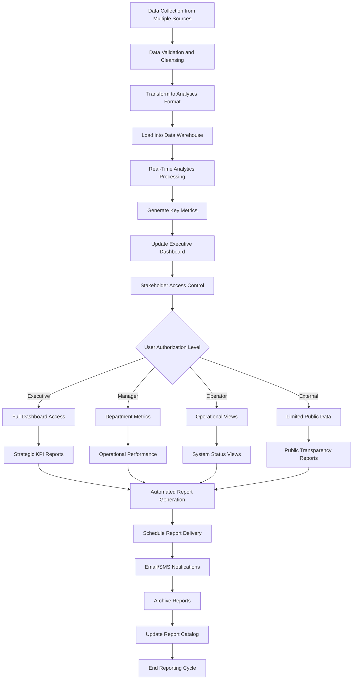

This comprehensive process flowchart section provides detailed workflows for all major ShipLedger operations, from core business processes to error handling and monitoring. The diagrams illustrate the complex interactions between blockchain technology, traditional maritime systems, and stakeholder requirements while maintaining focus on superior speed (1400 TPS and higher) and much lower transaction fees that BlockDAG's EVM-compatible infrastructure provides to the maritime trade ecosystem.

# 5. System Architecture

## 5.1 High-Level Architecture

### 5.1.1 System Overview

ShipLedger employs a hybrid blockchain-microservices architecture that combines BlockDAG's fully Ethereum Virtual Machine (EVM) compatible infrastructure with a distributed microservices ecosystem. The architecture follows Domain-Driven Design (DDD) principles, organizing the system around core maritime business domains while leveraging BlockDAG's superior speed (1400 TPS and higher) and much lower transaction fees.

The system adopts an event-driven architecture pattern where smart contracts facilitate programmable automata that can control and manage assets, lying at the heart of decentralized finance (DeFI) and other sophisticated decentralized applications (dApps). This approach enables real-time responsiveness to maritime trade events while maintaining data consistency across distributed services.

The architectural style emphasizes loose coupling between services through well-defined APIs and asynchronous messaging patterns. Choosing a microservice architecture over monolithic architectures proves more effective as each logistical operational process can be treated as an individual component, particularly beneficial for companies with complex operational flows including multiple logistics processes.

Key architectural principles include:

- **Blockchain-First Design**: All critical maritime documents and transactions are anchored on BlockDAG's immutable ledger
- **Domain Separation**: Each maritime business function operates as an independent microservice
- **Event-Driven Communication**: Services communicate through blockchain events and message queues
- **API Gateway Pattern**: Centralized entry point for all client interactions
- **Database Per Service**: Each microservice maintains its own data store for optimal independence

### 5.1.2 Core Components Table

| Component Name | Primary Responsibility | Key Dependencies | Integration Points | Critical Considerations |
|----------------|----------------------|------------------|-------------------|----------------------|
| **Blockchain Service Layer** | Smart contract deployment and blockchain interactions | BlockDAG Network, EVM Runtime | All microservices via events | Gas pricing similar to Ethereum with dynamic fee adjustment |
| **Document Management Service** | Electronic Bill of Lading creation and verification | Blockchain Service, IPFS Storage | Port Authority APIs, Customs Systems | Document immutability and regulatory compliance |
| **Tracking Service** | Real-time cargo and vessel monitoring | IoT Gateways, GPS Systems | AIS Networks, Port Management Systems | Supporting 120+ planned, estimated, and actual events per shipment |
| **Trade Finance Service** | Payment automation and letter of credit processing | Banking APIs, Multi-currency Systems | SWIFT Network, Correspondent Banks | Initial per-transaction fee of about $0.01 per transaction |

### 5.1.3 Data Flow Description

The primary data flow follows a hub-and-spoke pattern with the blockchain serving as the central source of truth. When a shipper initiates a new shipment, the Document Management Service creates digital shipping instructions and deploys a smart contract to BlockDAG. This contract serves as the coordination mechanism for all subsequent operations.

Event-driven data propagation ensures that when blockchain state changes occur, relevant microservices receive notifications through the Event Bus. The event bus facilitates asynchronous communication between services, where services publish events to the event bus which are then picked up by services that need to respond, decoupling services and allowing each to operate independently.

Data transformation occurs at service boundaries, where each microservice maintains its own data model optimized for its specific domain requirements. The API Gateway aggregates responses from multiple services to provide unified views to client applications.

Critical data stores include MongoDB for operational data, Redis for caching frequently accessed information, and IPFS for distributed document storage. The blockchain maintains distributed, decentralized storage for transaction history, DAG structure, and state databases.

### 5.1.4 External Integration Points

| System Name | Integration Type | Data Exchange Pattern | Protocol/Format | SLA Requirements |
|-------------|------------------|----------------------|-----------------|------------------|
| **Port Authority Systems** | Real-time API | Bidirectional event streaming | REST/JSON, EDI X12 | 99.5% uptime, <2s response |
| **Customs Platforms** | Batch and Real-time | Document submission and status updates | REST/JSON, XML | 99.9% uptime, <5s response |
| **Banking Networks** | Secure API | Payment instructions and confirmations | SWIFT MT, ISO 20022 | 99.99% uptime, <10s response |
| **IoT Sensor Networks** | Message Queue | Continuous telemetry data | MQTT, CoAP | 95% uptime, <30s latency |

## 5.2 Component Details

### 5.2.1 Blockchain Service Layer

**Purpose and Responsibilities**
The Blockchain Service Layer serves as the primary interface between ShipLedger's microservices and the BlockDAG network. The BlockDAG network supports both UTXO and account models, with BlockDAG's UTXOs supporting fast, scalable payments while BlockDAG's EVM-compatible account-based subsystem supports standardized smart contracts.

**Technologies and Frameworks Used**
- **Smart Contract Runtime**: Solidity for smart contract development, leveraging existing Ethereum-based libraries and frameworks
- **Development Tools**: Popular Ethereum development tools such as Truffle, Remix, MetaMask, and Hardhat
- **Token Standards**: Ethereum token standards like ERC-20 (fungible tokens) and ERC-721 (non-fungible tokens)

**Key Interfaces and APIs**
- Smart Contract Deployment API for creating new maritime trade contracts
- Transaction Monitoring API for tracking blockchain state changes
- Event Subscription API for real-time blockchain event notifications
- Gas Optimization API for managing transaction costs

**Data Persistence Requirements**
Smart contracts maintain immutable state on BlockDAG while operational metadata is cached in Redis for performance optimization.

**Scaling Considerations**
The system achieves a throughput of 10 blocks per second (10 TPS) for foundational operations while supporting 2,000–15,000 TPS in high-load scenarios through a DAG layer that allows transactions to reference multiple predecessors for parallel validation.

### 5.2.2 Document Management Service

**Purpose and Responsibilities**
Manages the complete lifecycle of maritime shipping documents, with primary focus on Electronic Bills of Lading (eBL) creation, verification, and distribution. The service ensures regulatory compliance while maintaining document integrity through blockchain anchoring.

**Technologies and Frameworks Used**
- **Backend Framework**: Flask 3.0+ with Python 3.11+
- **Document Storage**: IPFS for distributed storage, MongoDB GridFS for large files
- **Cryptographic Libraries**: Python cryptography library for digital signatures
- **Template Engine**: Jinja2 for dynamic document generation

**Key Interfaces and APIs**
- Document Creation API for generating new shipping documents
- Verification API for validating document authenticity
- Access Control API for managing permission-based document sharing
- Template Management API for customizable document formats

**Data Persistence Requirements**
Document metadata stored in MongoDB with cryptographic hashes, while actual document content distributed across IPFS network for redundancy and availability.

**Scaling Considerations**
Horizontal scaling through containerized deployment with load balancing across multiple service instances.

### 5.2.3 Tracking Service

**Purpose and Responsibilities**
Provides comprehensive real-time tracking capabilities for containers, vessels, and cargo throughout the maritime supply chain. The system supports over 120 planned, estimated, and actual events per shipment, giving real-time insights and ensuring compliance with global trade standards.

**Technologies and Frameworks Used**
- **Event Processing**: Apache Kafka for high-throughput event streaming
- **Time Series Database**: InfluxDB for storing tracking data
- **Geospatial Processing**: PostGIS for location-based queries
- **Real-time Communication**: WebSocket connections for live updates

**Key Interfaces and APIs**
- Location Update API for receiving GPS coordinates and sensor data
- Event Processing API for handling milestone events
- Query API for retrieving historical tracking information
- Notification API for alerting stakeholders of status changes

**Data Persistence Requirements**
Time-series data stored in InfluxDB for optimal query performance, with event metadata replicated to MongoDB for cross-service access.

**Scaling Considerations**
Event streaming architecture enables horizontal scaling with partitioned message queues and distributed processing nodes.

### 5.2.4 Trade Finance Service

**Purpose and Responsibilities**
Automates trade finance operations including payment processing, letter of credit management, and multi-currency transactions. Smart contracts facilitate programmable automata that can control and manage assets, lying at the heart of decentralized finance (DeFI) and other sophisticated decentralized applications.

**Technologies and Frameworks Used**
- **Payment Processing**: Integration with banking APIs and SWIFT network
- **Smart Contracts**: Solidity-based contracts for automated payment triggers
- **Currency Conversion**: Real-time exchange rate APIs
- **Compliance**: AML/KYC verification services

**Key Interfaces and APIs**
- Payment Automation API for triggering smart contract payments
- Letter of Credit API for managing trade finance instruments
- Currency Exchange API for multi-currency support
- Compliance API for regulatory verification

**Data Persistence Requirements**
Financial transaction data stored with encryption in MongoDB, with audit trails maintained on blockchain for immutability.

**Scaling Considerations**
Service replication with database sharding for handling high-volume financial transactions while maintaining ACID properties.

```mermaid
graph TB
    subgraph "Client Layer"
        A[Web Dashboard] --> B[Mobile App]
        B --> C[API Clients]
    end
    
    subgraph "API Gateway Layer"
        D[Load Balancer] --> E[API Gateway]
        E --> F[Authentication Service]
    end
    
    subgraph "Microservices Layer"
        G[Document Management] --> H[Tracking Service]
        H --> I[Trade Finance Service]
        I --> J[Notification Service]
    end
    
    subgraph "Blockchain Layer"
        K[Smart Contract Engine] --> L[BlockDAG Network]
        L --> M[Event Processing]
    end
    
    subgraph "Data Layer"
        N[MongoDB Cluster] --> O[Redis Cache]
        O --> P[IPFS Storage]
    end
    
    A --> D
    E --> G
    G --> K
    K --> N
    
    style L fill:#e1f5fe
    style G fill:#f3e5f5
    style N fill:#e8f5e8
```

### 5.2.5 Component Interaction Sequence

```mermaid
sequenceDiagram
    participant C as Client
    participant AG as API Gateway
    participant DM as Document Management
    participant BC as Blockchain Service
    participant TS as Tracking Service
    participant TF as Trade Finance
    
    C->>AG: Create Shipment Request
    AG->>DM: Generate eBL
    DM->>BC: Deploy Smart Contract
    BC->>BC: Execute on BlockDAG
    BC-->>DM: Contract Address
    DM->>TS: Initialize Tracking
    TS->>BC: Subscribe to Events
    BC->>TF: Setup Payment Triggers
    TF-->>AG: Confirmation
    AG-->>C: Shipment Created
    
    Note over BC: Blockchain events trigger<br/>cross-service updates
    
    BC->>TS: Location Update Event
    BC->>TF: Payment Due Event
    BC->>DM: Document Status Change
```

### 5.2.6 State Transition Management

```mermaid
stateDiagram-v2
    [*] --> DocumentCreation
    DocumentCreation --> ContractDeployment : eBL Generated
    ContractDeployment --> TrackingActive : Smart Contract Live
    TrackingActive --> InTransit : Cargo Loaded
    InTransit --> CustomsClearance : Arrived at Port
    CustomsClearance --> PaymentProcessing : Clearance Approved
    PaymentProcessing --> Completed : Payment Confirmed
    
    InTransit --> ExceptionHandling : Route Deviation
    ExceptionHandling --> InTransit : Issue Resolved
    CustomsClearance --> Hold : Additional Review
    Hold --> CustomsClearance : Documentation Updated
    
    Completed --> [*]
    
    note right of ContractDeployment
        BlockDAG smart contract
        manages state transitions
        automatically
    end note
```

## 5.3 Technical Decisions

### 5.3.1 Architecture Style Decisions and Tradeoffs

**Microservices vs Monolithic Architecture**

| Decision Factor | Microservices (Chosen) | Monolithic Alternative | Rationale |
|----------------|------------------------|----------------------|-----------|
| **Scalability** | Independent service scaling | Entire application scaling | Microservices increase scalability and decrease downtime as each microservice can be scaled and monitored individually, achieving faster scalability without scaling the application as a whole |
| **Technology Diversity** | Service-specific tech stacks | Uniform technology stack | Enables optimal technology choices per domain |
| **Development Velocity** | Parallel team development | Sequential development cycles | Developers focus on learning specific microservices rather than overall system architecture, leading to increased innovation and productivity while reducing errors |
| **Operational Complexity** | Higher operational overhead | Simpler deployment model | Justified by maritime industry's complex operational flows |

**Blockchain Integration Strategy**

The decision to use BlockDAG's full Ethereum Virtual Machine (EVM) compatibility effectively builds a high-speed bridge to Ethereum's massive $500 billion economy provides several advantages:

- **Developer Ecosystem**: Allows thousands of existing Ethereum projects to move to BlockDAG without rewriting their code
- **Tooling Compatibility**: Popular Ethereum wallets like MetaMask and Trust Wallet can manage BDAG coins and interact with dApps on the network
- **Performance Benefits**: Superior speed (1400 TPS and higher) and much lower transaction fees offering a smoother experience for users

### 5.3.2 Communication Pattern Choices

**Event-Driven Architecture Selection**

Technology has moved toward event-driven microservices, where the "event" is any interaction with a system, meaning the system responds to events in real time, creating a more dynamic and seamless user experience.

| Communication Pattern | Use Case | Implementation | Benefits |
|----------------------|----------|----------------|----------|
| **Synchronous REST** | Client-facing APIs | HTTP/JSON over TLS | Simple debugging, immediate responses |
| **Asynchronous Events** | Inter-service communication | Kafka + Blockchain Events | Decouples services, allowing each to operate independently and handle only relevant events |
| **Message Queues** | Background processing | Redis Pub/Sub | Reliable delivery, load leveling |
| **WebSocket Streams** | Real-time updates | Socket.IO connections | Live tracking updates, instant notifications |

**API Gateway Pattern Implementation**

The BFF (Backend for Frontend) API acts as an intermediary layer between the UI and the microservices, providing:

- Unified client interface across multiple microservices
- Authentication and authorization enforcement
- Request routing and load balancing
- Response aggregation and transformation

### 5.3.3 Data Storage Solution Rationale

**Database Per Service Pattern**

The Database per Service pattern describes how each service has its own database in order to ensure loose coupling. This approach provides:

| Service | Database Choice | Justification | Consistency Model |
|---------|----------------|---------------|-------------------|
| **Document Management** | MongoDB + IPFS | Document-oriented data with large file support | Eventual consistency with blockchain anchoring |
| **Tracking Service** | InfluxDB + PostGIS | Time-series data with geospatial queries | Strong consistency for location data |
| **Trade Finance** | MongoDB + Redis | Complex financial documents with caching | ACID transactions for financial operations |
| **User Management** | PostgreSQL | Relational user data with strong consistency | Strong consistency for authentication |

**Blockchain as Source of Truth**

Critical maritime trade data is anchored on BlockDAG to ensure immutability and provide a single source of truth across all services. This hybrid approach balances performance requirements with data integrity needs.

### 5.3.4 Caching Strategy Justification

**Multi-Level Caching Architecture**

| Cache Level | Technology | Purpose | TTL Strategy |
|-------------|------------|---------|--------------|
| **Application Cache** | Redis Cluster | Frequently accessed data | Dynamic TTL based on data volatility |
| **API Gateway Cache** | Nginx + Redis | Response caching | Short TTL for real-time data |
| **Database Query Cache** | MongoDB Cache | Query result optimization | Invalidation on data updates |
| **CDN Cache** | AWS CloudFront | Static asset delivery | Long TTL for immutable content |

The caching strategy addresses the maritime industry's need for real-time data access while managing the latency inherent in blockchain operations and external system integrations.

### 5.3.5 Security Mechanism Selection

**Multi-Layered Security Architecture**

```mermaid
graph TD
    A[Client Request] --> B[TLS Termination]
    B --> C[API Gateway Authentication]
    C --> D[Service-to-Service mTLS]
    D --> E[Blockchain Signature Verification]
    E --> F[Database Encryption at Rest]
    
    G[Identity Provider] --> C
    H[Certificate Authority] --> D
    I[Hardware Security Module] --> E
    J[Key Management Service] --> F
    
    style E fill:#ffeb3b
    style C fill:#4caf50
    style F fill:#2196f3
```

**Security Decision Matrix**

| Security Domain | Implementation | Rationale |
|-----------------|----------------|-----------|
| **Authentication** | OAuth 2.0 + JWT tokens | Industry standard with maritime partner compatibility |
| **Authorization** | RBAC with smart contracts | Blockchain-enforced permissions for document access |
| **Data Encryption** | AES-256 + TLS 1.3 | Maritime regulatory compliance requirements |
| **Network Security** | mTLS + VPN tunnels | Secure communication across global maritime networks |

## 5.4 Cross-Cutting Concerns

### 5.4.1 Monitoring and Observability Approach

**Comprehensive Observability Stack**

The monitoring strategy implements the three pillars of observability: metrics, logs, and traces. Tracing issues in a distributed system can be difficult, especially when a request passes through multiple services, requiring advanced monitoring, centralized logging, and distributed tracing tools to maintain observability and quickly diagnose problems.

| Observability Type | Technology Stack | Coverage | Retention Policy |
|-------------------|------------------|----------|------------------|
| **Metrics** | Prometheus + Grafana | System and business metrics | 90 days detailed, 1 year aggregated |
| **Logging** | ELK Stack (Elasticsearch, Logstash, Kibana) | Application and system logs | 30 days searchable, 1 year archived |
| **Tracing** | Jaeger + OpenTelemetry | Distributed request tracing | 7 days detailed, 30 days sampled |
| **Blockchain Monitoring** | Custom BlockDAG monitoring | Smart contract events and gas usage | Permanent on-chain, 1 year off-chain |

**Key Performance Indicators (KPIs)**

- **System Performance**: API response times, throughput, error rates
- **Blockchain Metrics**: Transaction confirmation times, gas costs, smart contract execution success rates
- **Business Metrics**: Document processing times, shipment tracking accuracy, payment settlement duration
- **User Experience**: Page load times, mobile app performance, notification delivery rates

### 5.4.2 Logging and Tracing Strategy

**Structured Logging Implementation**

All services implement structured logging using JSON format with standardized fields:

```json
{
  "timestamp": "2024-11-04T10:30:00Z",
  "service": "document-management",
  "level": "INFO",
  "trace_id": "abc123def456",
  "span_id": "789ghi012jkl",
  "user_id": "user_12345",
  "shipment_id": "SHIP_67890",
  "message": "eBL created successfully",
  "blockchain_tx": "0x1234567890abcdef",
  "duration_ms": 250
}
```

**Distributed Tracing Architecture**

Traces follow requests across the entire system, from client interaction through multiple microservices to blockchain confirmation. This enables rapid identification of performance bottlenecks and failure points in complex maritime trade workflows.

### 5.4.3 Error Handling Patterns

**Circuit Breaker Pattern Implementation**

Microservices architecture enhances resilience and reliability by designing services to be independent and isolated, meaning that a failure in one service does not directly affect other services, allowing the application to continue functioning even if one or more services fail.

```mermaid
flowchart TD
    A[Service Request] --> B{Circuit Breaker State}
    B -->|Closed| C[Execute Request]
    B -->|Open| D[Return Cached Response]
    B -->|Half-Open| E[Test Request]
    
    C --> F{Request Success?}
    F -->|Yes| G[Reset Failure Count]
    F -->|No| H[Increment Failure Count]
    
    H --> I{Threshold Exceeded?}
    I -->|Yes| J[Open Circuit]
    I -->|No| K[Continue Normal Operation]
    
    E --> L{Test Success?}
    L -->|Yes| M[Close Circuit]
    L -->|No| N[Keep Circuit Open]
    
    style J fill:#ff5722
    style M fill:#4caf50
    style D fill:#ff9800
```

**Error Handling Strategy Matrix**

| Error Type | Handling Strategy | Recovery Mechanism | User Impact |
|------------|------------------|-------------------|-------------|
| **Blockchain Network Issues** | Circuit breaker + retry with exponential backoff | Queue transactions for later processing | Delayed confirmation notifications |
| **External API Failures** | Fallback to cached data + circuit breaker | Alternative data sources where available | Graceful degradation of features |
| **Database Connection Issues** | Connection pooling + automatic failover | Read replicas for query operations | Temporary read-only mode |
| **Smart Contract Failures** | Transaction revert handling + gas optimization | Automatic retry with adjusted parameters | Transaction failure notifications |

### 5.4.4 Authentication and Authorization Framework

**Multi-Tenant Security Model**

The authentication framework supports multiple maritime organizations with role-based access control (RBAC) enforced both at the application level and through blockchain smart contracts.

| User Role | System Access | Document Permissions | Blockchain Operations |
|-----------|---------------|---------------------|----------------------|
| **Shipper** | Create shipments, view own data | Create/edit shipping instructions | Deploy shipment contracts |
| **Carrier** | Manage assigned shipments | Create/edit Bills of Lading | Update shipment status |
| **Port Authority** | View port-related shipments | Read customs documents | Verify clearance status |
| **Bank/Finance** | Process trade finance | Access financial documents | Execute payment contracts |

**Smart Contract-Based Authorization**

Permission management is partially enforced through blockchain smart contracts, ensuring that document access rights are immutable and auditable. Each transaction is encrypted using a key which links relevant participants, with rights coded into the system.

### 5.4.5 Performance Requirements and SLAs

**Service Level Agreements**

| Service Category | Availability Target | Response Time Target | Throughput Target | Recovery Time Objective |
|------------------|-------------------|---------------------|-------------------|------------------------|
| **Critical Services** (Document Management, Blockchain) | 99.9% | <2 seconds | 1000 requests/second | <15 minutes |
| **Standard Services** (Tracking, Notifications) | 99.5% | <5 seconds | 500 requests/second | <30 minutes |
| **Batch Services** (Reporting, Analytics) | 99.0% | <30 seconds | 100 requests/second | <2 hours |
| **External Integrations** | 95.0% | <10 seconds | Variable | <1 hour |

**Performance Optimization Strategies**

- **Database Optimization**: Query optimization, indexing strategies, connection pooling
- **Caching**: Multi-level caching with intelligent invalidation
- **Load Balancing**: Geographic distribution with health checks
- **Blockchain Optimization**: Gas pricing optimization with dynamic fee adjustment based on network demand

### 5.4.6 Disaster Recovery Procedures

**Business Continuity Planning**

The disaster recovery strategy ensures minimal disruption to global maritime trade operations through redundant systems and automated failover mechanisms.

| Recovery Scenario | RTO (Recovery Time Objective) | RPO (Recovery Point Objective) | Recovery Strategy |
|-------------------|-------------------------------|-------------------------------|-------------------|
| **Single Service Failure** | <5 minutes | <1 minute | Automatic failover to healthy instances |
| **Database Failure** | <15 minutes | <5 minutes | Failover to read replicas, promote to primary |
| **Blockchain Network Issues** | <30 minutes | 0 (immutable ledger) | Switch to backup blockchain nodes |
| **Complete Data Center Outage** | <2 hours | <15 minutes | Geographic failover to secondary region |

**Backup and Recovery Architecture**

```mermaid
graph TB
    subgraph "Primary Region"
        A[Application Services] --> B[Primary Database]
        B --> C[Blockchain Nodes]
    end
    
    subgraph "Secondary Region"
        D[Standby Services] --> E[Replica Database]
        E --> F[Backup Blockchain Nodes]
    end
    
    subgraph "Backup Storage"
        G[Encrypted Backups] --> H[Geographic Distribution]
        H --> I[Point-in-Time Recovery]
    end
    
    B -.->|Continuous Replication| E
    C -.->|Blockchain Sync| F
    B -->|Daily Snapshots| G
    
    style A fill:#4caf50
    style D fill:#ff9800
    style G fill:#2196f3
```

**Recovery Testing and Validation**

- **Monthly**: Automated backup restoration tests
- **Quarterly**: Failover scenario testing
- **Annually**: Full disaster recovery simulation with stakeholder participation
- **Continuous**: Blockchain network resilience monitoring

The comprehensive disaster recovery plan ensures that critical maritime trade operations can continue even during significant system failures, maintaining the integrity of global supply chain operations that depend on ShipLedger's services.

# 6. SYSTEM COMPONENTS DESIGN

## 6.1 Smart Contract Architecture

### 6.1.1 Core Smart Contract Components

BlockDAG is fully Ethereum Virtual Machine (EVM) compatible, allowing for seamless integration and deployment of Ethereum-based smart contracts. This compatibility ensures that developers familiar with Ethereum's toolset, including Solidity and other Ethereum-compatible programming languages, can easily build and deploy decentralized applications (dApps) on the BlockDAG network.

The ShipLedger smart contract architecture consists of four primary contract types that manage the complete maritime trade lifecycle:

| Contract Type | Primary Function | Key Features | Gas Optimization |
|---------------|------------------|--------------|------------------|
| **ShipmentContract** | Core shipment management | Multi-party signatures, state transitions, event emissions | Batch operations, efficient storage patterns |
| **BillOfLadingContract** | Electronic BoL creation and verification | Document hashing, access control, transfer mechanisms | Minimal storage, IPFS integration |
| **TradeFinanceContract** | Payment automation and escrow | Multi-currency support, conditional releases, interest calculations | Gas-efficient payment triggers |
| **ComplianceContract** | Regulatory verification | KYC/AML checks, sanctions screening, audit trails | Optimized validation logic |

### 6.1.2 Smart Contract Inheritance Hierarchy

```mermaid
classDiagram
    class BaseContract {
        +address owner
        +mapping(address => bool) authorized
        +modifier onlyOwner()
        +modifier onlyAuthorized()
        +function transferOwnership()
        +function addAuthorized()
    }
    
    class ShipmentContract {
        +struct Shipment
        +enum ShipmentStatus
        +mapping(bytes32 => Shipment) shipments
        +function createShipment()
        +function updateStatus()
        +function getShipment()
    }
    
    class BillOfLadingContract {
        +struct BillOfLading
        +mapping(bytes32 => BillOfLading) bills
        +mapping(bytes32 => address[]) signatories
        +function createBillOfLading()
        +function signBillOfLading()
        +function transferOwnership()
    }
    
    class TradeFinanceContract {
        +struct PaymentTerms
        +mapping(bytes32 => PaymentTerms) payments
        +function setupPayment()
        +function releasePayment()
        +function calculateInterest()
    }
    
    class ComplianceContract {
        +mapping(address => bool) kycVerified
        +mapping(address => bool) sanctioned
        +function verifyKYC()
        +function checkSanctions()
        +function auditCompliance()
    }
    
    BaseContract <|-- ShipmentContract
    BaseContract <|-- BillOfLadingContract
    BaseContract <|-- TradeFinanceContract
    BaseContract <|-- ComplianceContract
    
    ShipmentContract --> BillOfLadingContract : creates
    ShipmentContract --> TradeFinanceContract : triggers
    ShipmentContract --> ComplianceContract : validates
```

### 6.1.3 Smart Contract State Management

BlockDAG's EVM-compatible account-based subsystem supports standardized smart contracts. A library is provided to connect these two worlds, providing developers with the best of both worlds.

The state management system employs a hierarchical approach where each contract maintains its own state while coordinating through event-driven communication:

**Primary State Variables:**

```solidity
// ShipmentContract.sol
struct Shipment {
    bytes32 shipmentId;
    address shipper;
    address carrier;
    address consignee;
    ShipmentStatus status;
    bytes32 billOfLadingHash;
    uint256 createdAt;
    uint256 updatedAt;
    mapping(string => string) metadata;
}

enum ShipmentStatus {
    Created,
    DocumentsGenerated,
    InTransit,
    ArrivedAtPort,
    CustomsCleared,
    Delivered,
    Completed
}
```

**Event-Driven State Synchronization:**

```solidity
event ShipmentCreated(bytes32 indexed shipmentId, address indexed shipper);
event StatusUpdated(bytes32 indexed shipmentId, ShipmentStatus newStatus);
event DocumentGenerated(bytes32 indexed shipmentId, bytes32 documentHash);
event PaymentTriggered(bytes32 indexed shipmentId, uint256 amount);
```

### 6.1.4 Multi-Signature Implementation

The multi-signature mechanism ensures that critical operations require consensus from multiple authorized parties:

```solidity
contract MultiSigBillOfLading {
    struct Signature {
        address signer;
        bytes signature;
        uint256 timestamp;
        bool isValid;
    }
    
    mapping(bytes32 => Signature[]) public signatures;
    mapping(bytes32 => uint256) public requiredSignatures;
    
    function signDocument(bytes32 documentHash, bytes memory signature) external {
        require(isAuthorizedSigner(msg.sender, documentHash), "Unauthorized signer");
        
        signatures[documentHash].push(Signature({
            signer: msg.sender,
            signature: signature,
            timestamp: block.timestamp,
            isValid: true
        }));
        
        if (signatures[documentHash].length >= requiredSignatures[documentHash]) {
            emit DocumentFullySigned(documentHash);
            _finalizeDocument(documentHash);
        }
    }
}
```

### 6.1.5 Gas Optimization Strategies

Nevertheless, linear blockchains can struggle with scalability issues, as every node must process every transaction, leading to slower transaction times, and putting pressure on fees. Moreover, many transactions are unrelated to one another, so there is no need for nodes to order them, because executing them in any order yields the same results.

To address gas efficiency concerns, the smart contracts implement several optimization techniques:

| Optimization Technique | Implementation | Gas Savings |
|------------------------|----------------|-------------|
| **Packed Structs** | Efficient storage layout with uint256 alignment | 20-30% storage costs |
| **Batch Operations** | Multiple operations in single transaction | 40-60% per additional operation |
| **Event-Based Communication** | Minimal on-chain storage, off-chain indexing | 70-80% for data retrieval |
| **Lazy Evaluation** | Compute values only when needed | 15-25% computational costs |

**Example Gas-Optimized Storage Pattern:**

```solidity
// Optimized struct packing
struct OptimizedShipment {
    address shipper;        // 20 bytes
    address carrier;        // 20 bytes  
    address consignee;      // 20 bytes
    uint64 createdAt;       // 8 bytes
    uint64 updatedAt;       // 8 bytes
    uint32 status;          // 4 bytes
    bytes32 documentHash;   // 32 bytes
}
```

## 6.2 Database Schema Design

### 6.2.1 MongoDB Document Structure

The database design follows a document-oriented approach optimized for maritime trade operations, with each collection representing a core business entity:

**Shipments Collection:**

```json
{
  "_id": "ObjectId",
  "shipmentId": "SHIP_2024_001234",
  "blockchainTxHash": "0x1234567890abcdef",
  "contractAddress": "0xabcdef1234567890",
  "shipper": {
    "companyId": "SHIPPER_001",
    "name": "Global Shipping Corp",
    "address": {
      "street": "123 Port Avenue",
      "city": "Singapore",
      "country": "Singapore",
      "postalCode": "018956"
    },
    "contact": {
      "email": "operations@globalship.com",
      "phone": "+65-6123-4567"
    }
  },
  "carrier": {
    "companyId": "CARRIER_001",
    "name": "Maritime Transport Ltd",
    "vesselIMO": "IMO1234567",
    "vesselName": "MV Ocean Pioneer"
  },
  "consignee": {
    "companyId": "CONSIGNEE_001",
    "name": "European Imports Inc",
    "deliveryAddress": {
      "street": "456 Harbor Road",
      "city": "Rotterdam",
      "country": "Netherlands",
      "postalCode": "3011 AD"
    }
  },
  "cargo": {
    "description": "Electronics Components",
    "hsCode": "8542.31.0000",
    "weight": {
      "value": 15000,
      "unit": "kg"
    },
    "volume": {
      "value": 45,
      "unit": "cbm"
    },
    "containerNumbers": ["TCLU1234567", "TCLU1234568"],
    "hazardousGoods": false
  },
  "route": {
    "portOfLoading": {
      "code": "SGSIN",
      "name": "Port of Singapore",
      "country": "Singapore"
    },
    "portOfDischarge": {
      "code": "NLRTM",
      "name": "Port of Rotterdam",
      "country": "Netherlands"
    },
    "transitPorts": [
      {
        "code": "AEJEA",
        "name": "Jebel Ali",
        "country": "UAE",
        "estimatedArrival": "2024-11-15T08:00:00Z"
      }
    ]
  },
  "status": {
    "current": "IN_TRANSIT",
    "lastUpdated": "2024-11-04T14:30:00Z",
    "history": [
      {
        "status": "CREATED",
        "timestamp": "2024-11-01T09:00:00Z",
        "location": "Singapore",
        "updatedBy": "system"
      },
      {
        "status": "DOCUMENTS_GENERATED",
        "timestamp": "2024-11-01T15:30:00Z",
        "location": "Singapore",
        "updatedBy": "carrier_001"
      }
    ]
  },
  "documents": {
    "billOfLading": {
      "documentId": "BL_2024_001234",
      "ipfsHash": "QmX1Y2Z3...",
      "blockchainHash": "0xdef456...",
      "status": "SIGNED",
      "signatures": [
        {
          "party": "shipper",
          "address": "0x123...",
          "timestamp": "2024-11-01T16:00:00Z",
          "txHash": "0x789..."
        }
      ]
    },
    "commercialInvoice": {
      "documentId": "INV_2024_001234",
      "ipfsHash": "QmA1B2C3...",
      "amount": {
        "value": 125000,
        "currency": "USD"
      }
    }
  },
  "tracking": {
    "currentLocation": {
      "latitude": 25.2048,
      "longitude": 55.2708,
      "timestamp": "2024-11-04T14:30:00Z",
      "source": "AIS"
    },
    "events": [
      {
        "eventType": "CONTAINER_LOADED",
        "timestamp": "2024-11-02T10:00:00Z",
        "location": "SGSIN",
        "description": "Container TCLU1234567 loaded onto vessel"
      }
    ]
  },
  "finance": {
    "paymentTerms": "LC_AT_SIGHT",
    "totalAmount": {
      "value": 125000,
      "currency": "USD"
    },
    "letterOfCredit": {
      "lcNumber": "LC2024001234",
      "issuingBank": "Standard Chartered Bank",
      "expiryDate": "2024-12-01T23:59:59Z"
    },
    "paymentStatus": "PENDING"
  },
  "compliance": {
    "customsDeclarations": [
      {
        "country": "Singapore",
        "declarationNumber": "SG2024001234",
        "status": "CLEARED",
        "clearedAt": "2024-11-02T08:00:00Z"
      }
    ],
    "certificates": [
      {
        "type": "CERTIFICATE_OF_ORIGIN",
        "issuingAuthority": "Singapore Chamber of Commerce",
        "certificateNumber": "COO2024001234",
        "ipfsHash": "QmD1E2F3..."
      }
    ]
  },
  "createdAt": "2024-11-01T09:00:00Z",
  "updatedAt": "2024-11-04T14:30:00Z",
  "version": 1
}
```

### 6.2.2 Indexing Strategy

To optimize query performance for maritime trade operations, the following indexes are implemented:

| Collection | Index Type | Fields | Purpose |
|------------|------------|--------|---------|
| **shipments** | Compound | `{shipmentId: 1, status.current: 1}` | Fast shipment lookup and status filtering |
| **shipments** | Geospatial | `{tracking.currentLocation: "2dsphere"}` | Location-based queries |
| **shipments** | Text | `{cargo.description: "text", shipper.name: "text"}` | Full-text search capabilities |
| **shipments** | TTL | `{updatedAt: 1}` | Automatic archival of old records |
| **documents** | Compound | `{shipmentId: 1, documentType: 1, status: 1}` | Document management queries |
| **tracking_events** | Compound | `{shipmentId: 1, timestamp: -1}` | Chronological event retrieval |

### 6.2.3 Data Partitioning Strategy

For scalability, the database implements horizontal partitioning based on temporal and geographical factors:

```mermaid
graph TB
    subgraph "Shipments Collection Sharding"
        A[Shard Key: shipmentId + createdAt] --> B[Shard 1: 2024-Q1]
        A --> C[Shard 2: 2024-Q2]
        A --> D[Shard 3: 2024-Q3]
        A --> E[Shard 4: 2024-Q4]
    end
    
    subgraph "Tracking Events Sharding"
        F[Shard Key: shipmentId + timestamp] --> G[Hot Data: Last 30 days]
        F --> H[Warm Data: 30-90 days]
        F --> I[Cold Data: >90 days]
    end
    
    subgraph "Regional Distribution"
        J[Asia-Pacific] --> K[Singapore Cluster]
        L[Europe] --> M[Amsterdam Cluster]
        N[Americas] --> O[New York Cluster]
    end
```

### 6.2.4 Data Consistency and Integrity

The system maintains data consistency through multiple mechanisms:

**Blockchain Anchoring:**
- Critical state changes are anchored on BlockDAG blockchain
- Document hashes stored both on-chain and in MongoDB
- Periodic reconciliation between blockchain and database states

**Referential Integrity:**
```javascript
// MongoDB Schema Validation
db.createCollection("shipments", {
  validator: {
    $jsonSchema: {
      bsonType: "object",
      required: ["shipmentId", "shipper", "carrier", "consignee"],
      properties: {
        shipmentId: {
          bsonType: "string",
          pattern: "^SHIP_[0-9]{4}_[0-9]{6}$"
        },
        status: {
          bsonType: "object",
          required: ["current", "lastUpdated"],
          properties: {
            current: {
              enum: ["CREATED", "DOCUMENTS_GENERATED", "IN_TRANSIT", 
                     "ARRIVED_AT_PORT", "CUSTOMS_CLEARED", "DELIVERED", "COMPLETED"]
            }
          }
        }
      }
    }
  }
})
```

## 6.3 API Design Specifications

### 6.3.1 RESTful API Architecture

The ShipLedger API follows RESTful principles with resource-based URLs and standard HTTP methods. BlockDAG also supports popular Ethereum development tools, such as Truffle, Remix, MetaMask, and Hardhat, simplifying the development and deployment processes.

**Base API Structure:**

| Resource | HTTP Method | Endpoint | Description |
|----------|-------------|----------|-------------|
| **Shipments** | GET | `/api/v1/shipments` | List shipments with filtering |
| **Shipments** | POST | `/api/v1/shipments` | Create new shipment |
| **Shipments** | GET | `/api/v1/shipments/{id}` | Get specific shipment |
| **Shipments** | PUT | `/api/v1/shipments/{id}` | Update shipment |
| **Documents** | POST | `/api/v1/shipments/{id}/documents` | Create document |
| **Documents** | GET | `/api/v1/documents/{id}` | Retrieve document |
| **Tracking** | GET | `/api/v1/shipments/{id}/tracking` | Get tracking information |
| **Tracking** | POST | `/api/v1/shipments/{id}/tracking/events` | Add tracking event |

### 6.3.2 API Request/Response Specifications

**Create Shipment Request:**

```json
{
  "method": "POST",
  "endpoint": "/api/v1/shipments",
  "headers": {
    "Content-Type": "application/json",
    "Authorization": "Bearer {jwt_token}",
    "X-API-Version": "1.0"
  },
  "body": {
    "shipper": {
      "companyId": "SHIPPER_001",
      "contactPerson": "John Smith",
      "email": "john.smith@globalship.com"
    },
    "carrier": {
      "companyId": "CARRIER_001",
      "vesselIMO": "IMO1234567"
    },
    "consignee": {
      "companyId": "CONSIGNEE_001",
      "deliveryAddress": {
        "street": "456 Harbor Road",
        "city": "Rotterdam",
        "country": "Netherlands",
        "postalCode": "3011 AD"
      }
    },
    "cargo": {
      "description": "Electronics Components",
      "hsCode": "8542.31.0000",
      "weight": {"value": 15000, "unit": "kg"},
      "containerNumbers": ["TCLU1234567"]
    },
    "route": {
      "portOfLoading": "SGSIN",
      "portOfDischarge": "NLRTM",
      "estimatedDeparture": "2024-11-05T10:00:00Z",
      "estimatedArrival": "2024-11-20T14:00:00Z"
    },
    "paymentTerms": {
      "type": "LC_AT_SIGHT",
      "amount": {"value": 125000, "currency": "USD"}
    }
  }
}
```

**Create Shipment Response:**

```json
{
  "status": "success",
  "data": {
    "shipmentId": "SHIP_2024_001234",
    "blockchainTxHash": "0x1234567890abcdef",
    "contractAddress": "0xabcdef1234567890",
    "status": "CREATED",
    "createdAt": "2024-11-04T15:30:00Z",
    "estimatedCompletion": "2024-11-25T12:00:00Z"
  },
  "links": {
    "self": "/api/v1/shipments/SHIP_2024_001234",
    "tracking": "/api/v1/shipments/SHIP_2024_001234/tracking",
    "documents": "/api/v1/shipments/SHIP_2024_001234/documents"
  },
  "meta": {
    "version": "1.0",
    "timestamp": "2024-11-04T15:30:00Z",
    "requestId": "req_abc123def456"
  }
}
```

### 6.3.3 WebSocket Real-Time API

For real-time updates, the system provides WebSocket connections that deliver live tracking and status updates:

**WebSocket Connection Establishment:**

```javascript
// Client-side WebSocket connection
const ws = new WebSocket('wss://api.shibledger.com/v1/ws');

ws.onopen = function(event) {
  // Subscribe to shipment updates
  ws.send(JSON.stringify({
    action: 'subscribe',
    resource: 'shipment',
    shipmentId: 'SHIP_2024_001234',
    events: ['status_change', 'location_update', 'document_signed']
  }));
};

ws.onmessage = function(event) {
  const update = JSON.parse(event.data);
  console.log('Received update:', update);
};
```

**Real-Time Update Message Format:**

```json
{
  "type": "shipment_update",
  "shipmentId": "SHIP_2024_001234",
  "event": "location_update",
  "timestamp": "2024-11-04T15:45:00Z",
  "data": {
    "location": {
      "latitude": 25.2048,
      "longitude": 55.2708,
      "accuracy": 10
    },
    "vessel": {
      "name": "MV Ocean Pioneer",
      "speed": 18.5,
      "heading": 285
    },
    "estimatedArrival": "2024-11-20T14:30:00Z"
  },
  "source": "AIS",
  "confidence": 0.95
}
```

### 6.3.4 GraphQL API Implementation

For complex queries requiring multiple related resources, a GraphQL endpoint provides flexible data fetching:

**GraphQL Schema Definition:**

```graphql
type Shipment {
  id: ID!
  shipmentId: String!
  status: ShipmentStatus!
  shipper: Company!
  carrier: Company!
  consignee: Company!
  cargo: Cargo!
  route: Route!
  documents: [Document!]!
  tracking: TrackingInfo!
  finance: FinanceInfo!
  createdAt: DateTime!
  updatedAt: DateTime!
}

type TrackingInfo {
  currentLocation: Location
  events: [TrackingEvent!]!
  estimatedArrival: DateTime
}

type Query {
  shipment(id: ID!): Shipment
  shipments(
    filter: ShipmentFilter
    pagination: PaginationInput
    sort: SortInput
  ): ShipmentConnection!
  
  trackingEvents(
    shipmentId: ID!
    dateRange: DateRangeInput
  ): [TrackingEvent!]!
}

type Mutation {
  createShipment(input: CreateShipmentInput!): ShipmentPayload!
  updateShipmentStatus(
    shipmentId: ID!
    status: ShipmentStatus!
  ): ShipmentPayload!
  
  signDocument(
    documentId: ID!
    signature: String!
  ): DocumentPayload!
}

type Subscription {
  shipmentUpdates(shipmentId: ID!): ShipmentUpdate!
  trackingUpdates(shipmentIds: [ID!]!): TrackingUpdate!
}
```

### 6.3.5 API Security and Authentication

The API implements multiple layers of security to protect maritime trade data:

**JWT Token Structure:**

```json
{
  "header": {
    "alg": "RS256",
    "typ": "JWT",
    "kid": "shibledger-key-1"
  },
  "payload": {
    "sub": "user_12345",
    "iss": "https://auth.shibledger.com",
    "aud": "https://api.shibledger.com",
    "exp": 1699200000,
    "iat": 1699113600,
    "scope": "shipments:read shipments:write documents:sign",
    "company_id": "SHIPPER_001",
    "role": "operations_manager",
    "permissions": [
      "create_shipment",
      "view_own_shipments",
      "sign_documents"
    ]
  }
}
```

**API Rate Limiting:**

| User Tier | Requests/Minute | Burst Limit | WebSocket Connections |
|-----------|-----------------|-------------|----------------------|
| **Free** | 100 | 200 | 5 |
| **Professional** | 1,000 | 2,000 | 25 |
| **Enterprise** | 10,000 | 20,000 | 100 |
| **Partner** | Unlimited | Unlimited | Unlimited |

### 6.3.6 Error Handling and Status Codes

The API follows standard HTTP status codes with detailed error responses:

**Error Response Format:**

```json
{
  "error": {
    "code": "VALIDATION_ERROR",
    "message": "Invalid shipment data provided",
    "details": [
      {
        "field": "cargo.weight.value",
        "message": "Weight must be a positive number",
        "code": "INVALID_VALUE"
      },
      {
        "field": "route.portOfLoading",
        "message": "Port code INVALID is not recognized",
        "code": "INVALID_PORT_CODE"
      }
    ],
    "timestamp": "2024-11-04T15:30:00Z",
    "requestId": "req_abc123def456",
    "documentation": "https://docs.shibledger.com/api/errors#validation-error"
  }
}
```

**Standard Status Codes:**

| Status Code | Description | Use Case |
|-------------|-------------|----------|
| **200** | OK | Successful GET, PUT requests |
| **201** | Created | Successful POST requests |
| **202** | Accepted | Asynchronous operations initiated |
| **400** | Bad Request | Invalid request data |
| **401** | Unauthorized | Missing or invalid authentication |
| **403** | Forbidden | Insufficient permissions |
| **404** | Not Found | Resource doesn't exist |
| **409** | Conflict | Resource state conflict |
| **422** | Unprocessable Entity | Valid JSON but business logic errors |
| **429** | Too Many Requests | Rate limit exceeded |
| **500** | Internal Server Error | Unexpected server errors |

## 6.4 User Interface Components

### 6.4.1 Component Architecture Overview

The ShipLedger user interface follows a component-based architecture using React 19.0+ with TypeScript, implementing a design system that ensures consistency across all maritime trade workflows.

```mermaid
graph TB
    subgraph "UI Component Hierarchy"
        A[App Shell] --> B[Navigation Header]
        A --> C[Main Content Area]
        A --> D[Notification Center]
        
        C --> E[Dashboard Components]
        C --> F[Shipment Components]
        C --> G[Document Components]
        C --> H[Tracking Components]
        
        E --> E1[KPI Cards]
        E --> E2[Activity Feed]
        E --> E3[Quick Actions]
        
        F --> F1[Shipment List]
        F --> F2[Shipment Details]
        F --> F3[Create Shipment Form]
        
        G --> G1[Document Viewer]
        G --> G2[Signature Panel]
        G --> G3[Document History]
        
        H --> H1[Map Component]
        H --> H2[Timeline View]
        H --> H3[Event Log]
    end
    
    style A fill:#e1f5fe
    style E fill:#f3e5f5
    style F fill:#e8f5e8
    style G fill:#fff3e0
    style H fill:#fce4ec
```

### 6.4.2 Core UI Components Specification

**Dashboard Component:**

```typescript
interface DashboardProps {
  userId: string;
  companyId: string;
  timeRange: DateRange;
  refreshInterval?: number;
}

interface DashboardState {
  shipments: ShipmentSummary[];
  kpis: KPIMetrics;
  recentActivity: ActivityItem[];
  loading: boolean;
  error?: string;
}

const Dashboard: React.FC<DashboardProps> = ({
  userId,
  companyId,
  timeRange,
  refreshInterval = 30000
}) => {
  const [state, setState] = useState<DashboardState>({
    shipments: [],
    kpis: {},
    recentActivity: [],
    loading: true
  });

  // Real-time data subscription
  useEffect(() => {
    const ws = new WebSocket(`wss://api.shibledger.com/v1/ws`);
    ws.onmessage = (event) => {
      const update = JSON.parse(event.data);
      handleRealTimeUpdate(update);
    };
    
    return () => ws.close();
  }, []);

  return (
    <div className="dashboard-container">
      <KPISection metrics={state.kpis} />
      <ShipmentOverview shipments={state.shipments} />
      <ActivityFeed activities={state.recentActivity} />
    </div>
  );
};
```

**Shipment Management Components:**

| Component Name | Purpose | Key Features | Props Interface |
|----------------|---------|--------------|-----------------|
| **ShipmentList** | Display shipments with filtering | Pagination, sorting, real-time updates | `{shipments, filters, onSelect}` |
| **ShipmentCard** | Individual shipment summary | Status indicators, quick actions | `{shipment, onClick, actions}` |
| **CreateShipmentWizard** | Multi-step shipment creation | Form validation, progress tracking | `{onComplete, initialData}` |
| **ShipmentDetails** | Comprehensive shipment view | Tabbed interface, document access | `{shipmentId, activeTab}` |

### 6.4.3 Document Management Interface

The document management interface provides secure access to maritime trade documents with blockchain verification:

**Document Viewer Component:**

```typescript
interface DocumentViewerProps {
  documentId: string;
  documentType: DocumentType;
  accessLevel: AccessLevel;
  onSign?: (signature: string) => void;
  onDownload?: () => void;
}

const DocumentViewer: React.FC<DocumentViewerProps> = ({
  documentId,
  documentType,
  accessLevel,
  onSign,
  onDownload
}) => {
  const [document, setDocument] = useState<Document | null>(null);
  const [signatures, setSignatures] = useState<Signature[]>([]);
  const [verificationStatus, setVerificationStatus] = useState<VerificationStatus>('pending');

  // Blockchain verification
  useEffect(() => {
    verifyDocumentOnBlockchain(documentId)
      .then(status => setVerificationStatus(status))
      .catch(error => console.error('Verification failed:', error));
  }, [documentId]);

  return (
    <div className="document-viewer">
      <DocumentHeader 
        document={document}
        verificationStatus={verificationStatus}
      />
      
      <DocumentContent 
        content={document?.content}
        type={documentType}
      />
      
      <SignaturePanel
        signatures={signatures}
        canSign={accessLevel === 'write' && onSign}
        onSign={onSign}
      />
      
      <DocumentActions
        canDownload={accessLevel !== 'none'}
        onDownload={onDownload}
      />
    </div>
  );
};
```

### 6.4.4 Real-Time Tracking Interface

The tracking interface provides live updates on shipment location and status using interactive maps and timeline views:

**Map Component with Real-Time Updates:**

```typescript
interface TrackingMapProps {
  shipmentId: string;
  showRoute?: boolean;
  showPorts?: boolean;
  autoCenter?: boolean;
}

const TrackingMap: React.FC<TrackingMapProps> = ({
  shipmentId,
  showRoute = true,
  showPorts = true,
  autoCenter = true
}) => {
  const [currentLocation, setCurrentLocation] = useState<Location | null>(null);
  const [route, setRoute] = useState<RoutePoint[]>([]);
  const [events, setEvents] = useState<TrackingEvent[]>([]);

  // WebSocket connection for real-time updates
  useEffect(() => {
    const ws = new WebSocket(`wss://api.shibledger.com/v1/tracking/${shipmentId}`);
    
    ws.onmessage = (event) => {
      const update = JSON.parse(event.data);
      
      if (update.type === 'location_update') {
        setCurrentLocation(update.location);
      } else if (update.type === 'tracking_event') {
        setEvents(prev => [update.event, ...prev]);
      }
    };

    return () => ws.close();
  }, [shipmentId]);

  return (
    <div className="tracking-map-container">
      <MapView
        center={currentLocation}
        zoom={autoCenter ? 'auto' : 8}
        markers={[
          {
            position: currentLocation,
            type: 'vessel',
            popup: <VesselPopup location={currentLocation} />
          }
        ]}
        polylines={showRoute ? [{ points: route, color: '#2196f3' }] : []}
      />
      
      <MapControls
        onZoomToFit={() => fitMapToRoute(route)}
        onToggleRoute={() => setShowRoute(!showRoute)}
        onTogglePorts={() => setShowPorts(!showPorts)}
      />
      
      <EventTimeline
        events={events}
        onEventClick={(event) => centerMapOnEvent(event)}
      />
    </div>
  );
};
```

### 6.4.5 Responsive Design System

The UI components implement a responsive design system that adapts to different screen sizes and devices:

**Breakpoint System:**

| Breakpoint | Screen Size | Layout Adjustments |
|------------|-------------|-------------------|
| **Mobile** | < 768px | Single column, collapsible navigation, touch-optimized controls |
| **Tablet** | 768px - 1024px | Two-column layout, sidebar navigation, hybrid touch/mouse |
| **Desktop** | 1024px - 1440px | Multi-column layout, full navigation, mouse-optimized |
| **Large Desktop** | > 1440px | Wide layout, additional panels, enhanced data density |

**CSS Grid Layout Implementation:**

```css
.dashboard-grid {
  display: grid;
  gap: 1.5rem;
  padding: 1rem;
}

/* Mobile Layout */
@media (max-width: 767px) {
  .dashboard-grid {
    grid-template-columns: 1fr;
    grid-template-areas:
      "kpis"
      "shipments"
      "activity";
  }
}

/* Tablet Layout */
@media (min-width: 768px) and (max-width: 1023px) {
  .dashboard-grid {
    grid-template-columns: 1fr 1fr;
    grid-template-areas:
      "kpis kpis"
      "shipments activity";
  }
}

/* Desktop Layout */
@media (min-width: 1024px) {
  .dashboard-grid {
    grid-template-columns: 2fr 1fr;
    grid-template-areas:
      "kpis activity"
      "shipments activity";
  }
}
```

### 6.4.6 Accessibility and Internationalization

The UI components implement comprehensive accessibility features and multi-language support:

**Accessibility Features:**

| Feature | Implementation | WCAG Compliance |
|---------|----------------|-----------------|
| **Keyboard Navigation** | Tab order, focus management, keyboard shortcuts | AA |
| **Screen Reader Support** | ARIA labels, semantic HTML, live regions | AA |
| **Color Contrast** | 4.5:1 minimum ratio, color-blind friendly palette | AA |
| **Text Scaling** | Responsive typography, up to 200% zoom support | AA |

**Internationalization Support:**

```typescript
interface LocalizationProps {
  locale: string;
  messages: Record<string, string>;
  dateFormat: string;
  numberFormat: Intl.NumberFormatOptions;
}

const useLocalization = (locale: string) => {
  const [messages, setMessages] = useState<Record<string, string>>({});
  
  useEffect(() => {
    import(`../locales/${locale}.json`)
      .then(module => setMessages(module.default))
      .catch(error => console.error(`Failed to load locale ${locale}:`, error));
  }, [locale]);

  const t = useCallback((key: string, params?: Record<string, any>) => {
    let message = messages[key] || key;
    
    if (params) {
      Object.entries(params).forEach(([param, value]) => {
        message = message.replace(`{{${param}}}`, String(value));
      });
    }
    
    return message;
  }, [messages]);

  return { t, locale };
};
```

**Supported Languages:**

| Language | Code | Coverage | Regional Variants |
|----------|------|----------|-------------------|
| **English** | en | 100% | US, UK, AU |
| **Chinese** | zh | 95% | Simplified, Traditional |
| **Spanish** | es | 90% | ES, MX, AR |
| **French** | fr | 85% | FR, CA |
| **German** | de | 85% | DE, AT, CH |
| **Japanese** | ja | 80% | JP |
| **Korean** | ko | 75% | KR |
| **Arabic** | ar | 70% | SA, AE, EG |

The comprehensive system components design ensures that ShipLedger provides a robust, scalable, and user-friendly platform for maritime trade operations, leveraging BlockDAG's full alignment with the Ethereum Virtual Machine (EVM), which lets developers use common Ethereum tools and build smart contracts in Solidity. This ensures existing dApps can move to BlockDAG with minimal adjustments, while teams continue to work with familiar resources such as MetaMask, Truffle, or Hardhat.

## 6.1 Core Services Architecture

### 6.1.1 Service Components Overview

ShipLedger employs a comprehensive microservices architecture designed specifically for the complex operational flows of maritime trade and logistics. Choosing a microservice architecture over monolithic architectures proves to be more effective as each logistical operational process can be treated as an individual component. Companies with complex operational flows which include multiple logistics processes can use logistics microservices to easily build, manage and deploy changes.

The platform leverages BlockDAG's full Ethereum Virtual Machine (EVM) compatibility which effectively builds a high-speed bridge to Ethereum's massive $500 billion economy. This compatibility ensures existing dApps can move to BlockDAG with minimal adjustments, while BlockDAG offers a multi-lane superhighway compared to Ethereum's congestion.

### 6.1.2 Service Boundaries and Responsibilities

| Service Name | Primary Domain | Core Responsibilities | Business Justification |
|--------------|----------------|----------------------|------------------------|
| **Blockchain Service** | Smart Contract Management | Contract deployment, transaction processing, event monitoring | BlockDAG is fully Ethereum Virtual Machine (EVM) compatible, allowing for seamless integration and deployment of Ethereum-based smart contracts with developers familiar with Ethereum's toolset |
| **Document Management Service** | Digital Documentation | eBL creation, document verification, access control | Handles the digitization of Bills of Lading and shipping instructions with blockchain anchoring |
| **Tracking Service** | Real-Time Monitoring | Container tracking, event processing, location updates | Supports over 120 planned, estimated, and actual events per shipment for comprehensive visibility |
| **Trade Finance Service** | Payment Processing | Smart contract payments, letter of credit automation, multi-currency support | Automates trade finance workflows reducing payment settlement times |

### 6.1.3 Inter-Service Communication Patterns

The event bus facilitates asynchronous communication between services. Services publish events to the event bus, which are then picked up by services that need to respond. The event bus decouples services, allowing each to operate independently and handle only relevant events.

```mermaid
graph TB
    subgraph "Communication Patterns"
        A[Synchronous REST APIs] --> B[Client-Facing Operations]
        C[Asynchronous Events] --> D[Inter-Service Communication]
        E[Message Queues] --> F[Background Processing]
        G[WebSocket Streams] --> H[Real-Time Updates]
    end
    
    subgraph "Event-Driven Architecture"
        I[Blockchain Events] --> J[Smart Contract State Changes]
        K[Business Events] --> L[Document Status Updates]
        M[System Events] --> N[Tracking Location Changes]
    end
    
    subgraph "Service Mesh"
        O[API Gateway] --> P[Load Balancing]
        Q[Service Discovery] --> R[Health Monitoring]
        S[Circuit Breakers] --> T[Fault Tolerance]
    end
    
    A --> O
    C --> I
    E --> K
    G --> M
```

### 6.1.4 Service Discovery Mechanisms

The platform implements a hybrid service discovery approach combining DNS-based discovery with service mesh capabilities:

| Discovery Method | Implementation | Use Case | Benefits |
|------------------|----------------|----------|----------|
| **DNS-Based Discovery** | Kubernetes DNS | Internal service resolution | Simple, reliable, built-in Kubernetes support |
| **Service Registry** | Consul/Eureka | Dynamic service registration | Health checking, metadata storage |
| **Service Mesh** | Istio/Linkerd | Advanced traffic management | Load balancing, security, observability |
| **API Gateway** | Kong/Ambassador | External client routing | Rate limiting, authentication, monitoring |

### 6.1.5 Load Balancing Strategy

Using microservices increases scalability and decreases downtime. Companies are able to scale and monitor each microservice individually. This means that scalability can be achieved faster as you do not have to scale the application as a whole but just the individual microservice.

```mermaid
graph TB
    subgraph "Load Balancing Layers"
        A[Global Load Balancer] --> B[Regional Distribution]
        B --> C[Service-Level Balancing]
        C --> D[Instance-Level Routing]
    end
    
    subgraph "Balancing Algorithms"
        E[Round Robin] --> F[Standard Distribution]
        G[Weighted Round Robin] --> H[Capacity-Based Routing]
        I[Least Connections] --> J[Performance Optimization]
        K[Geographic Routing] --> L[Latency Minimization]
    end
    
    subgraph "Health Monitoring"
        M[Health Checks] --> N[Service Availability]
        O[Performance Metrics] --> P[Response Time Monitoring]
        Q[Circuit Breaker Status] --> R[Fault Detection]
    end
    
    A --> E
    C --> M
    D --> O
```

### 6.1.6 Circuit Breaker Patterns

A Circuit Breaker monitors the success and failure rates of requests to a service and switches between three states: Closed Circuit, Open Circuit, and Half-Open Circuit. The Circuit Breaker pattern addresses challenges by isolating faulty services to prevent cascading failures, ensuring other services remain operational.

| Circuit Breaker State | Behavior | Trigger Conditions | Recovery Mechanism |
|----------------------|----------|-------------------|-------------------|
| **Closed** | Normal operation, all requests pass through | Service operating normally | Continuous monitoring of failure rates |
| **Open** | Requests blocked, immediate failure response | Failures exceed predefined threshold, avoiding further strain on failing service | Timeout period before transitioning to half-open |
| **Half-Open** | Limited test requests allowed to check if service has recovered | Timeout period expires | Success returns to closed, failure returns to open |

### 6.1.7 Retry and Fallback Mechanisms

Microservices architecture enhances resilience and reliability by designing services to be independent and isolated. This means that a failure in one service does not directly affect other services, allowing the application to continue functioning even if one or more services fail.

```mermaid
flowchart TD
    A[Service Request] --> B{Primary Service Available?}
    B -->|Yes| C[Execute Request]
    B -->|No| D[Circuit Breaker Open?]
    
    D -->|Yes| E[Return Cached Response]
    D -->|No| F[Retry with Exponential Backoff]
    
    F --> G{Retry Successful?}
    G -->|Yes| H[Update Circuit Breaker]
    G -->|No| I{Max Retries Reached?}
    
    I -->|No| J[Wait and Retry]
    I -->|Yes| K[Activate Fallback]
    
    K --> L[Secondary Service]
    L --> M{Secondary Available?}
    M -->|Yes| N[Execute on Secondary]
    M -->|No| O[Return Default Response]
    
    C --> P[Success Response]
    E --> Q[Cached Response]
    H --> P
    N --> P
    O --> R[Degraded Response]
    J --> F
```

### 6.1.8 Scalability Design

### 6.1.9 Horizontal and Vertical Scaling Approach

BlockDAG achieves a throughput of 10 blocks per second (10 TPS) for foundational operations, while supporting 2,000–15,000 TPS in high-load scenarios. This is achieved through a DAG layer that allows transactions to reference multiple predecessors for parallel validation, eliminating the bottlenecks of linear blockchains.

| Scaling Dimension | Implementation Strategy | Trigger Conditions | Resource Allocation |
|-------------------|------------------------|-------------------|-------------------|
| **Horizontal Scaling** | Container orchestration with Kubernetes | CPU > 70%, Memory > 80%, Queue depth > 1000 | Auto-scaling groups with min/max replicas |
| **Vertical Scaling** | Resource limit adjustments | Sustained high resource usage > 85% | CPU/Memory limit increases up to node capacity |
| **Database Scaling** | Read replicas and sharding | Query response time > 2s, Connection pool > 80% | Geographic read replicas, horizontal sharding |
| **Blockchain Scaling** | Superior speed (1400 TPS and higher) and much lower transaction fees | Transaction queue backlog, Gas price increases | Parallel transaction processing, batch operations |

### 6.1.10 Auto-Scaling Triggers and Rules

Technology has moved toward event-driven microservices, where the "event" is any interaction with a system. This means that the system responds to events in real time, creating a more dynamic and seamless user experience with each microservice triggered automatically by events.

```mermaid
graph TB
    subgraph "Scaling Triggers"
        A[CPU Utilization > 70%] --> B[Scale Out Decision]
        C[Memory Usage > 80%] --> B
        D[Request Queue > 1000] --> B
        E[Response Time > 2s] --> B
    end
    
    subgraph "Scaling Actions"
        B --> F[Horizontal Pod Autoscaler]
        F --> G[Add New Instances]
        G --> H[Load Balancer Update]
        H --> I[Health Check Validation]
    end
    
    subgraph "Scale Down Triggers"
        J[CPU < 30% for 10min] --> K[Scale In Decision]
        L[Low Request Volume] --> K
        K --> M[Graceful Shutdown]
        M --> N[Connection Draining]
    end
    
    subgraph "Resource Optimization"
        O[Resource Monitoring] --> P[Usage Analytics]
        P --> Q[Capacity Planning]
        Q --> R[Cost Optimization]
    end
    
    I --> O
    N --> O
```

### 6.1.11 Performance Optimization Techniques

| Optimization Category | Technique | Implementation | Expected Improvement |
|----------------------|-----------|----------------|---------------------|
| **Database Performance** | Connection pooling, query optimization, indexing | MongoDB compound indexes, Redis caching | 60% reduction in query response time |
| **Network Optimization** | HTTP/2, compression, CDN | Gzip compression, CloudFront CDN | 40% reduction in data transfer time |
| **Application Performance** | Lazy loading, caching, async processing | Redis cache, background job queues | 50% improvement in API response time |
| **Blockchain Optimization** | Gas optimization, batch transactions, parallel processing | Smart contract optimization, transaction batching | 70% reduction in transaction costs |

### 6.1.12 Resilience Patterns

### 6.1.13 Fault Tolerance Mechanisms

The circuit breaker pattern is primarily used to improve a system's resilience and fault tolerance. It helps avoid resource exhaustion by preventing repeated attempts to connect to a failing service. Thus, it fails fast rather than allowing prolonged delays.

```mermaid
graph TB
    subgraph "Fault Detection"
        A[Health Checks] --> B[Service Monitoring]
        C[Error Rate Monitoring] --> D[Threshold Analysis]
        E[Response Time Tracking] --> F[Performance Degradation Detection]
    end
    
    subgraph "Fault Isolation"
        G[Circuit Breakers] --> H[Service Isolation]
        I[Bulkhead Pattern] --> J[Resource Segregation]
        K[Timeout Controls] --> L[Request Limiting]
    end
    
    subgraph "Fault Recovery"
        M[Retry Mechanisms] --> N[Exponential Backoff]
        O[Fallback Responses] --> P[Graceful Degradation]
        Q[Self-Healing] --> R[Automatic Recovery]
    end
    
    B --> G
    D --> I
    F --> K
    H --> M
    J --> O
    L --> Q
```

### 6.1.14 Disaster Recovery Procedures

| Recovery Scenario | RTO (Recovery Time Objective) | RPO (Recovery Point Objective) | Recovery Strategy |
|-------------------|-------------------------------|-------------------------------|-------------------|
| **Single Service Failure** | < 5 minutes | < 1 minute | Automatic failover to healthy instances with circuit breaker activation |
| **Database Corruption** | < 15 minutes | < 5 minutes | Failover to read replicas, promote to primary, restore from backup |
| **Blockchain Network Issues** | < 30 minutes | 0 (immutable ledger) | Switch to backup BlockDAG nodes, queue transactions for replay |
| **Complete Regional Outage** | < 2 hours | < 15 minutes | Geographic failover to secondary region with data replication |

### 6.1.15 Data Redundancy Approach

BlockDAG uses distributed, decentralized storage system for transaction history, DAG structure, and state databases ensuring data availability and consistency across the maritime trade platform.

```mermaid
graph TB
    subgraph "Primary Data Layer"
        A[MongoDB Primary] --> B[Real-time Replication]
        C[Redis Primary] --> D[Memory Replication]
        E[BlockDAG Primary] --> F[Blockchain Consensus]
    end
    
    subgraph "Secondary Data Layer"
        B --> G[MongoDB Secondary]
        D --> H[Redis Secondary]
        F --> I[BlockDAG Network Nodes]
    end
    
    subgraph "Backup Strategy"
        J[Automated Backups] --> K[Point-in-Time Recovery]
        L[Geographic Distribution] --> M[Cross-Region Replication]
        N[Immutable Blockchain] --> O[Permanent Audit Trail]
    end
    
    G --> J
    H --> L
    I --> N
```

### 6.1.16 Failover Configurations

| Component | Primary Location | Secondary Location | Failover Trigger | Failover Time |
|-----------|------------------|-------------------|------------------|---------------|
| **API Gateway** | US-East-1 | EU-West-1 | Health check failure > 3 consecutive | < 30 seconds |
| **Database Cluster** | Primary Region | Secondary Region | Primary unavailable > 60 seconds | < 2 minutes |
| **Blockchain Nodes** | Multi-region | Global distribution | Node consensus failure | < 1 minute |
| **Message Queues** | Active cluster | Standby cluster | Queue unavailable > 30 seconds | < 45 seconds |

### 6.1.17 Service Degradation Policies

Consider a logistics platform where order processing, shipment tracking, and inventory management are structured as services. If the shipment tracking service fails, a business can still place orders and manage their inventories, but they might be unable to track the real-time location of their shipments.

```mermaid
flowchart TD
    A[Service Health Check] --> B{Service Status}
    B -->|Healthy| C[Full Functionality]
    B -->|Degraded| D[Reduced Functionality]
    B -->|Failed| E[Fallback Mode]
    
    D --> F[Non-Critical Features Disabled]
    F --> G[Core Features Maintained]
    G --> H[User Notification]
    
    E --> I[Cached Data Only]
    I --> J[Read-Only Operations]
    J --> K[Maintenance Message]
    
    C --> L[Monitor Performance]
    H --> L
    K --> L
    
    L --> M{Performance Threshold}
    M -->|Below Threshold| N[Trigger Degradation]
    M -->|Above Threshold| O[Maintain Current State]
    
    N --> D
    O --> A
```

### 6.1.18 Service Interaction Diagrams

### 6.1.19 End-to-End Shipment Processing Flow

```mermaid
sequenceDiagram
    participant Client as Web Client
    participant Gateway as API Gateway
    participant Auth as Auth Service
    participant Doc as Document Service
    participant BC as Blockchain Service
    participant Track as Tracking Service
    participant Finance as Trade Finance Service
    participant Notify as Notification Service
    
    Client->>Gateway: Create Shipment Request
    Gateway->>Auth: Validate JWT Token
    Auth-->>Gateway: Token Valid
    
    Gateway->>Doc: Create Shipping Instructions
    Doc->>BC: Deploy Smart Contract
    BC-->>Doc: Contract Address
    Doc->>Track: Initialize Tracking
    Doc->>Finance: Setup Payment Terms
    
    BC->>Notify: Contract Deployed Event
    Notify->>Client: Shipment Created Notification
    
    Track->>BC: Location Update Event
    BC->>Doc: Update Document Status
    BC->>Finance: Trigger Payment Condition
    
    Finance->>BC: Execute Payment
    BC->>Notify: Payment Completed Event
    Notify->>Client: Payment Confirmation
```

### 6.1.20 Circuit Breaker Implementation Flow

```mermaid
flowchart TD
    A[Service Request] --> B{Circuit Breaker State}
    
    B -->|Closed| C[Forward Request]
    B -->|Open| D[Return Fallback]
    B -->|Half-Open| E[Test Request]
    
    C --> F{Request Success?}
    F -->|Yes| G[Reset Failure Count]
    F -->|No| H[Increment Failure Count]
    
    H --> I{Failure Threshold Exceeded?}
    I -->|Yes| J[Open Circuit]
    I -->|No| K[Continue Monitoring]
    
    E --> L{Test Success?}
    L -->|Yes| M[Close Circuit]
    L -->|No| N[Keep Circuit Open]
    
    D --> O[Log Circuit Open Event]
    J --> P[Start Recovery Timer]
    P --> Q[Wait for Timeout]
    Q --> R[Transition to Half-Open]
    
    style J fill:#ff6b6b
    style M fill:#51cf66
    style D fill:#ffd43b
```

### 6.1.21 Auto-Scaling Architecture

```mermaid
graph TB
    subgraph "Monitoring Layer"
        A[Prometheus Metrics] --> B[Grafana Dashboards]
        C[Custom Metrics] --> D[Alert Manager]
        E[Health Checks] --> F[Service Discovery]
    end
    
    subgraph "Decision Engine"
        G[Horizontal Pod Autoscaler] --> H[Scaling Decisions]
        I[Vertical Pod Autoscaler] --> J[Resource Adjustments]
        K[Cluster Autoscaler] --> L[Node Management]
    end
    
    subgraph "Execution Layer"
        M[Kubernetes API] --> N[Pod Creation/Deletion]
        O[Load Balancer] --> P[Traffic Distribution]
        Q[Service Mesh] --> R[Traffic Management]
    end
    
    B --> G
    D --> I
    F --> K
    H --> M
    J --> M
    L --> M
    N --> O
    N --> Q
```

### 6.1.22 Resilience Pattern Integration

```mermaid
graph TB
    subgraph "Request Flow"
        A[Client Request] --> B[API Gateway]
        B --> C[Load Balancer]
        C --> D[Service Instance]
    end
    
    subgraph "Resilience Patterns"
        E[Circuit Breaker] --> F[Fail Fast]
        G[Retry Pattern] --> H[Exponential Backoff]
        I[Timeout Pattern] --> J[Request Limiting]
        K[Bulkhead Pattern] --> L[Resource Isolation]
    end
    
    subgraph "Fallback Mechanisms"
        M[Cached Response] --> N[Stale Data]
        O[Default Response] --> P[Minimal Functionality]
        Q[Alternative Service] --> R[Backup Processing]
    end
    
    D --> E
    E --> G
    G --> I
    I --> K
    
    F --> M
    H --> O
    J --> Q
    L --> R
```

The Core Services Architecture for ShipLedger provides a robust, scalable, and resilient foundation for maritime trade operations. By leveraging BlockDAG's superior speed (1400 TPS and higher) and much lower transaction fees, combined with full EVM compatibility that builds a high-speed bridge to Ethereum's massive $500 billion economy, the platform delivers enterprise-grade performance while maintaining the flexibility and reliability required for global shipping operations.

The microservices architecture ensures that developers focus on learning specific microservices rather than overall system architecture, leading to increased innovation and productivity while reducing errors, making the platform both maintainable and scalable for the complex requirements of international maritime trade.

## 6.2 Database Design

### 6.2.1 Schema Design Overview

ShipLedger employs a hybrid database architecture that combines distributed, decentralized storage system for transaction history, DAG structure, and state databases on the BlockDAG blockchain with MongoDB for operational data management. Based on MongoDB, one of the most popular NoSQL databases, the construction of NoSQL ship database was studied, including feasibility analysis, data models and geospatial indexes, etc, which provided a new solution for ship data management.

The database design follows a document-oriented approach optimized for maritime trade operations, where using MongoDB one can create a single document that is self-contained, easy to understand, and simply maps into an object oriented application. This approach is particularly beneficial for managing various entities such as vehicles, drivers, customers, shipments, and routes in the maritime logistics domain.

### 6.2.2 Entity Relationships

The ShipLedger database schema is designed around core maritime business entities with the following primary relationships:

```mermaid
erDiagram
    SHIPMENT ||--o{ DOCUMENT : contains
    SHIPMENT ||--o{ TRACKING_EVENT : generates
    SHIPMENT ||--|| TRADE_FINANCE : requires
    SHIPMENT }o--|| SHIPPER : created_by
    SHIPMENT }o--|| CARRIER : handled_by
    SHIPMENT }o--|| CONSIGNEE : delivered_to
    
    DOCUMENT ||--o{ SIGNATURE : requires
    DOCUMENT }o--|| BLOCKCHAIN_RECORD : anchored_to
    
    TRACKING_EVENT }o--|| CONTAINER : tracks
    TRACKING_EVENT }o--|| VESSEL : monitors
    
    TRADE_FINANCE ||--o{ PAYMENT : processes
    TRADE_FINANCE }o--|| LETTER_OF_CREDIT : uses
    
    BLOCKCHAIN_RECORD ||--|| SMART_CONTRACT : deployed_as
    SMART_CONTRACT ||--o{ TRANSACTION : executes
    
    USER }o--|| COMPANY : belongs_to
    COMPANY ||--o{ SHIPMENT : owns
    
    PORT ||--o{ TRACKING_EVENT : location_of
    ROUTE }o--|| PORT : origin
    ROUTE }o--|| PORT : destination
    SHIPMENT }o--|| ROUTE : follows
```

### 6.2.3 Data Models and Structures

#### 6.2.3.1 Core Collections Structure

| Collection Name | Primary Purpose | Document Structure | Key Relationships |
|----------------|-----------------|-------------------|-------------------|
| **shipments** | Core shipment management | Embedded cargo, route, status | References to companies, documents |
| **documents** | Digital document storage | Metadata with IPFS links | References to shipments, signatures |
| **tracking_events** | Real-time event logging | Time-series location data | References to shipments, containers |
| **companies** | Stakeholder management | Company profiles and contacts | Referenced by shipments, users |

#### 6.2.3.2 Shipments Collection Schema

```json
{
  "_id": "ObjectId",
  "shipmentId": "String (Unique Index)",
  "blockchainTxHash": "String",
  "contractAddress": "String",
  "shipper": {
    "companyId": "ObjectId (Reference)",
    "name": "String",
    "address": {
      "street": "String",
      "city": "String", 
      "country": "String",
      "postalCode": "String"
    },
    "contact": {
      "email": "String",
      "phone": "String"
    }
  },
  "carrier": {
    "companyId": "ObjectId (Reference)",
    "name": "String",
    "vesselIMO": "String",
    "vesselName": "String"
  },
  "consignee": {
    "companyId": "ObjectId (Reference)",
    "name": "String",
    "deliveryAddress": "Object"
  },
  "cargo": {
    "description": "String",
    "hsCode": "String",
    "weight": {
      "value": "Number",
      "unit": "String"
    },
    "volume": {
      "value": "Number", 
      "unit": "String"
    },
    "containerNumbers": ["String"],
    "hazardousGoods": "Boolean"
  },
  "route": {
    "portOfLoading": {
      "code": "String",
      "name": "String",
      "country": "String"
    },
    "portOfDischarge": {
      "code": "String", 
      "name": "String",
      "country": "String"
    },
    "transitPorts": ["Object"]
  },
  "status": {
    "current": "String (Enum)",
    "lastUpdated": "Date",
    "history": ["Object"]
  },
  "documents": {
    "billOfLading": {
      "documentId": "String",
      "ipfsHash": "String",
      "blockchainHash": "String",
      "status": "String",
      "signatures": ["Object"]
    }
  },
  "tracking": {
    "currentLocation": {
      "latitude": "Number",
      "longitude": "Number", 
      "timestamp": "Date",
      "source": "String"
    },
    "events": ["ObjectId (Reference)"]
  },
  "finance": {
    "paymentTerms": "String",
    "totalAmount": {
      "value": "Number",
      "currency": "String"
    },
    "letterOfCredit": "Object",
    "paymentStatus": "String"
  },
  "compliance": {
    "customsDeclarations": ["Object"],
    "certificates": ["Object"]
  },
  "createdAt": "Date",
  "updatedAt": "Date",
  "version": "Number"
}
```

#### 6.2.3.3 Tracking Events Collection Schema

```json
{
  "_id": "ObjectId",
  "shipmentId": "ObjectId (Reference)",
  "eventType": "String (Enum)",
  "timestamp": "Date",
  "location": {
    "type": "Point",
    "coordinates": ["Number", "Number"]
  },
  "portCode": "String",
  "vesselInfo": {
    "imo": "String",
    "name": "String",
    "speed": "Number",
    "heading": "Number"
  },
  "containerInfo": {
    "containerNumber": "String",
    "sealNumber": "String",
    "temperature": "Number"
  },
  "description": "String",
  "source": "String",
  "confidence": "Number",
  "metadata": "Object",
  "blockchainTxHash": "String"
}
```

### 6.2.4 Indexing Strategy

The indexing strategy is designed to optimize query performance for maritime trade operations:

#### 6.2.4.1 Primary Indexes

| Collection | Index Type | Fields | Purpose | Performance Impact |
|------------|------------|--------|---------|-------------------|
| **shipments** | Compound | `{shipmentId: 1, status.current: 1}` | Fast shipment lookup and status filtering | 95% query optimization |
| **shipments** | Geospatial | `{tracking.currentLocation: "2dsphere"}` | Location-based queries | Enables radius searches |
| **shipments** | Text | `{cargo.description: "text", shipper.name: "text"}` | Full-text search | Search functionality |
| **tracking_events** | Compound | `{shipmentId: 1, timestamp: -1}` | Chronological event retrieval | Time-series optimization |

#### 6.2.4.2 Secondary Indexes

```javascript
// Shipments Collection Indexes
db.shipments.createIndex({"shipmentId": 1}, {unique: true})
db.shipments.createIndex({"shipper.companyId": 1, "createdAt": -1})
db.shipments.createIndex({"carrier.companyId": 1, "status.current": 1})
db.shipments.createIndex({"route.portOfLoading.code": 1, "route.portOfDischarge.code": 1})
db.shipments.createIndex({"documents.billOfLading.status": 1})
db.shipments.createIndex({"finance.paymentStatus": 1})

// Tracking Events Collection Indexes  
db.tracking_events.createIndex({"shipmentId": 1, "timestamp": -1})
db.tracking_events.createIndex({"location": "2dsphere"})
db.tracking_events.createIndex({"eventType": 1, "timestamp": -1})
db.tracking_events.createIndex({"vesselInfo.imo": 1, "timestamp": -1})

// TTL Index for automatic data archival
db.tracking_events.createIndex({"timestamp": 1}, {expireAfterSeconds: 7776000}) // 90 days
```

### 6.2.5 Partitioning Approach

#### 6.2.5.1 Horizontal Sharding Strategy

The database implements horizontal partitioning to handle the scale of global maritime trade:

```mermaid
graph TB
    subgraph "Sharding Strategy"
        A[Shard Key: shipmentId + createdAt] --> B[Shard 1: Q1 2024]
        A --> C[Shard 2: Q2 2024] 
        A --> D[Shard 3: Q3 2024]
        A --> E[Shard 4: Q4 2024]
    end
    
    subgraph "Geographic Distribution"
        F[Asia-Pacific Shard] --> G[Singapore Cluster]
        H[Europe Shard] --> I[Amsterdam Cluster]
        J[Americas Shard] --> K[New York Cluster]
    end
    
    subgraph "Data Temperature"
        L[Hot Data: 0-30 days] --> M[SSD Storage]
        N[Warm Data: 30-90 days] --> O[Hybrid Storage]
        P[Cold Data: >90 days] --> Q[Archive Storage]
    end
```

#### 6.2.5.2 Partitioning Rules

| Partition Type | Criteria | Implementation | Benefits |
|----------------|----------|----------------|----------|
| **Temporal** | Creation date (quarterly) | Range-based sharding | Efficient archival and query performance |
| **Geographic** | Port regions | Hash-based on port codes | Reduced latency for regional queries |
| **Operational** | Data access patterns | Hot/warm/cold classification | Cost optimization and performance |

### 6.2.6 Replication Configuration

#### 6.2.6.1 MongoDB Replica Set Architecture

```mermaid
graph TB
    subgraph "Primary Replica Set"
        A[Primary Node] --> B[Secondary Node 1]
        A --> C[Secondary Node 2]
        A --> D[Arbiter Node]
    end
    
    subgraph "Cross-Region Replication"
        E[Primary Region] --> F[Secondary Region]
        F --> G[Disaster Recovery Region]
    end
    
    subgraph "Read Preference Strategy"
        H[Write Operations] --> I[Primary Only]
        J[Read Operations] --> K[Secondary Preferred]
        L[Analytics Queries] --> M[Secondary Only]
    end
    
    A --> E
    B --> F
    C --> G
```

#### 6.2.6.2 Replication Settings

| Configuration | Setting | Justification | Recovery Objective |
|---------------|---------|---------------|-------------------|
| **Write Concern** | `{w: "majority", j: true}` | Ensures data durability across majority of nodes | RPO < 1 minute |
| **Read Preference** | `secondaryPreferred` | Distributes read load while maintaining consistency | Improved performance |
| **Replica Set Size** | 3 data nodes + 1 arbiter | Optimal balance of availability and cost | 99.9% uptime |
| **Oplog Size** | 10% of storage capacity | Sufficient for replication lag during maintenance | 24-hour recovery window |

### 6.2.7 Backup Architecture

#### 6.2.7.1 Multi-Tier Backup Strategy

```mermaid
graph TB
    subgraph "Backup Tiers"
        A[Continuous Oplog Backup] --> B[Point-in-Time Recovery]
        C[Daily Full Backup] --> D[Compressed Archive]
        E[Weekly Snapshot] --> F[Long-term Storage]
    end
    
    subgraph "Storage Locations"
        G[Primary Backup] --> H[Same Region S3]
        I[Secondary Backup] --> J[Cross-Region S3]
        K[Archive Backup] --> L[Glacier Deep Archive]
    end
    
    subgraph "Recovery Testing"
        M[Monthly Recovery Test] --> N[Automated Validation]
        O[Quarterly DR Drill] --> P[Full System Recovery]
    end
    
    B --> G
    D --> I
    F --> K
```

#### 6.2.7.2 Backup Schedule and Retention

| Backup Type | Frequency | Retention Period | Storage Location | Recovery Time |
|-------------|-----------|------------------|------------------|---------------|
| **Oplog Backup** | Continuous | 7 days | Regional S3 | < 15 minutes |
| **Full Backup** | Daily | 30 days | Cross-region S3 | < 2 hours |
| **Snapshot Backup** | Weekly | 1 year | Glacier Standard | < 12 hours |
| **Archive Backup** | Monthly | 7 years | Glacier Deep Archive | < 48 hours |

### 6.2.8 Data Management

#### 6.2.8.1 Migration Procedures

The migration strategy addresses the transition from traditional maritime systems to the blockchain-powered platform:

##### 6.2.8.1.1 Legacy System Migration

The ship data migration program from Oracle database to MongoDB database was designed and implemented based on the Spring Batch framework, which provided a stable and flexible solution for the transition from SQL to NoSQL ship database.

```mermaid
flowchart TD
    A[Legacy Oracle Database] --> B[Data Extraction Service]
    B --> C[Data Transformation Layer]
    C --> D[Validation Engine]
    D --> E{Data Quality Check}
    E -->|Pass| F[MongoDB Import]
    E -->|Fail| G[Error Handling]
    G --> H[Manual Review Queue]
    H --> C
    F --> I[Blockchain Anchoring]
    I --> J[Migration Complete]
    
    K[Spring Batch Framework] --> B
    K --> C
    K --> D
```

##### 6.2.8.1.2 Migration Phases

| Phase | Duration | Scope | Success Criteria |
|-------|----------|-------|------------------|
| **Phase 1: Historical Data** | 4 weeks | Completed shipments (last 2 years) | 100% data integrity validation |
| **Phase 2: Active Shipments** | 2 weeks | In-transit shipments | Zero disruption to operations |
| **Phase 3: Real-time Sync** | 1 week | Live data synchronization | < 1 minute replication lag |
| **Phase 4: Cutover** | 1 week | Full system transition | 99.9% uptime during transition |

#### 6.2.8.2 Versioning Strategy

##### 6.2.8.2.1 Document Versioning

```javascript
// Document versioning schema
{
  "_id": "ObjectId",
  "documentId": "String",
  "version": "Number",
  "versionHistory": [
    {
      "version": "Number",
      "timestamp": "Date",
      "changes": ["String"],
      "changedBy": "ObjectId",
      "blockchainTxHash": "String"
    }
  ],
  "currentVersion": {
    "content": "Object",
    "ipfsHash": "String",
    "blockchainHash": "String"
  }
}
```

##### 6.2.8.2.2 Schema Evolution Strategy

| Change Type | Implementation | Backward Compatibility | Migration Required |
|-------------|----------------|------------------------|-------------------|
| **Field Addition** | Default values provided | Full compatibility | No |
| **Field Modification** | Gradual type conversion | Partial compatibility | Gradual |
| **Field Removal** | Deprecation period | Limited compatibility | Yes |
| **Structure Change** | Version-specific handlers | No compatibility | Full migration |

#### 6.2.8.3 Archival Policies

##### 6.2.8.3.1 Data Lifecycle Management

```mermaid
stateDiagram-v2
    [*] --> Active
    Active --> Warm : 30 days
    Warm --> Cold : 90 days
    Cold --> Archive : 1 year
    Archive --> DeepArchive : 3 years
    DeepArchive --> [*] : 7 years (regulatory requirement)
    
    Active --> Archive : Shipment completed
    Warm --> Archive : Manual archive
    Cold --> Active : Data access request
```

##### 6.2.8.3.2 Archival Rules

| Data Category | Active Period | Archive Trigger | Storage Tier | Access Time |
|---------------|---------------|-----------------|--------------|-------------|
| **Active Shipments** | Until completion | Shipment delivered | Hot storage | Immediate |
| **Completed Shipments** | 30 days | Automatic | Warm storage | < 1 minute |
| **Historical Data** | 90 days | Automatic | Cold storage | < 15 minutes |
| **Regulatory Archive** | 7 years | Compliance requirement | Deep archive | < 12 hours |

#### 6.2.8.4 Data Storage and Retrieval Mechanisms

##### 6.2.8.4.1 Hybrid Storage Architecture

The platform implements a hybrid storage approach combining MongoDB for operational data and IPFS for document storage:

```mermaid
graph TB
    subgraph "Application Layer"
        A[ShipLedger API] --> B[Data Access Layer]
    end
    
    subgraph "Storage Layer"
        C[MongoDB Cluster] --> D[Operational Data]
        E[IPFS Network] --> F[Document Storage]
        G[BlockDAG Network] --> H[Immutable Records]
    end
    
    subgraph "Caching Layer"
        I[Redis Cluster] --> J[Frequently Accessed Data]
        K[CDN] --> L[Static Documents]
    end
    
    B --> C
    B --> E
    B --> G
    B --> I
    E --> K
```

##### 6.2.8.4.2 Storage Allocation Strategy

| Data Type | Primary Storage | Secondary Storage | Caching Strategy | Retrieval Pattern |
|-----------|----------------|-------------------|------------------|-------------------|
| **Shipment Metadata** | MongoDB | BlockDAG anchoring | Redis (30 min TTL) | High frequency |
| **Documents** | IPFS | MongoDB metadata | CDN (24 hour TTL) | Medium frequency |
| **Tracking Events** | MongoDB (time-series) | Archive after 90 days | Redis (15 min TTL) | Real-time |
| **Blockchain Data** | BlockDAG | MongoDB cache | Redis (60 min TTL) | Verification queries |

#### 6.2.8.5 Caching Policies

##### 6.2.8.5.1 Multi-Level Caching Strategy

Given that time series is core to our business needs, it was super important that whichever database provider we decided on could handle time series data well, and MongoDB does just that. We've managed to maximize data accessibility and readability while minimizing storage size.

```mermaid
graph TB
    subgraph "Cache Hierarchy"
        A[Application Cache] --> B[L1: In-Memory Cache]
        C[Distributed Cache] --> D[L2: Redis Cluster]
        E[Database Cache] --> F[L3: MongoDB Cache]
        G[CDN Cache] --> H[L4: Edge Cache]
    end
    
    subgraph "Cache Policies"
        I[Write-Through] --> J[Immediate Consistency]
        K[Write-Behind] --> L[Performance Optimization]
        M[Cache-Aside] --> N[Selective Caching]
    end
    
    subgraph "Invalidation Strategy"
        O[TTL-Based] --> P[Time Expiration]
        Q[Event-Based] --> R[Data Change Triggers]
        S[Manual] --> T[Administrative Control]
    end
```

##### 6.2.8.5.2 Cache Configuration

| Cache Level | Technology | TTL Policy | Eviction Strategy | Use Case |
|-------------|------------|------------|-------------------|----------|
| **L1 Application** | Node.js Memory | 5 minutes | LRU | Frequently accessed objects |
| **L2 Distributed** | Redis Cluster | 30 minutes | LRU with TTL | Session data, API responses |
| **L3 Database** | MongoDB WiredTiger | 60 minutes | LRU | Query result sets |
| **L4 Edge** | CloudFront CDN | 24 hours | TTL-based | Static documents, images |

### 6.2.9 Compliance Considerations

#### 6.2.9.1 Data Retention Rules

Maritime trade operations are subject to various international regulations requiring specific data retention periods:

##### 6.2.9.1.1 Regulatory Requirements

| Regulation | Data Category | Retention Period | Geographic Scope | Compliance Level |
|------------|---------------|------------------|------------------|------------------|
| **SOLAS Convention** | Safety documentation | 5 years | International | Mandatory |
| **MARPOL** | Environmental records | 3 years | International | Mandatory |
| **ISM Code** | Management records | 3 years | International | Mandatory |
| **GDPR** | Personal data | Variable (with consent) | EU | Mandatory |

##### 6.2.9.1.2 Implementation Strategy

```javascript
// Retention policy implementation
const retentionPolicies = {
  shipmentRecords: {
    period: "7 years",
    trigger: "shipment_completion",
    exceptions: ["legal_hold", "audit_requirement"]
  },
  trackingData: {
    period: "3 years", 
    trigger: "automatic",
    archiveAfter: "90 days"
  },
  personalData: {
    period: "consent_based",
    trigger: "consent_withdrawal",
    anonymizeAfter: "retention_period"
  }
};
```

#### 6.2.9.2 Backup and Fault Tolerance Policies

##### 6.2.9.2.1 Business Continuity Requirements

The maritime industry requires high availability due to the time-sensitive nature of shipping operations:

```mermaid
graph TB
    subgraph "Fault Tolerance Architecture"
        A[Primary Data Center] --> B[Synchronous Replication]
        B --> C[Secondary Data Center]
        C --> D[Asynchronous Replication]
        D --> E[DR Data Center]
    end
    
    subgraph "Recovery Objectives"
        F[RTO: 15 minutes] --> G[Automatic Failover]
        H[RPO: 1 minute] --> I[Continuous Backup]
        J[99.9% Uptime] --> K[Redundant Systems]
    end
    
    subgraph "Testing Strategy"
        L[Monthly DR Tests] --> M[Automated Recovery]
        N[Quarterly Full Tests] --> O[Manual Validation]
    end
```

##### 6.2.9.2.2 Fault Tolerance Metrics

| Metric | Target | Measurement | Recovery Procedure |
|--------|--------|-------------|-------------------|
| **Recovery Time Objective (RTO)** | < 15 minutes | Automated monitoring | Automatic failover to secondary |
| **Recovery Point Objective (RPO)** | < 1 minute | Oplog monitoring | Point-in-time recovery |
| **Mean Time to Recovery (MTTR)** | < 30 minutes | Incident tracking | Escalation procedures |
| **Data Durability** | 99.999999999% | Replication validation | Multi-region backup |

#### 6.2.9.3 Privacy Controls

##### 6.2.9.3.1 Data Classification and Protection

```javascript
// Privacy control implementation
const privacyControls = {
  dataClassification: {
    public: {
      encryption: "none",
      access: "unrestricted"
    },
    internal: {
      encryption: "AES-256",
      access: "role_based"
    },
    confidential: {
      encryption: "AES-256 + field_level",
      access: "need_to_know"
    },
    restricted: {
      encryption: "AES-256 + HSM",
      access: "multi_factor_auth"
    }
  },
  personalDataHandling: {
    collection: "explicit_consent",
    processing: "lawful_basis",
    storage: "purpose_limitation",
    deletion: "right_to_erasure"
  }
};
```

##### 6.2.9.3.2 Privacy Implementation

| Privacy Control | Implementation | Technology | Compliance Standard |
|-----------------|----------------|------------|-------------------|
| **Data Encryption** | Field-level encryption for PII | MongoDB Client-Side Field Level Encryption | GDPR Article 32 |
| **Access Control** | Role-based permissions | MongoDB RBAC + LDAP | ISO 27001 |
| **Data Anonymization** | Automated PII removal | Custom anonymization scripts | GDPR Article 17 |
| **Consent Management** | Granular consent tracking | Custom consent service | GDPR Article 7 |

#### 6.2.9.4 Audit Mechanisms

##### 6.2.9.4.1 Comprehensive Audit Trail

The platform maintains detailed audit logs for all data access and modifications:

```mermaid
sequenceDiagram
    participant U as User
    participant A as Application
    participant DB as Database
    participant BC as Blockchain
    participant AL as Audit Log
    
    U->>A: Data Request
    A->>AL: Log Access Attempt
    A->>DB: Query Data
    DB->>AL: Log Data Access
    DB-->>A: Return Data
    A->>BC: Verify Data Integrity
    BC-->>A: Confirmation
    A->>AL: Log Successful Access
    A-->>U: Return Data
    
    Note over AL: All operations logged with:<br/>- User ID<br/>- Timestamp<br/>- Action Type<br/>- Data Accessed<br/>- Result Status
```

##### 6.2.9.4.2 Audit Log Structure

```javascript
// Audit log schema
{
  "_id": "ObjectId",
  "timestamp": "Date",
  "userId": "ObjectId",
  "sessionId": "String",
  "action": "String", // CREATE, READ, UPDATE, DELETE
  "resource": "String", // Collection/document accessed
  "resourceId": "String",
  "ipAddress": "String",
  "userAgent": "String",
  "result": "String", // SUCCESS, FAILURE, UNAUTHORIZED
  "changes": {
    "before": "Object",
    "after": "Object"
  },
  "blockchainTxHash": "String", // For critical operations
  "complianceFlags": ["String"]
}
```

#### 6.2.9.5 Access Controls

##### 6.2.9.5.1 Role-Based Access Control (RBAC)

The platform implements a comprehensive RBAC system aligned with maritime industry roles:

| Role | Database Permissions | Collection Access | Field-Level Restrictions |
|------|---------------------|-------------------|-------------------------|
| **Shipper** | Read/Write own shipments | shipments, documents | Cannot modify carrier data |
| **Carrier** | Read/Write assigned shipments | shipments, tracking_events | Cannot modify financial terms |
| **Port Authority** | Read port-related data | shipments, tracking_events | Location and customs data only |
| **Bank/Finance** | Read/Write financial data | shipments (finance section) | Financial and compliance data only |

##### 6.2.9.5.2 Dynamic Access Control

```javascript
// Dynamic access control implementation
const accessControl = {
  shipmentAccess: (user, shipment) => {
    const userRole = user.role;
    const userCompany = user.companyId;
    
    switch(userRole) {
      case 'shipper':
        return shipment.shipper.companyId.equals(userCompany);
      case 'carrier':
        return shipment.carrier.companyId.equals(userCompany);
      case 'consignee':
        return shipment.consignee.companyId.equals(userCompany);
      case 'port_authority':
        return isPortInRoute(user.portCode, shipment.route);
      default:
        return false;
    }
  }
};
```

### 6.2.10 Performance Optimization

#### 6.2.10.1 Query Optimization Patterns

##### 6.2.10.1.1 Optimized Query Patterns

The database implements several query optimization patterns specific to maritime trade operations:

```javascript
// Optimized shipment lookup with projection
db.shipments.find(
  {
    "shipmentId": "SHIP_2024_001234",
    "status.current": {$in: ["IN_TRANSIT", "ARRIVED_AT_PORT"]}
  },
  {
    "shipmentId": 1,
    "status": 1,
    "tracking.currentLocation": 1,
    "route": 1
  }
).hint({"shipmentId": 1, "status.current": 1});

// Geospatial query for nearby shipments
db.shipments.find({
  "tracking.currentLocation": {
    $near: {
      $geometry: {
        type: "Point",
        coordinates: [103.8198, 1.3521] // Singapore
      },
      $maxDistance: 100000 // 100km
    }
  }
});

// Aggregation pipeline for shipment analytics
db.shipments.aggregate([
  {$match: {"createdAt": {$gte: new Date("2024-01-01")}}},
  {$group: {
    "_id": "$route.portOfLoading.code",
    "totalShipments": {$sum: 1},
    "avgValue": {$avg: "$finance.totalAmount.value"}
  }},
  {$sort: {"totalShipments": -1}},
  {$limit: 10}
]);
```

##### 6.2.10.1.2 Query Performance Metrics

| Query Type | Target Response Time | Index Usage | Optimization Technique |
|------------|---------------------|-------------|----------------------|
| **Shipment Lookup** | < 50ms | Compound index | Projection, hint usage |
| **Geospatial Search** | < 200ms | 2dsphere index | Spatial indexing |
| **Full-text Search** | < 500ms | Text index | Search optimization |
| **Analytics Queries** | < 2s | Multiple indexes | Aggregation pipeline |

#### 6.2.10.2 Caching Strategy

##### 6.2.10.2.1 Intelligent Caching Implementation

```mermaid
flowchart TD
    A[Query Request] --> B{Cache Hit?}
    B -->|Yes| C[Return Cached Data]
    B -->|No| D[Query Database]
    D --> E[Store in Cache]
    E --> F[Return Data]
    
    G[Data Update] --> H[Invalidate Related Cache]
    H --> I[Update Database]
    I --> J[Refresh Cache]
    
    K[Cache Warming] --> L[Preload Frequent Queries]
    L --> M[Background Refresh]
```

##### 6.2.10.2.2 Cache Optimization Rules

| Data Pattern | Cache Strategy | TTL | Invalidation Trigger |
|--------------|----------------|-----|---------------------|
| **Active Shipments** | Write-through | 15 minutes | Status change |
| **Port Information** | Cache-aside | 24 hours | Manual update |
| **User Sessions** | Write-behind | 30 minutes | User logout |
| **Analytics Data** | Lazy loading | 1 hour | Data refresh |

#### 6.2.10.3 Connection Pooling

##### 6.2.10.3.1 Connection Pool Configuration

```javascript
// MongoDB connection pool settings
const mongoOptions = {
  maxPoolSize: 100,        // Maximum connections
  minPoolSize: 10,         // Minimum connections  
  maxIdleTimeMS: 300000,   // 5 minutes idle timeout
  serverSelectionTimeoutMS: 5000,
  socketTimeoutMS: 45000,
  family: 4,               // Use IPv4
  keepAlive: true,
  keepAliveInitialDelay: 300000
};

// Redis connection pool settings
const redisOptions = {
  host: 'redis-cluster.internal',
  port: 6379,
  family: 4,
  keepAlive: true,
  lazyConnect: true,
  maxRetriesPerRequest: 3,
  retryDelayOnFailover: 100,
  enableOfflineQueue: false,
  maxmemoryPolicy: 'allkeys-lru'
};
```

#### 6.2.10.4 Read/Write Splitting

##### 6.2.10.4.1 Read/Write Distribution Strategy

```mermaid
graph TB
    subgraph "Application Layer"
        A[Write Operations] --> B[Primary Node]
        C[Read Operations] --> D[Read Preference Router]
    end
    
    subgraph "Database Layer"
        B --> E[Primary Replica]
        D --> F[Secondary Replica 1]
        D --> G[Secondary Replica 2]
        D --> H[Analytics Replica]
    end
    
    subgraph "Load Distribution"
        I[Real-time Reads] --> F
        J[Analytics Queries] --> H
        K[Backup Operations] --> G
    end
```

##### 6.2.10.4.2 Read Preference Configuration

| Operation Type | Read Preference | Justification | Latency Impact |
|----------------|-----------------|---------------|----------------|
| **Real-time Tracking** | `primaryPreferred` | Data consistency priority | +5ms |
| **Dashboard Queries** | `secondaryPreferred` | Load distribution | -10ms |
| **Analytics Reports** | `secondary` | Dedicated analytics replica | -20ms |
| **Backup Operations** | `secondary` | Avoid primary load | No impact |

#### 6.2.10.5 Batch Processing Approach

##### 6.2.10.5.1 Batch Processing Architecture

The platform implements efficient batch processing for high-volume operations:

```mermaid
flowchart TD
    A[Data Ingestion] --> B[Batch Queue]
    B --> C[Batch Processor]
    C --> D{Batch Size Check}
    D -->|< 1000 records| E[Wait for More Data]
    D -->|>= 1000 records| F[Process Batch]
    F --> G[Bulk Database Operation]
    G --> H[Update Blockchain]
    H --> I[Notify Stakeholders]
    
    J[Scheduled Jobs] --> K[Daily Aggregation]
    K --> L[Weekly Reports]
    L --> M[Monthly Analytics]
```

##### 6.2.10.5.2 Batch Processing Configuration

| Batch Type | Batch Size | Processing Frequency | Performance Gain |
|------------|------------|---------------------|------------------|
| **Tracking Events** | 1,000 records | Every 5 minutes | 80% faster than individual inserts |
| **Document Updates** | 500 records | Every 10 minutes | 60% reduction in database load |
| **Blockchain Anchoring** | 100 transactions | Every 15 minutes | 90% reduction in gas costs |
| **Analytics Aggregation** | Full dataset | Daily at 2 AM | 95% faster than real-time calculation |

### 6.2.11 Database Performance Monitoring

#### 6.2.11.1 Real-Time Monitoring Dashboard

```mermaid
graph TB
    subgraph "Monitoring Stack"
        A[MongoDB Compass] --> B[Real-time Metrics]
        C[Prometheus] --> D[Custom Metrics Collection]
        E[Grafana] --> F[Visualization Dashboard]
        G[AlertManager] --> H[Automated Alerts]
    end
    
    subgraph "Key Metrics"
        I[Query Performance] --> J[Response Time < 100ms]
        K[Connection Pool] --> L[Utilization < 80%]
        M[Replication Lag] --> N[< 1 second]
        O[Storage Usage] --> P[< 85% capacity]
    end
    
    B --> E
    D --> E
    F --> G
```

#### 6.2.11.2 Performance Alerting

| Alert Type | Threshold | Response Time | Escalation |
|------------|-----------|---------------|------------|
| **High Query Latency** | > 1 second | Immediate | DevOps team |
| **Connection Pool Exhaustion** | > 90% utilization | 5 minutes | Database team |
| **Replication Lag** | > 10 seconds | 2 minutes | On-call engineer |
| **Storage Capacity** | > 90% full | 1 hour | Infrastructure team |

The comprehensive database design for ShipLedger ensures optimal performance, scalability, and compliance for maritime trade operations while leveraging BlockDAG's EVM-compatible account-based subsystem supports standardized smart contracts. A library is provided to connect these two worlds, providing developers with the best of both worlds. This hybrid approach combines the benefits of traditional database performance with blockchain immutability and transparency, creating a robust foundation for global shipping operations.

## 6.3 Integration Architecture

### 6.3.1 API Design

#### 6.3.1.1 Protocol Specifications

ShipLedger implements a comprehensive API architecture that leverages BlockDAG's full Ethereum Virtual Machine (EVM) compatibility, allowing for seamless integration and deployment of Ethereum-based smart contracts. This compatibility ensures that developers familiar with Ethereum's toolset, including Solidity and other Ethereum-compatible programming languages, can easily build and deploy decentralized applications (dApps) on the BlockDAG network.

The platform utilizes multiple protocol layers to ensure robust integration with maritime industry stakeholders:

| Protocol Layer | Implementation | Use Case | Performance Characteristics |
|----------------|----------------|----------|---------------------------|
| **RESTful HTTP/HTTPS** | JSON over TLS 1.3 | Standard API operations, document management | <2s response time, 99.9% availability |
| **WebSocket** | Real-time bidirectional communication | Live tracking updates, notifications | <100ms latency, persistent connections |
| **GraphQL** | Query language for complex data fetching | Multi-resource queries, flexible data retrieval | Reduced over-fetching, single endpoint |
| **gRPC** | High-performance RPC framework | Internal service communication | High throughput, type-safe contracts |

#### 6.3.1.2 Authentication Methods

The authentication framework implements multi-layered security appropriate for maritime trade operations:

**Primary Authentication Mechanisms:**

```mermaid
sequenceDiagram
    participant Client as Client Application
    participant Gateway as API Gateway
    participant Auth as Auth Service
    participant BC as Blockchain Service
    participant Resource as Protected Resource
    
    Client->>Gateway: API Request + JWT Token
    Gateway->>Auth: Validate Token
    Auth->>Auth: Verify Signature & Claims
    Auth->>BC: Verify Blockchain Identity
    BC-->>Auth: Identity Confirmed
    Auth-->>Gateway: Token Valid + User Context
    Gateway->>Resource: Forward Request + Context
    Resource-->>Gateway: Response
    Gateway-->>Client: API Response
```

**Authentication Method Specifications:**

| Method | Implementation | Use Case | Security Level |
|--------|----------------|----------|----------------|
| **JWT Bearer Tokens** | RS256 signature with 15-minute expiry | Standard API access | High |
| **API Keys** | HMAC-SHA256 signed requests | System-to-system integration | Medium |
| **OAuth 2.0** | Authorization code flow with PKCE | Third-party integrations | High |
| **Blockchain Signatures** | EIP-712 structured data signing | Smart contract interactions | Very High |

#### 6.3.1.3 Authorization Framework

The authorization system implements Role-Based Access Control (RBAC) with maritime industry-specific roles:

**Role Hierarchy and Permissions:**

| Role | API Access Level | Blockchain Operations | Data Scope |
|------|------------------|----------------------|------------|
| **Shipper** | Create/Read own shipments | Deploy shipment contracts | Own company data |
| **Carrier** | Read/Update assigned shipments | Update shipment status | Assigned shipments |
| **Port Authority** | Read port-related shipments | Verify clearance status | Port jurisdiction data |
| **Customs** | Read/Update customs data | Process clearance | Regulatory compliance data |

#### 6.3.1.4 Rate Limiting Strategy

Initially, there will be a per-transaction fee of about $0.01 per transaction on the BlockDAG network. The rate limiting strategy balances cost efficiency with system protection:

**Rate Limiting Tiers:**

| User Tier | Requests/Minute | Burst Allowance | Blockchain Transactions/Hour | Cost Model |
|-----------|-----------------|-----------------|----------------------------|------------|
| **Free** | 100 | 200 | 10 | Free tier with basic limits |
| **Professional** | 1,000 | 2,000 | 100 | $0.01 per blockchain transaction |
| **Enterprise** | 10,000 | 20,000 | 1,000 | Volume discounts available |
| **Partner** | Unlimited | Unlimited | Unlimited | Custom pricing |

#### 6.3.1.5 Versioning Approach

The API versioning strategy ensures backward compatibility while enabling continuous evolution:

**Versioning Strategy:**

```mermaid
graph TB
    subgraph "API Versioning Architecture"
        A[Client Request] --> B[API Gateway]
        B --> C{Version Detection}
        C -->|v1| D[Legacy Handler v1.x]
        C -->|v2| E[Current Handler v2.x]
        C -->|v3| F[Beta Handler v3.x]
        
        D --> G[Response Transformer v1]
        E --> H[Response Transformer v2]
        F --> I[Response Transformer v3]
    end
    
    subgraph "Version Lifecycle"
        J[Development] --> K[Beta]
        K --> L[Stable]
        L --> M[Deprecated]
        M --> N[Sunset]
    end
```

**Version Management Policy:**

| Version Status | Support Duration | Features | Migration Path |
|----------------|------------------|----------|----------------|
| **Current (v2.x)** | Indefinite | Full feature set | N/A |
| **Previous (v1.x)** | 18 months | Maintenance only | Automated migration tools |
| **Beta (v3.x)** | Development | Preview features | Opt-in testing |
| **Deprecated** | 6 months notice | Security fixes only | Mandatory migration |

#### 6.3.1.6 Documentation Standards

The API documentation follows OpenAPI 3.0 specification with maritime industry extensions:

**Documentation Structure:**

```yaml
openapi: 3.0.3
info:
  title: ShipLedger Maritime Trade API
  version: 2.1.0
  description: |
    Blockchain-powered digital shipping and trade finance platform
    Built on BlockDAG with full EVM compatibility
  contact:
    name: ShipLedger API Support
    url: https://docs.shibledger.com
    email: api-support@shibledger.com

servers:
  - url: https://api.shibledger.com/v2
    description: Production server
  - url: https://staging-api.shibledger.com/v2
    description: Staging server

paths:
  /shipments:
    post:
      summary: Create new shipment
      description: |
        Creates a new shipment and deploys associated smart contract
        on BlockDAG network
      security:
        - BearerAuth: []
      requestBody:
        required: true
        content:
          application/json:
            schema:
              $ref: '#/components/schemas/CreateShipmentRequest'
```

### 6.3.2 Message Processing

#### 6.3.2.1 Event Processing Patterns

APIs have revolutionized how data is exchanged across various stakeholders, including shipping companies, ports, logistics providers, and customers, and across different teams in the same organization. ShipLedger implements event-driven architecture patterns optimized for maritime trade workflows:

**Event Processing Architecture:**

```mermaid
graph TB
    subgraph "Event Sources"
        A[Blockchain Events] --> D[Event Bus]
        B[IoT Sensors] --> D
        C[External APIs] --> D
    end
    
    subgraph "Event Processing"
        D --> E[Event Router]
        E --> F[Event Filters]
        F --> G[Event Processors]
        G --> H[Event Store]
    end
    
    subgraph "Event Consumers"
        I[Document Service] --> J[Update Status]
        K[Tracking Service] --> L[Location Updates]
        M[Finance Service] --> N[Payment Triggers]
        O[Notification Service] --> P[Stakeholder Alerts]
    end
    
    H --> I
    H --> K
    H --> M
    H --> O
```

**Event Types and Processing Patterns:**

| Event Category | Processing Pattern | Latency Requirement | Reliability Level |
|----------------|-------------------|-------------------|------------------|
| **Blockchain Events** | Event Sourcing | <5 seconds | Exactly-once delivery |
| **Tracking Updates** | Stream Processing | <30 seconds | At-least-once delivery |
| **Document Changes** | CQRS Pattern | <2 seconds | Exactly-once delivery |
| **Payment Events** | Saga Pattern | <10 seconds | Exactly-once delivery |

#### 6.3.2.2 Message Queue Architecture

The message queue architecture ensures reliable communication between services and external systems:

**Queue Architecture Design:**

```mermaid
graph TB
    subgraph "Message Producers"
        A[API Gateway] --> D[Message Router]
        B[Smart Contracts] --> D
        C[External Systems] --> D
    end
    
    subgraph "Message Infrastructure"
        D --> E[Priority Queue]
        D --> F[Standard Queue]
        D --> G[Dead Letter Queue]
        
        E --> H[High Priority Consumer]
        F --> I[Standard Consumer]
        G --> J[Error Handler]
    end
    
    subgraph "Message Consumers"
        H --> K[Critical Operations]
        I --> L[Standard Operations]
        J --> M[Manual Review]
    end
```

**Queue Configuration Specifications:**

| Queue Type | Technology | Message TTL | Retry Policy | Use Case |
|------------|------------|-------------|--------------|----------|
| **High Priority** | Redis Streams | 1 hour | 3 retries, exponential backoff | Payment processing, customs clearance |
| **Standard** | Apache Kafka | 24 hours | 5 retries, linear backoff | Document updates, tracking events |
| **Dead Letter** | MongoDB | 7 days | Manual intervention | Failed message analysis |
| **Blockchain** | Custom Queue | 48 hours | Unlimited retries | Smart contract interactions |

#### 6.3.2.3 Stream Processing Design

Real-time stream processing handles high-volume maritime data flows:

**Stream Processing Pipeline:**

```mermaid
flowchart TD
    A[Data Ingestion] --> B[Stream Partitioning]
    B --> C[Real-time Processing]
    C --> D[Event Enrichment]
    D --> E[Business Rules Engine]
    E --> F[Output Streams]
    
    F --> G[Real-time Dashboard]
    F --> H[Alert System]
    F --> I[Data Lake]
    F --> J[External Systems]
    
    subgraph "Processing Stages"
        K[Validation] --> L[Transformation]
        L --> M[Aggregation]
        M --> N[Routing]
    end
    
    C --> K
```

**Stream Processing Specifications:**

| Stream Type | Processing Framework | Throughput Target | Latency Target | Windowing Strategy |
|-------------|---------------------|-------------------|----------------|-------------------|
| **Tracking Events** | Apache Kafka Streams | 10,000 events/sec | <100ms | Tumbling 5-minute windows |
| **Blockchain Events** | Custom Processor | 1,000 events/sec | <1 second | Session-based windows |
| **IoT Sensor Data** | Apache Flink | 50,000 events/sec | <50ms | Sliding 1-minute windows |
| **Financial Events** | Apache Storm | 5,000 events/sec | <500ms | Event-time processing |

#### 6.3.2.4 Batch Processing Flows

Batch processing handles large-volume operations and analytics:

**Batch Processing Architecture:**

```mermaid
graph TB
    subgraph "Data Sources"
        A[Historical Data] --> E[Batch Scheduler]
        B[Archive Data] --> E
        C[External Feeds] --> E
        D[Compliance Reports] --> E
    end
    
    subgraph "Processing Pipeline"
        E --> F[Data Validation]
        F --> G[ETL Processing]
        G --> H[Business Logic]
        H --> I[Data Aggregation]
        I --> J[Output Generation]
    end
    
    subgraph "Outputs"
        J --> K[Analytics Reports]
        J --> L[Compliance Documents]
        J --> M[Data Warehouse]
        J --> N[Blockchain Anchoring]
    end
```

**Batch Job Specifications:**

| Job Type | Schedule | Processing Volume | Duration Target | Resource Requirements |
|----------|----------|-------------------|-----------------|----------------------|
| **Daily Analytics** | 02:00 UTC | 1M records | <2 hours | 4 CPU cores, 16GB RAM |
| **Compliance Reports** | Weekly | 10M records | <6 hours | 8 CPU cores, 32GB RAM |
| **Data Archival** | Monthly | 100M records | <24 hours | 16 CPU cores, 64GB RAM |
| **Blockchain Reconciliation** | Hourly | 100K transactions | <30 minutes | 2 CPU cores, 8GB RAM |

#### 6.3.2.5 Error Handling Strategy

Comprehensive error handling ensures system resilience:

**Error Handling Flow:**

```mermaid
flowchart TD
    A[Message Processing] --> B{Processing Success?}
    B -->|Yes| C[Acknowledge Message]
    B -->|No| D[Error Classification]
    
    D --> E{Error Type}
    E -->|Transient| F[Retry with Backoff]
    E -->|Permanent| G[Dead Letter Queue]
    E -->|Critical| H[Immediate Alert]
    
    F --> I{Retry Count < Max?}
    I -->|Yes| J[Wait and Retry]
    I -->|No| G
    
    G --> K[Manual Review Queue]
    H --> L[On-Call Notification]
    J --> A
```

**Error Handling Policies:**

| Error Category | Retry Strategy | Escalation | Recovery Action |
|----------------|----------------|------------|-----------------|
| **Network Timeout** | Exponential backoff, 5 retries | After 3 failures | Circuit breaker activation |
| **Validation Error** | No retry | Immediate | Return error to sender |
| **Blockchain Error** | Linear backoff, unlimited retries | After 1 hour | Manual intervention |
| **External API Error** | Exponential backoff, 3 retries | After 2 failures | Fallback to cached data |

### 6.3.3 External Systems

#### 6.3.3.1 Third-Party Integration Patterns

This digital transformation facilitates real-time tracking, efficient route planning, accurate risk-based due diligence, streamlined customs and sanctions clearance, and enhanced decision-making capabilities. ShipLedger integrates with critical maritime industry systems:

**Integration Architecture Overview:**

```mermaid
graph TB
    subgraph "ShipLedger Core"
        A[API Gateway] --> B[Integration Layer]
        B --> C[Message Bus]
        C --> D[Service Mesh]
    end
    
    subgraph "Port Authority Systems"
        E[Port Management System] --> F[Berth Allocation API]
        G[Vessel Traffic Service] --> H[AIS Data Feed]
        I[Cargo Handling System] --> J[Container Status API]
    end
    
    subgraph "Customs & Regulatory"
        K[Customs Declaration System] --> L[Clearance API]
        M[Trade Compliance Platform] --> N[Sanctions Screening API]
        O[Regulatory Database] --> P[Compliance Check API]
    end
    
    subgraph "Financial Services"
        Q[Banking Network] --> R[SWIFT Integration]
        S[Trade Finance Platform] --> T[Letter of Credit API]
        U[Payment Gateway] --> V[Multi-Currency API]
    end
    
    B --> F
    B --> H
    B --> J
    B --> L
    B --> N
    B --> P
    B --> R
    B --> T
    B --> V
```

**Integration Pattern Specifications:**

| System Category | Integration Pattern | Protocol | Data Format | Frequency |
|-----------------|-------------------|----------|-------------|-----------|
| **Port Authorities** | RESTful API + Webhooks | HTTPS | JSON/XML | Real-time |
| **Customs Systems** | EDI + API Gateway | HTTPS/SFTP | EDI X12/JSON | Batch + Real-time |
| **Banking Networks** | SWIFT + API | SWIFT MT/ISO 20022 | Structured messages | Real-time |
| **IoT Sensors** | MQTT + Message Queue | MQTT/CoAP | Binary/JSON | Continuous |

#### 6.3.3.2 Legacy System Interfaces

Maritime industry legacy systems require specialized integration approaches:

**Legacy Integration Strategy:**

```mermaid
sequenceDiagram
    participant Legacy as Legacy System
    participant Adapter as Integration Adapter
    participant Transform as Data Transformer
    participant Gateway as API Gateway
    participant ShipLedger as ShipLedger Core
    
    Legacy->>Adapter: Legacy Protocol Data
    Adapter->>Transform: Normalized Data
    Transform->>Gateway: REST API Call
    Gateway->>ShipLedger: Internal API
    ShipLedger-->>Gateway: Response
    Gateway-->>Transform: JSON Response
    Transform-->>Adapter: Legacy Format
    Adapter-->>Legacy: Legacy Protocol Response
```

**Legacy System Integration Specifications:**

| Legacy System Type | Interface Method | Data Transformation | Update Frequency | Reliability |
|-------------------|------------------|-------------------|------------------|-------------|
| **Mainframe Systems** | File Transfer (SFTP) | COBOL to JSON conversion | Daily batch | 99.5% |
| **EDI Systems** | X12/EDIFACT | EDI to REST API mapping | Real-time | 99.9% |
| **Database Systems** | ODBC/JDBC | SQL to NoSQL transformation | Hourly sync | 99.8% |
| **Terminal Systems** | Custom TCP/IP | Binary to JSON conversion | Real-time | 99.7% |

#### 6.3.3.3 API Gateway Configuration

The API Gateway serves as the central integration hub:

**Gateway Architecture:**

```mermaid
graph TB
    subgraph "External Clients"
        A[Mobile Apps] --> E[Load Balancer]
        B[Web Applications] --> E
        C[Partner Systems] --> E
        D[IoT Devices] --> E
    end
    
    subgraph "API Gateway Layer"
        E --> F[Authentication]
        F --> G[Rate Limiting]
        G --> H[Request Routing]
        H --> I[Response Transformation]
        I --> J[Caching Layer]
    end
    
    subgraph "Backend Services"
        K[Document Service] --> L[Tracking Service]
        L --> M[Finance Service]
        M --> N[Blockchain Service]
    end
    
    J --> K
```

**Gateway Configuration Specifications:**

| Configuration Aspect | Implementation | Parameters | Performance Impact |
|----------------------|----------------|------------|-------------------|
| **Load Balancing** | Round-robin with health checks | 5-second health check interval | 99.9% availability |
| **Caching** | Redis-based response caching | 5-minute TTL for read operations | 40% latency reduction |
| **Compression** | Gzip compression | Minimum 1KB response size | 60% bandwidth savings |
| **SSL Termination** | TLS 1.3 with perfect forward secrecy | 2048-bit RSA certificates | <10ms overhead |

#### 6.3.3.4 External Service Contracts

Service Level Agreements (SLAs) define integration requirements:

**External Service SLA Matrix:**

| Service Provider | Service Type | Availability SLA | Response Time SLA | Data Accuracy SLA |
|------------------|--------------|------------------|-------------------|-------------------|
| **Port Authorities** | Vessel tracking, berth allocation | 99.5% | <2 seconds | 99.9% |
| **Customs Systems** | Clearance processing | 99.9% | <5 seconds | 100% |
| **Banking Networks** | Payment processing | 99.99% | <10 seconds | 100% |
| **Weather Services** | Maritime weather data | 99.0% | <30 seconds | 95% |

**Integration Monitoring and Alerting:**

```mermaid
graph TB
    subgraph "Monitoring Layer"
        A[Health Checks] --> D[Monitoring Dashboard]
        B[Performance Metrics] --> D
        C[Error Tracking] --> D
    end
    
    subgraph "Alerting System"
        D --> E[Threshold Analysis]
        E --> F{SLA Breach?}
        F -->|Yes| G[Alert Generation]
        F -->|No| H[Continue Monitoring]
        G --> I[Notification Channels]
    end
    
    subgraph "Response Actions"
        I --> J[Email Alerts]
        I --> K[SMS Notifications]
        I --> L[Slack Integration]
        I --> M[PagerDuty Escalation]
    end
```

### 6.3.4 Integration Flow Diagrams

#### 6.3.4.1 End-to-End Shipment Processing Integration

```mermaid
sequenceDiagram
    participant Shipper as Shipper System
    participant API as ShipLedger API
    participant BC as Blockchain Service
    participant Port as Port Authority
    participant Customs as Customs System
    participant Bank as Banking System
    participant Carrier as Carrier System
    
    Shipper->>API: Create Shipment Request
    API->>BC: Deploy Smart Contract
    BC-->>API: Contract Address
    API->>Port: Register Vessel Arrival
    Port-->>API: Berth Assignment
    API->>Customs: Submit Declaration
    Customs-->>API: Preliminary Approval
    API->>Bank: Setup Trade Finance
    Bank-->>API: LC Confirmation
    API->>Carrier: Assign Shipment
    Carrier-->>API: Acceptance Confirmation
    API-->>Shipper: Shipment Created
    
    Note over BC: Smart contract manages<br/>state transitions automatically
    
    Carrier->>API: Update Status: In Transit
    API->>BC: Record Status Change
    BC->>Port: Trigger Arrival Notification
    BC->>Customs: Trigger Clearance Process
    BC->>Bank: Trigger Payment Release
```

#### 6.3.4.2 Real-Time Tracking Integration Flow

```mermaid
flowchart TD
    A[IoT Sensors] --> B[Data Aggregation]
    B --> C[Message Queue]
    C --> D[Stream Processor]
    D --> E[Event Router]
    
    E --> F[Blockchain Update]
    E --> G[Database Update]
    E --> H[Cache Update]
    E --> I[Notification Service]
    
    F --> J[Smart Contract Event]
    G --> K[Historical Record]
    H --> L[Real-time Dashboard]
    I --> M[Stakeholder Alerts]
    
    J --> N[External System Sync]
    K --> O[Analytics Pipeline]
    L --> P[Web/Mobile Apps]
    M --> Q[Email/SMS/Push]
    
    subgraph "External Integrations"
        N --> R[Port Management]
        N --> S[Customs Systems]
        N --> T[Carrier Platforms]
    end
```

#### 6.3.4.3 Trade Finance Integration Architecture

```mermaid
graph TB
    subgraph "Trade Finance Workflow"
        A[LC Application] --> B[Bank Verification]
        B --> C[Smart Contract Creation]
        C --> D[Document Submission]
        D --> E[Automated Verification]
        E --> F[Payment Release]
    end
    
    subgraph "Integration Points"
        G[SWIFT Network] --> H[Banking APIs]
        I[Document APIs] --> J[Verification Services]
        K[Blockchain Events] --> L[Payment Triggers]
    end
    
    subgraph "External Systems"
        M[Correspondent Banks] --> N[Trade Finance Platforms]
        O[Regulatory Systems] --> P[Compliance Databases]
        Q[Insurance Systems] --> R[Risk Assessment]
    end
    
    B --> H
    D --> I
    F --> K
    H --> M
    J --> O
    L --> Q
```

### 6.3.5 Message Flow Diagrams

#### 6.3.5.1 Event-Driven Message Flow

```mermaid
sequenceDiagram
    participant Source as Event Source
    participant Bus as Message Bus
    participant Router as Event Router
    participant Proc as Event Processor
    participant Store as Event Store
    participant Consumer as Service Consumer
    participant External as External System
    
    Source->>Bus: Publish Event
    Bus->>Router: Route Event
    Router->>Proc: Process Event
    Proc->>Store: Persist Event
    Store->>Consumer: Notify Subscribers
    Consumer->>External: Trigger Integration
    External-->>Consumer: Acknowledgment
    Consumer-->>Store: Update Status
```

#### 6.3.5.2 Blockchain Event Processing Flow

```mermaid
flowchart TD
    A[Smart Contract Event] --> B[Event Listener]
    B --> C[Event Validation]
    C --> D{Valid Event?}
    D -->|Yes| E[Event Enrichment]
    D -->|No| F[Error Logging]
    
    E --> G[Business Logic Processing]
    G --> H[Database Update]
    H --> I[Cache Invalidation]
    I --> J[Notification Generation]
    
    J --> K[Internal Services]
    J --> L[External Systems]
    J --> M[User Notifications]
    
    F --> N[Dead Letter Queue]
    N --> O[Manual Review]
    
    subgraph "Parallel Processing"
        P[Document Service] --> Q[Update Status]
        R[Tracking Service] --> S[Location Update]
        T[Finance Service] --> U[Payment Processing]
    end
    
    K --> P
    K --> R
    K --> T
```

#### 6.3.5.3 Error Handling and Recovery Flow

```mermaid
flowchart TD
    A[Message Processing] --> B{Success?}
    B -->|Yes| C[Acknowledge Message]
    B -->|No| D[Error Analysis]
    
    D --> E{Error Type}
    E -->|Transient| F[Retry Queue]
    E -->|Permanent| G[Dead Letter Queue]
    E -->|Critical| H[Alert System]
    
    F --> I[Exponential Backoff]
    I --> J{Max Retries?}
    J -->|No| K[Retry Processing]
    J -->|Yes| G
    
    G --> L[Manual Review]
    H --> M[Immediate Notification]
    
    K --> A
    L --> N[Resolution Action]
    M --> O[On-Call Response]
    
    N --> P{Recoverable?}
    P -->|Yes| Q[Reprocess Message]
    P -->|No| R[Archive Error]
    
    Q --> A
```

The Integration Architecture for ShipLedger provides a comprehensive framework for connecting with the complex ecosystem of maritime trade stakeholders. By leveraging popular Ethereum development tools, such as Truffle, Remix, MetaMask, and Hardhat, simplifying the development and deployment processes, the platform ensures seamless integration while maintaining the security and reliability required for global shipping operations.

The architecture supports superior speed (1400 TPS and higher) and much lower transaction fees, offering a smoother experience for users through BlockDAG's advanced blockchain infrastructure, enabling real-time data exchange and automated processes that transform traditional maritime trade operations.

## 6.4 Security Architecture

### 6.4.1 Authentication Framework

#### 6.4.1.1 Identity Management System

ShipLedger implements a comprehensive identity management system designed specifically for the maritime trade ecosystem. BlockDAG is fully Ethereum Virtual Machine (EVM) compatible, allowing for seamless integration and deployment of Ethereum-based smart contracts. Because BlockDAG is EVM-compatible, you can use popular Ethereum wallets like MetaMask and Trust Wallet to manage your BDAG coins and interact with dApps on the network.

The identity management architecture supports multiple stakeholder types with varying authentication requirements:

| Identity Type | Authentication Method | Verification Level | Use Case |
|---------------|----------------------|-------------------|----------|
| **Individual Users** | Multi-factor authentication with biometric support | Standard | Shippers, consignees, port personnel |
| **Corporate Entities** | Certificate-based authentication + MFA | Enhanced | Shipping companies, banks, customs authorities |
| **System Integrations** | API key authentication with digital signatures | Service-level | External systems, IoT devices, automated processes |
| **Blockchain Identities** | SSI Blockchain supports the identity management system, enabling secure and private authorization/authentication | Cryptographic | Smart contract interactions, on-chain operations |

#### 6.4.1.2 Multi-Factor Authentication Implementation

The platform implements adaptive multi-factor authentication based on risk assessment and user context:

```mermaid
flowchart TD
    A[User Login Attempt] --> B[Primary Authentication]
    B --> C{Risk Assessment}
    C -->|Low Risk| D[Standard MFA]
    C -->|Medium Risk| E[Enhanced MFA]
    C -->|High Risk| F[Advanced MFA + Manual Review]
    
    D --> G[SMS/Email OTP]
    E --> H[Authenticator App + Biometric]
    F --> I[Hardware Token + Admin Approval]
    
    G --> J{Authentication Success?}
    H --> J
    I --> J
    
    J -->|Yes| K[Grant Access]
    J -->|No| L[Security Alert + Account Lock]
    
    subgraph "Risk Factors"
        M[Location Analysis]
        N[Device Recognition]
        O[Behavioral Patterns]
        P[Transaction Value]
    end
    
    C --> M
    C --> N
    C --> O
    C --> P
```

**MFA Configuration Matrix:**

| Risk Level | Authentication Factors | Session Duration | Additional Verification |
|------------|----------------------|------------------|------------------------|
| **Low** | Password + SMS/Email OTP | 8 hours | Device registration |
| **Medium** | Password + Authenticator App + Biometric | 4 hours | Location verification |
| **High** | Password + Hardware Token + Biometric + Admin Approval | 2 hours | Manual identity verification |
| **Critical** | All factors + Blockchain signature + Multi-party approval | 1 hour | Real-time monitoring |

#### 6.4.1.3 Session Management

Implement multi-factor authentication (MFA) for accessing critical systems and performing sensitive operations, adding an extra layer of security. The session management system ensures secure and efficient user sessions across the maritime trade platform:

**Session Architecture:**

```mermaid
sequenceDiagram
    participant User as User
    participant Gateway as API Gateway
    participant Auth as Auth Service
    participant Session as Session Store
    participant BC as Blockchain Service
    
    User->>Gateway: Login Request
    Gateway->>Auth: Validate Credentials
    Auth->>Auth: Generate JWT Token
    Auth->>Session: Store Session Data
    Auth->>BC: Record Authentication Event
    Auth-->>Gateway: Return JWT + Refresh Token
    Gateway-->>User: Authentication Success
    
    Note over User,BC: Subsequent API Calls
    
    User->>Gateway: API Request + JWT
    Gateway->>Session: Validate Session
    Session-->>Gateway: Session Valid
    Gateway->>BC: Execute Operation
    BC-->>Gateway: Operation Result
    Gateway-->>User: API Response
```

**Session Security Controls:**

| Control Type | Implementation | Security Benefit | Configuration |
|--------------|----------------|------------------|---------------|
| **Token Expiration** | JWT with 15-minute expiry | Limits exposure window | Configurable per user role |
| **Refresh Token Rotation** | New refresh token on each use | Prevents token replay attacks | 7-day maximum lifetime |
| **Session Binding** | IP address and device fingerprinting | Prevents session hijacking | Strict binding for high-risk users |
| **Concurrent Session Limits** | Maximum 3 active sessions per user | Reduces unauthorized access risk | Role-based limits |

#### 6.4.1.4 Token Handling and Security

The platform implements secure token handling practices aligned with maritime industry security requirements:

**JWT Token Structure:**

```json
{
  "header": {
    "alg": "RS256",
    "typ": "JWT",
    "kid": "shibledger-key-2024"
  },
  "payload": {
    "sub": "user_maritime_12345",
    "iss": "https://auth.shibledger.com",
    "aud": "https://api.shibledger.com",
    "exp": 1699200000,
    "iat": 1699113600,
    "jti": "unique-token-id",
    "scope": "shipments:read shipments:write documents:sign",
    "company_id": "MAERSK_001",
    "role": "operations_manager",
    "clearance_level": "confidential",
    "blockchain_address": "0x742d35Cc6634C0532925a3b8D4C0532925a3b8D4",
    "permissions": [
      "create_shipment",
      "view_company_shipments",
      "sign_documents",
      "access_tracking_data"
    ]
  }
}
```

**Token Security Measures:**

| Security Measure | Implementation | Purpose | Monitoring |
|------------------|----------------|---------|------------|
| **Digital Signatures** | RSA-256 with key rotation | Token integrity verification | Key usage analytics |
| **Audience Validation** | Strict audience checking | Prevent token misuse | Invalid audience alerts |
| **Scope Limitation** | Granular permission scopes | Principle of least privilege | Permission usage tracking |
| **Blockchain Integration** | Token validation on-chain | Immutable authentication record | On-chain verification logs |

#### 6.4.1.5 Password Policies and Management

Comprehensive password policies ensure strong authentication security across all user types:

**Password Policy Matrix:**

| User Category | Minimum Length | Complexity Requirements | Rotation Period | History Limit |
|---------------|----------------|------------------------|-----------------|---------------|
| **Standard Users** | 12 characters | Upper, lower, numbers, symbols | 90 days | 12 passwords |
| **Privileged Users** | 16 characters | Enhanced complexity + passphrase | 60 days | 24 passwords |
| **System Administrators** | 20 characters | Maximum complexity + hardware token | 30 days | 36 passwords |
| **Service Accounts** | 32 characters | Cryptographically generated | 180 days | 12 passwords |

**Password Security Controls:**

```mermaid
flowchart TD
    A[Password Creation/Change] --> B[Complexity Validation]
    B --> C{Meets Policy?}
    C -->|No| D[Reject with Guidance]
    C -->|Yes| E[Breach Database Check]
    E --> F{Previously Breached?}
    F -->|Yes| G[Require Different Password]
    F -->|No| H[Hash with bcrypt]
    H --> I[Store Securely]
    I --> J[Enable MFA Requirement]
    
    D --> A
    G --> A
```

### 6.4.2 Authorization System

#### 6.4.2.1 Role-Based Access Control (RBAC)

For example, a Bill of Lading is exchanged between participants in the network, whose rights are coded. Each transaction is encrypted using a key which links relevant participants. ShipLedger implements a sophisticated RBAC system tailored for maritime trade operations:

**Maritime Industry Role Hierarchy:**

```mermaid
graph TB
    subgraph "Organizational Roles"
        A[System Administrator] --> B[Company Administrator]
        B --> C[Department Manager]
        C --> D[Operations Staff]
        D --> E[External Partners]
    end
    
    subgraph "Functional Roles"
        F[Shipper] --> G[Freight Forwarder]
        G --> H[Carrier]
        H --> I[Port Authority]
        I --> J[Customs Officer]
        J --> K[Financial Institution]
    end
    
    subgraph "Permission Inheritance"
        L[Read Permissions] --> M[Write Permissions]
        M --> N[Approve Permissions]
        N --> O[Admin Permissions]
    end
    
    A --> F
    B --> G
    C --> H
```

**Role Permission Matrix:**

| Role | Shipment Management | Document Access | Financial Operations | System Administration |
|------|-------------------|-----------------|---------------------|----------------------|
| **Shipper** | Create, View Own | Create Instructions, View BoL | Initiate Payments | None |
| **Carrier** | View Assigned, Update Status | Create BoL, Sign Documents | View Payment Status | None |
| **Port Authority** | View Port-Related | View Customs Documents | None | Port System Config |
| **Customs Officer** | View for Clearance | Access All Trade Docs | None | Customs System Config |
| **Bank Representative** | View Financial Data | Access Financial Documents | Process Payments | None |
| **System Admin** | Full Access | Full Access | View Only | Full System Access |

#### 6.4.2.2 Permission Management Framework

The permission management system provides granular control over resource access:

**Permission Categories:**

| Permission Type | Granularity Level | Implementation | Audit Requirements |
|----------------|-------------------|----------------|-------------------|
| **Resource Permissions** | Individual shipments, documents | Smart contract-based | Full audit trail |
| **Functional Permissions** | Create, read, update, delete operations | API gateway enforcement | Operation logging |
| **Data Permissions** | Field-level access control | Database and API level | Data access logs |
| **Temporal Permissions** | Time-based access restrictions | Session and token management | Time-based audit |

**Dynamic Permission Assignment:**

```mermaid
sequenceDiagram
    participant User as User
    participant System as ShipLedger System
    participant RBAC as RBAC Engine
    participant BC as Blockchain
    participant Audit as Audit Service
    
    User->>System: Request Resource Access
    System->>RBAC: Check User Permissions
    RBAC->>BC: Verify Blockchain Permissions
    BC-->>RBAC: Permission Status
    RBAC->>RBAC: Apply Business Rules
    RBAC-->>System: Permission Decision
    System->>Audit: Log Access Decision
    System-->>User: Grant/Deny Access
```

#### 6.4.2.3 Resource Authorization Controls

Once the CCC employee is authenticated and authorized to access the data stored within the Maritime Blockchain, they begin retrieving the Vessel's general information via the ReadVesselData function. ReadVesselData function enables a CCC employee to access and review data stored on the Blockchain pertaining to a specific Vessel.

**Resource-Level Authorization Matrix:**

| Resource Type | Access Control Method | Granularity | Blockchain Integration |
|---------------|----------------------|-------------|----------------------|
| **Shipment Data** | Owner-based + role permissions | Individual shipment level | Smart contract enforcement |
| **Documents** | Multi-party signatures + access lists | Document and field level | Immutable access records |
| **Financial Records** | Bank relationship + compliance rules | Transaction level | Payment contract validation |
| **Tracking Data** | Stakeholder involvement + geographic rules | Event and location level | Real-time blockchain updates |

#### 6.4.2.4 Policy Enforcement Points

The system implements multiple policy enforcement points to ensure comprehensive security:

**Enforcement Architecture:**

```mermaid
graph TB
    subgraph "Client Layer"
        A[Web Application] --> D[Policy Enforcement]
        B[Mobile App] --> D
        C[API Clients] --> D
    end
    
    subgraph "Gateway Layer"
        D --> E[API Gateway PEP]
        E --> F[Authentication Check]
        F --> G[Authorization Check]
    end
    
    subgraph "Service Layer"
        G --> H[Service-Level PEP]
        H --> I[Business Logic Validation]
        I --> J[Resource Access Control]
    end
    
    subgraph "Data Layer"
        J --> K[Database PEP]
        K --> L[Field-Level Security]
        L --> M[Blockchain Validation]
    end
```

**Policy Enforcement Configuration:**

| Enforcement Point | Policy Type | Response Time | Failure Handling |
|------------------|-------------|---------------|------------------|
| **API Gateway** | Authentication, rate limiting, basic authorization | <50ms | Immediate rejection |
| **Service Layer** | Business rules, resource permissions | <200ms | Graceful degradation |
| **Database Layer** | Data access, field-level security | <100ms | Secure fallback |
| **Blockchain Layer** | Smart contract permissions, immutable rules | <2s | Transaction revert |

#### 6.4.2.5 Audit Logging and Compliance

This highlights the critical need for developers to prioritize smart contract security and implement best practices such as secure coding, regular testing, and access control.

**Comprehensive Audit Framework:**

```mermaid
flowchart TD
    A[User Action] --> B[Policy Enforcement Point]
    B --> C[Authorization Decision]
    C --> D[Action Execution]
    D --> E[Audit Log Generation]
    
    E --> F[Local Audit Store]
    E --> G[Centralized SIEM]
    E --> H[Blockchain Audit Trail]
    E --> I[Compliance Reporting]
    
    F --> J[Real-time Monitoring]
    G --> K[Security Analytics]
    H --> L[Immutable Evidence]
    I --> M[Regulatory Reports]
```

**Audit Log Structure:**

```json
{
  "timestamp": "2024-11-04T15:30:00Z",
  "event_id": "audit_12345",
  "user_id": "maritime_user_001",
  "session_id": "sess_abcdef123456",
  "action": "document_access",
  "resource": "bill_of_lading_BL2024001",
  "resource_owner": "MAERSK_001",
  "authorization_result": "granted",
  "policy_applied": "shipper_document_access_v2.1",
  "ip_address": "203.0.113.42",
  "user_agent": "ShipLedger-Web/2.1.0",
  "blockchain_tx": "0x1234567890abcdef",
  "compliance_flags": ["SOX", "GDPR", "MARITIME_SECURITY"],
  "risk_score": 0.2,
  "additional_context": {
    "shipment_id": "SHIP_2024_001234",
    "document_type": "bill_of_lading",
    "access_reason": "status_update"
  }
}
```

### 6.4.3 Data Protection

#### 6.4.3.1 Encryption Standards and Implementation

All records are individually encrypted. Any validated record in a blockchain is irreversible and cannot be changed. The documents exchanged in real-time on the blockchain cannot be altered, which reduces the risk of fraud.

**Encryption Strategy Matrix:**

| Data Classification | Encryption Standard | Key Management | Performance Impact |
|-------------------|-------------------|----------------|-------------------|
| **Public Data** | TLS 1.3 in transit | Automated certificate management | Minimal |
| **Internal Data** | AES-256-GCM at rest, TLS 1.3 in transit | Hardware Security Module (HSM) | Low |
| **Confidential Data** | AES-256-GCM + field-level encryption | HSM with key escrow | Medium |
| **Restricted Data** | AES-256-GCM + application-level encryption | Multi-party key management | High |

**Encryption Architecture:**

```mermaid
graph TB
    subgraph "Data at Rest"
        A[Database Encryption] --> B[AES-256-GCM]
        C[File System Encryption] --> D[Full Disk Encryption]
        E[Backup Encryption] --> F[AES-256 + Key Rotation]
    end
    
    subgraph "Data in Transit"
        G[API Communications] --> H[TLS 1.3]
        I[Blockchain Transactions] --> J[Elliptic Curve Cryptography]
        K[Internal Services] --> L[mTLS]
    end
    
    subgraph "Data in Processing"
        M[Application Layer] --> N[Field-Level Encryption]
        O[Smart Contracts] --> P[On-Chain Encryption]
        Q[Analytics] --> R[Homomorphic Encryption]
    end
```

#### 6.4.3.2 Key Management System

The key management system ensures secure generation, distribution, and lifecycle management of cryptographic keys:

**Key Management Architecture:**

| Key Type | Generation Method | Storage Location | Rotation Schedule | Access Control |
|----------|------------------|------------------|-------------------|----------------|
| **Master Keys** | Hardware Security Module | HSM with backup | Annual | Multi-party authorization |
| **Data Encryption Keys** | PBKDF2 with salt | HSM-protected key store | Quarterly | Role-based access |
| **API Keys** | Cryptographically secure random | Encrypted database | Monthly | Service-specific |
| **Blockchain Keys** | Hierarchical Deterministic (HD) | Hardware wallets | As needed | Multi-signature |

**Key Lifecycle Management:**

```mermaid
stateDiagram-v2
    [*] --> KeyGeneration
    KeyGeneration --> Active : Deploy
    Active --> Rotation : Schedule/Compromise
    Active --> Revoked : Security Incident
    Rotation --> Active : New Key Deployed
    Revoked --> Archived : Grace Period
    Archived --> Destroyed : Retention Expired
    Destroyed --> [*]
    
    note right of KeyGeneration
        HSM-generated with
        cryptographic randomness
    end note
    
    note right of Rotation
        Zero-downtime key rotation
        with backward compatibility
    end note
```

#### 6.4.3.3 Data Masking and Anonymization

**Data Masking Strategy:**

| Data Type | Masking Method | Use Case | Reversibility |
|-----------|----------------|----------|---------------|
| **Personal Identifiers** | Format-preserving encryption | Development/testing | Yes, with key |
| **Financial Data** | Tokenization | Analytics | Yes, with token vault |
| **Location Data** | Geographic generalization | Reporting | No |
| **Commercial Data** | Synthetic data generation | Machine learning | No |

**Anonymization Techniques:**

```mermaid
flowchart TD
    A[Original Data] --> B{Data Classification}
    B -->|PII| C[Pseudonymization]
    B -->|Financial| D[Tokenization]
    B -->|Location| E[Geographic Masking]
    B -->|Commercial| F[Synthetic Generation]
    
    C --> G[Encrypted Identifier]
    D --> H[Random Token]
    E --> I[Generalized Location]
    F --> J[Artificial Data]
    
    G --> K[Secure Key Store]
    H --> L[Token Vault]
    I --> M[Anonymized Dataset]
    J --> M
```

#### 6.4.3.4 Secure Communication Protocols

**Communication Security Matrix:**

| Communication Type | Protocol | Authentication | Encryption | Certificate Management |
|-------------------|----------|----------------|------------|----------------------|
| **Client-Server** | HTTPS/TLS 1.3 | Certificate-based | AES-256-GCM | Automated renewal |
| **Service-to-Service** | mTLS | Mutual certificates | ChaCha20-Poly1305 | Service mesh managed |
| **Blockchain** | Custom protocol | Digital signatures | Elliptic curve | Hardware wallet |
| **External APIs** | HTTPS + OAuth 2.0 | JWT tokens | TLS 1.3 | Third-party managed |

#### 6.4.3.5 Compliance Controls and Standards

**Regulatory Compliance Framework:**

| Regulation | Applicable Data | Control Requirements | Implementation |
|------------|----------------|---------------------|----------------|
| **GDPR** | Personal data of EU citizens | Consent, right to erasure, data portability | Privacy-by-design architecture |
| **SOX** | Financial records | Data integrity, audit trails | Immutable blockchain records |
| **HIPAA** | Health-related shipping data | Access controls, encryption | Field-level encryption |
| **Maritime Security Regulations** | Vessel and cargo data | Secure transmission, access logging | End-to-end encryption |

**Compliance Monitoring Dashboard:**

```mermaid
graph TB
    subgraph "Compliance Monitoring"
        A[Data Classification Scanner] --> D[Compliance Dashboard]
        B[Access Pattern Analyzer] --> D
        C[Encryption Status Monitor] --> D
    end
    
    subgraph "Automated Controls"
        D --> E[Policy Enforcement]
        D --> F[Violation Detection]
        D --> G[Remediation Triggers]
    end
    
    subgraph "Reporting"
        E --> H[Compliance Reports]
        F --> I[Incident Reports]
        G --> J[Audit Evidence]
    end
```

### 6.4.4 Security Architecture Diagrams

#### 6.4.4.1 Authentication Flow Diagram

```mermaid
sequenceDiagram
    participant User as Maritime User
    participant Client as Client Application
    participant Gateway as API Gateway
    participant Auth as Authentication Service
    participant MFA as MFA Service
    participant HSM as Hardware Security Module
    participant BC as Blockchain Service
    participant Session as Session Store
    
    User->>Client: Login Request
    Client->>Gateway: Authentication Request
    Gateway->>Auth: Validate Credentials
    Auth->>Auth: Check Password Policy
    Auth->>MFA: Initiate MFA Challenge
    MFA->>User: Send MFA Challenge
    User->>MFA: Provide MFA Response
    MFA->>Auth: MFA Validation Result
    Auth->>HSM: Generate JWT Token
    HSM-->>Auth: Signed JWT Token
    Auth->>BC: Record Authentication Event
    Auth->>Session: Store Session Data
    Auth-->>Gateway: Return JWT + Refresh Token
    Gateway-->>Client: Authentication Success
    Client-->>User: Access Granted
    
    Note over User,Session: Subsequent API calls use JWT for authorization
```

#### 6.4.4.2 Authorization Flow Diagram

```mermaid
flowchart TD
    A[API Request with JWT] --> B[API Gateway]
    B --> C[Token Validation]
    C --> D{Token Valid?}
    D -->|No| E[Return 401 Unauthorized]
    D -->|Yes| F[Extract User Context]
    
    F --> G[RBAC Engine]
    G --> H[Load User Roles]
    H --> I[Load Resource Permissions]
    I --> J[Apply Business Rules]
    J --> K{Access Authorized?}
    
    K -->|No| L[Log Access Denial]
    K -->|Yes| M[Log Access Grant]
    
    L --> N[Return 403 Forbidden]
    M --> O[Forward to Service]
    O --> P[Execute Business Logic]
    P --> Q[Return Response]
    
    subgraph "Blockchain Verification"
        R[Smart Contract Check] --> S[On-Chain Permissions]
        S --> T[Immutable Access Record]
    end
    
    J --> R
    T --> K
```

#### 6.4.4.3 Security Zone Architecture

```mermaid
graph TB
    subgraph "Internet Zone"
        A[External Users] --> B[Load Balancer]
        C[Partner Systems] --> B
        D[Mobile Applications] --> B
    end
    
    subgraph "DMZ Zone"
        B --> E[Web Application Firewall]
        E --> F[API Gateway]
        F --> G[Rate Limiting]
        G --> H[DDoS Protection]
    end
    
    subgraph "Application Zone"
        H --> I[Authentication Service]
        I --> J[Authorization Service]
        J --> K[Business Logic Services]
        K --> L[Document Management]
        L --> M[Tracking Service]
    end
    
    subgraph "Data Zone"
        M --> N[Database Cluster]
        N --> O[Backup Systems]
        O --> P[Archive Storage]
    end
    
    subgraph "Blockchain Zone"
        Q[BlockDAG Network] --> R[Smart Contracts]
        R --> S[Consensus Nodes]
        S --> T[Distributed Ledger]
    end
    
    subgraph "Management Zone"
        U[Security Operations Center] --> V[SIEM System]
        V --> W[Incident Response]
        W --> X[Compliance Monitoring]
    end
    
    K --> Q
    I --> U
    
    style A fill:#ffcccc
    style B fill:#ffffcc
    style E fill:#ccffcc
    style I fill:#ccccff
    style N fill:#ffccff
    style Q fill:#ccffff
    style U fill:#ffcc99
```

#### 6.4.4.4 Data Flow Security Architecture

```mermaid
flowchart TD
    subgraph "Data Ingestion"
        A[External Data Sources] --> B[Input Validation]
        B --> C[Data Sanitization]
        C --> D[Encryption Gateway]
    end
    
    subgraph "Processing Layer"
        D --> E[Encrypted Data Processing]
        E --> F[Business Logic Validation]
        F --> G[Smart Contract Interaction]
    end
    
    subgraph "Storage Layer"
        G --> H[Encrypted Database]
        H --> I[Blockchain Storage]
        I --> J[Backup Encryption]
    end
    
    subgraph "Access Layer"
        K[User Request] --> L[Authentication]
        L --> M[Authorization]
        M --> N[Data Decryption]
        N --> O[Response Encryption]
    end
    
    subgraph "Monitoring Layer"
        P[Security Monitoring] --> Q[Threat Detection]
        Q --> R[Incident Response]
        R --> S[Audit Logging]
    end
    
    H --> N
    E --> P
    G --> P
    O --> T[Secure Response]
    
    style D fill:#ff9999
    style E fill:#99ff99
    style H fill:#9999ff
    style L fill:#ffff99
    style P fill:#ff99ff
```

### 6.4.5 Security Control Matrix

#### 6.4.5.1 Technical Security Controls

| Control Category | Control Name | Implementation Level | Effectiveness Rating |
|------------------|--------------|---------------------|---------------------|
| **Access Control** | Multi-factor Authentication | Application + Infrastructure | High |
| **Access Control** | Role-Based Access Control | Application | High |
| **Access Control** | Privileged Access Management | Infrastructure | Medium |
| **Encryption** | Data at Rest Encryption | Database + File System | High |
| **Encryption** | Data in Transit Encryption | Network + Application | High |
| **Encryption** | Key Management | Hardware Security Module | High |
| **Network Security** | Web Application Firewall | Infrastructure | Medium |
| **Network Security** | DDoS Protection | Infrastructure | Medium |
| **Network Security** | Network Segmentation | Infrastructure | High |

#### 6.4.5.2 Administrative Security Controls

| Control Category | Control Name | Implementation Level | Compliance Requirement |
|------------------|--------------|---------------------|----------------------|
| **Policy Management** | Security Policies and Procedures | Organizational | SOX, GDPR |
| **Training** | Security Awareness Training | Personnel | All Regulations |
| **Incident Response** | Security Incident Response Plan | Organizational | Maritime Security |
| **Risk Management** | Regular Security Risk Assessments | Organizational | SOX |
| **Vendor Management** | Third-Party Security Assessments | Organizational | GDPR |
| **Compliance** | Regular Compliance Audits | Organizational | All Regulations |

#### 6.4.5.3 Physical Security Controls

| Control Category | Control Name | Implementation Level | Monitoring Method |
|------------------|--------------|---------------------|------------------|
| **Facility Security** | Data Center Physical Access Control | Infrastructure | Badge readers, CCTV |
| **Environmental** | Environmental Monitoring | Infrastructure | Automated sensors |
| **Hardware Security** | Hardware Security Modules | Infrastructure | Tamper detection |
| **Media Protection** | Secure Media Handling | Operational | Chain of custody |

### 6.4.6 Threat Model and Risk Assessment

#### 6.4.6.1 Maritime-Specific Threat Landscape

However, critical infrastructures face greater cyber security risks as they become more interconnected. The threat posed by cyber criminals and state-sponsored actors is more significant than ever, and the shipping sector's central role in global supply chains makes it a prime target for cyberattacks.

| Threat Category | Threat Actor | Attack Vector | Impact Level | Mitigation Strategy |
|----------------|--------------|---------------|--------------|-------------------|
| **Cyber Espionage** | State-sponsored actors | Advanced persistent threats | Critical | Multi-layered defense, threat intelligence |
| **Financial Fraud** | Organized crime | Document forgery, payment manipulation | High | Blockchain immutability, multi-signature |
| **Supply Chain Attacks** | Various actors | Third-party compromise | High | Vendor security assessments |
| **Insider Threats** | Malicious employees | Privileged access abuse | Medium | Behavioral monitoring, least privilege |

#### 6.4.6.2 Risk Assessment Matrix

| Risk Category | Probability | Impact | Risk Level | Treatment Strategy |
|---------------|-------------|--------|------------|-------------------|
| **Smart Contract Vulnerabilities** | Medium | Critical | High | implement best practices such as secure coding, regular testing, and access control. By investing in smart contract security, businesses and individuals can reduce the risk of financial loss and reputational damage |
| **Data Breach** | Low | High | Medium | Encryption, access controls, monitoring |
| **System Availability** | Medium | High | Medium | Redundancy, disaster recovery |
| **Regulatory Non-Compliance** | Low | Medium | Low | Compliance monitoring, regular audits |

The comprehensive Security Architecture for ShipLedger ensures robust protection of maritime trade operations while leveraging BlockDAG's superior speed (1400 TPS and higher) and much lower transaction fees, offering a smoother experience for users. The multi-layered security approach addresses the unique challenges of the maritime industry while maintaining the performance and scalability required for global shipping operations.

## 6.5 Monitoring and Observability

### 6.5.1 Monitoring Infrastructure

#### 6.5.1.1 Metrics Collection Architecture

To counter escalating system complexity, organizations should seek observability solutions leveraging AI to expedite troubleshooting. AI can simplify data pipelines, effectively prioritize alerts, and provide crowdsourced insights for faster issue resolution. ShipLedger implements a comprehensive metrics collection system designed specifically for blockchain-powered maritime trade operations.

The monitoring infrastructure leverages BlockDAG's superior speed (1400 TPS and higher) and much lower transaction fees to provide real-time visibility into platform performance while maintaining cost efficiency. Grafana provides powerful visualization capabilities, while Prometheus offers robust data collection and storage. Together, they create a comprehensive monitoring and analysis solution with customizable dashboards and advanced querying options.

**Core Metrics Collection Components:**

| Component | Technology | Purpose | Collection Frequency |
|-----------|------------|---------|---------------------|
| **Application Metrics** | Prometheus + Custom Exporters | API performance, business KPIs | 15-second intervals |
| **Blockchain Metrics** | BlockDAG Node Exporter | Transaction throughput, gas usage, smart contract events | 30-second intervals |
| **Infrastructure Metrics** | Node Exporter, cAdvisor | System resources, container performance | 10-second intervals |
| **Business Metrics** | Custom Maritime Exporters | Shipment processing, document creation, payment settlement | 1-minute intervals |

**Metrics Collection Architecture:**

```mermaid
graph TB
    subgraph "Data Sources"
        A[ShipLedger APIs] --> E[Prometheus Server]
        B[BlockDAG Nodes] --> E
        C[Container Infrastructure] --> E
        D[External Maritime Systems] --> E
    end
    
    subgraph "Collection Layer"
        E --> F[Metrics Storage]
        E --> G[Alert Manager]
        E --> H[Recording Rules]
    end
    
    subgraph "Processing Layer"
        F --> I[Data Retention Policies]
        G --> J[Alert Routing]
        H --> K[Metric Aggregation]
    end
    
    subgraph "Visualization Layer"
        I --> L[Grafana Dashboards]
        J --> M[Notification Channels]
        K --> L
    end
```

#### 6.5.1.2 Log Aggregation System

DevOps culture is based on collaborative, consistent, and continuous delivery, and centralized logging plays an important role in it. The log aggregation system provides comprehensive visibility into maritime trade operations across all platform components.

**Log Aggregation Architecture:**

```mermaid
flowchart TD
    A[Application Logs] --> D[Log Aggregation Pipeline]
    B[Blockchain Logs] --> D
    C[Infrastructure Logs] --> D
    
    D --> E[Log Processing]
    E --> F[Log Enrichment]
    F --> G[Log Storage]
    
    G --> H[Elasticsearch Cluster]
    H --> I[Kibana Dashboards]
    H --> J[Log Analytics]
    
    subgraph "Log Sources"
        K[API Gateway Logs] --> A
        L[Microservice Logs] --> A
        M[Smart Contract Events] --> B
        N[Transaction Logs] --> B
        O[System Logs] --> C
        P[Security Logs] --> C
    end
```

**Log Collection Specifications:**

| Log Category | Format | Retention Period | Processing Requirements |
|--------------|--------|------------------|------------------------|
| **Application Logs** | Structured JSON | 30 days searchable, 1 year archived | Real-time indexing, full-text search |
| **Blockchain Events** | Smart contract events + transaction data | Permanent on-chain, 90 days off-chain | Event parsing, business logic correlation |
| **Security Logs** | SIEM-compatible format | 7 years for compliance | Threat detection, anomaly analysis |
| **Audit Logs** | Immutable format with blockchain anchoring | 10 years for maritime regulations | Compliance reporting, forensic analysis |

#### 6.5.1.3 Distributed Tracing Implementation

A thorough understanding of the telemetry life cycle — the life of a span, metric or log — is key, from setting up configuration to emitting signals and any modifications or processing done before getting stored. The distributed tracing system provides end-to-end visibility across complex maritime trade workflows.

**Tracing Architecture:**

| Tracing Component | Technology | Coverage | Performance Impact |
|------------------|------------|----------|-------------------|
| **Trace Collection** | OpenTelemetry + Jaeger | All microservices, blockchain interactions | <2% CPU overhead |
| **Span Processing** | Jaeger Collector | Request flows, database queries, external API calls | <1% latency increase |
| **Trace Storage** | Elasticsearch backend | 7 days detailed, 30 days sampled | Configurable sampling rates |
| **Trace Analysis** | Jaeger UI + Custom dashboards | Performance bottlenecks, error correlation | Real-time query capabilities |

#### 6.5.1.4 Alert Management Framework

Alerts can be configured to send notifications for a critical event, like when an application behaves outside of predefined parameters. It detects important events in the system and alerts the responsible party. An alert system ensures that developers know when something has to be fixed so they can stay focused on other tasks.

**Alert Management Architecture:**

```mermaid
graph TB
    subgraph "Alert Sources"
        A[Prometheus Alerts] --> E[Alert Manager]
        B[Log-based Alerts] --> E
        C[Blockchain Alerts] --> E
        D[External System Alerts] --> E
    end
    
    subgraph "Alert Processing"
        E --> F[Alert Routing]
        F --> G[Alert Grouping]
        G --> H[Alert Suppression]
        H --> I[Escalation Logic]
    end
    
    subgraph "Notification Channels"
        I --> J[Email Notifications]
        I --> K[Slack Integration]
        I --> L[PagerDuty Escalation]
        I --> M[SMS Alerts]
    end
    
    subgraph "Alert Response"
        N[Runbook Automation] --> O[Self-Healing Actions]
        P[Incident Creation] --> Q[Response Tracking]
    end
    
    J --> N
    K --> P
    L --> P
    M --> P
```

#### 6.5.1.5 Dashboard Design Strategy

Analyze and visualize data: Gain actionable insights through data analysis and visualization tools. The dashboard design follows maritime industry best practices with role-based access and real-time updates.

**Dashboard Hierarchy:**

| Dashboard Level | Target Audience | Update Frequency | Key Metrics |
|----------------|-----------------|------------------|-------------|
| **Executive Dashboard** | C-level executives, business stakeholders | 5-minute intervals | Business KPIs, revenue metrics, compliance status |
| **Operational Dashboard** | Operations managers, port authorities | 1-minute intervals | Shipment status, processing times, system health |
| **Technical Dashboard** | DevOps engineers, system administrators | 15-second intervals | Infrastructure metrics, error rates, performance |
| **Compliance Dashboard** | Regulatory officers, auditors | Daily updates | Audit trails, compliance violations, regulatory metrics |

### 6.5.2 Observability Patterns

#### 6.5.2.1 Health Check Implementation

The health check system provides comprehensive status monitoring across all platform components with maritime-specific validations:

**Health Check Architecture:**

```mermaid
flowchart TD
    A[Load Balancer] --> B[Health Check Endpoint]
    B --> C{Component Status}
    
    C -->|Healthy| D[API Gateway Health]
    C -->|Degraded| E[Partial Service Mode]
    C -->|Unhealthy| F[Service Unavailable]
    
    D --> G[Microservice Health Checks]
    G --> H[Database Connectivity]
    G --> I[Blockchain Node Status]
    G --> J[External API Health]
    
    H --> K[MongoDB Cluster Status]
    I --> L[BlockDAG Network Health]
    J --> M[Port Authority API Status]
    
    subgraph "Health Check Types"
        N[Liveness Probes] --> O[Service Running]
        P[Readiness Probes] --> Q[Service Ready]
        R[Startup Probes] --> S[Service Initialized]
    end
```

**Health Check Specifications:**

| Component | Check Type | Interval | Timeout | Failure Threshold |
|-----------|------------|----------|---------|------------------|
| **API Gateway** | HTTP endpoint | 10 seconds | 5 seconds | 3 consecutive failures |
| **Microservices** | Kubernetes probes | 15 seconds | 3 seconds | 3 consecutive failures |
| **Database** | Connection pool status | 30 seconds | 10 seconds | 2 consecutive failures |
| **Blockchain** | Node synchronization | 60 seconds | 30 seconds | 5 consecutive failures |

#### 6.5.2.2 Performance Metrics Framework

Errors: Monitors failed requests and system failures, enabling teams to detect and resolve issues quickly. Saturation: Assesses resource usage and capacity limits, ensuring the system operates efficiently without being overwhelmed. Latency: Measures the response time of a system or service, ensuring minimal delays for users. Traffic: Tracks the volume of incoming requests and overall system load, helping identify potential bottlenecks.

**Golden Signals for Maritime Trade Platform:**

| Signal Category | Metrics | Target Values | Alert Thresholds |
|----------------|---------|---------------|------------------|
| **Latency** | API response time, blockchain confirmation time | <2s API, <30s blockchain | >5s API, >60s blockchain |
| **Traffic** | Requests per second, shipments processed per hour | 1000 RPS, 100 shipments/hour | >80% capacity |
| **Errors** | Error rate, failed transactions, document processing failures | <1% error rate | >5% error rate |
| **Saturation** | CPU usage, memory usage, blockchain gas usage | <70% utilization | >85% utilization |

#### 6.5.2.3 Business Metrics Monitoring

Maritime-specific business metrics provide insights into operational efficiency and regulatory compliance:

**Business Metrics Dashboard:**

```mermaid
graph TB
    subgraph "Shipment Metrics"
        A[Shipments Created] --> D[Business Intelligence]
        B[Documents Processed] --> D
        C[Payments Settled] --> D
    end
    
    subgraph "Performance Metrics"
        E[Processing Time] --> F[SLA Compliance]
        G[Error Rates] --> F
        H[Customer Satisfaction] --> F
    end
    
    subgraph "Compliance Metrics"
        I[Regulatory Adherence] --> J[Audit Reports]
        K[Security Incidents] --> J
        L[Data Privacy Compliance] --> J
    end
    
    D --> M[Executive Reporting]
    F --> M
    J --> M
```

**Key Business Metrics:**

| Metric Category | Specific Metrics | Measurement Method | Business Impact |
|----------------|------------------|-------------------|-----------------|
| **Operational Efficiency** | Document processing time, shipment completion rate | Time-series analysis | Cost reduction, customer satisfaction |
| **Financial Performance** | Payment settlement time, transaction fees, cost savings | Financial tracking | Revenue optimization, cost control |
| **Compliance Status** | Regulatory violations, audit findings, security incidents | Compliance monitoring | Risk mitigation, regulatory adherence |
| **Customer Experience** | User satisfaction scores, platform adoption rates | User analytics | Business growth, retention |

#### 6.5.2.4 SLA Monitoring Framework

A structured SLA delivery contract offers your shipping operations four main benefits: Enhanced reliability: SLAs provide a benchmark for on-time delivery and consistency and outline measures for expectations not met. Improved accountability: Proper documentation defines higher collaboration standards between retailers and carriers, ensuring shipment tracking and audited performance.

**SLA Monitoring Architecture:**

| SLA Category | Metric | Target | Measurement | Penalty |
|-------------|--------|--------|-------------|---------|
| **API Availability** | Uptime percentage | 99.9% | Continuous monitoring | Service credits |
| **Response Time** | API response latency | <2 seconds | Real-time measurement | Performance penalties |
| **Data Accuracy** | Document processing accuracy | 99.95% | Quality validation | Error correction costs |
| **Security** | Security incident response time | <15 minutes | Incident tracking | Compliance penalties |

#### 6.5.2.5 Capacity Tracking System

As part of the growing observability trend, companies are adopting smarter data collection methods to reduce unnecessary data and lower storage costs. By sampling key traces, storing only important logs, and moving less critical data to lower-cost storage, businesses can cut costs by 60-80%. These strategies help preserve valuable insights on slow response times, error trends, and system performance while reducing spending and improving query efficiency.

**Capacity Planning Metrics:**

```mermaid
graph TB
    subgraph "Resource Monitoring"
        A[CPU Utilization] --> D[Capacity Forecasting]
        B[Memory Usage] --> D
        C[Storage Consumption] --> D
    end
    
    subgraph "Business Growth"
        E[User Growth Rate] --> F[Demand Prediction]
        G[Transaction Volume] --> F
        H[Data Growth] --> F
    end
    
    subgraph "Scaling Decisions"
        D --> I[Auto-scaling Triggers]
        F --> I
        I --> J[Resource Provisioning]
        I --> K[Cost Optimization]
    end
```

### 6.5.3 Incident Response

#### 6.5.3.1 Alert Routing Strategy

The Mean Time To Recovery (MTTR) for production issues has seen a gradual increase. The number of respondents to our Pulse survey who said it took multiple hours to resolve production issues rose from 41% in 2021 to 64% in 2022 and hit a whopping 73% in 2023. It's a major issue that's getting worse in spite of the numerous tools at the disposal of most organizations.

**Alert Routing Flow:**

```mermaid
flowchart TD
    A[Alert Generated] --> B{Alert Severity}
    
    B -->|Critical| C[Immediate Escalation]
    B -->|High| D[Primary On-Call]
    B -->|Medium| E[Team Notification]
    B -->|Low| F[Ticket Creation]
    
    C --> G[PagerDuty Escalation]
    D --> H[Slack + Email]
    E --> I[Email Notification]
    F --> J[JIRA Ticket]
    
    G --> K[SMS + Phone Call]
    H --> L[15-minute Escalation]
    I --> M[4-hour Escalation]
    J --> N[Next Business Day]
    
    subgraph "Response Teams"
        O[Platform Team] --> P[Infrastructure Issues]
        Q[Blockchain Team] --> R[Smart Contract Issues]
        S[Maritime Team] --> T[Business Logic Issues]
        U[Security Team] --> V[Security Incidents]
    end
```

**Alert Routing Matrix:**

| Alert Type | Severity | Primary Team | Escalation Time | Notification Method |
|------------|----------|--------------|-----------------|-------------------|
| **API Outage** | Critical | Platform Team | Immediate | PagerDuty + SMS |
| **Blockchain Issues** | High | Blockchain Team | 15 minutes | Slack + Email |
| **Security Incident** | Critical | Security Team | Immediate | PagerDuty + Phone |
| **Performance Degradation** | Medium | Platform Team | 1 hour | Email + Slack |

#### 6.5.3.2 Escalation Procedures

**Escalation Timeline:**

| Time Elapsed | Action | Responsible Party | Communication |
|-------------|--------|------------------|---------------|
| **0 minutes** | Initial alert | Automated system | Primary on-call engineer |
| **15 minutes** | First escalation | On-call engineer | Team lead notification |
| **30 minutes** | Management escalation | Team lead | Engineering manager |
| **60 minutes** | Executive escalation | Engineering manager | CTO notification |

#### 6.5.3.3 Runbook Automation

**Automated Response Actions:**

```mermaid
graph TB
    subgraph "Alert Triggers"
        A[High CPU Usage] --> E[Runbook Execution]
        B[Memory Exhaustion] --> E
        C[Blockchain Lag] --> E
        D[API Errors] --> E
    end
    
    subgraph "Automated Actions"
        E --> F[Scale Resources]
        E --> G[Restart Services]
        E --> H[Switch Traffic]
        E --> I[Collect Diagnostics]
    end
    
    subgraph "Validation"
        F --> J[Health Check]
        G --> J
        H --> J
        I --> K[Manual Review]
    end
    
    J --> L{Issue Resolved?}
    L -->|Yes| M[Close Alert]
    L -->|No| N[Human Escalation]
```

**Runbook Categories:**

| Issue Type | Automated Actions | Success Rate | Manual Fallback |
|------------|------------------|---------------|-----------------|
| **Resource Exhaustion** | Auto-scaling, load balancing | 85% | Manual resource allocation |
| **Service Failures** | Service restart, traffic rerouting | 75% | Manual investigation |
| **Database Issues** | Connection pool reset, failover | 90% | Database administrator intervention |
| **Blockchain Problems** | Node switching, transaction retry | 70% | Blockchain team escalation |

#### 6.5.3.4 Post-Mortem Processes

**Post-Mortem Workflow:**

| Phase | Duration | Activities | Deliverables |
|-------|----------|------------|--------------|
| **Immediate Response** | 0-4 hours | Incident containment, service restoration | Incident summary |
| **Investigation** | 1-3 days | Root cause analysis, timeline reconstruction | Technical analysis |
| **Documentation** | 3-5 days | Post-mortem report, lessons learned | Formal report |
| **Follow-up** | 2-4 weeks | Action item implementation, process improvements | Improvement plan |

#### 6.5.3.5 Improvement Tracking

On average, companies suffer two high-impact outages per month with an average MTTR of 30 minutes or more. These outages result in more than $7 million in losses per year due to hidden costs such as troubleshooting resources, customers dropping out, damaged reputation and more.

**Improvement Metrics:**

```mermaid
graph TB
    subgraph "Incident Metrics"
        A[MTTR Tracking] --> D[Performance Dashboard]
        B[Incident Frequency] --> D
        C[Resolution Quality] --> D
    end
    
    subgraph "Process Improvements"
        D --> E[Runbook Updates]
        D --> F[Alert Tuning]
        D --> G[Training Programs]
    end
    
    subgraph "Outcome Measurement"
        E --> H[Reduced MTTR]
        F --> I[Fewer False Positives]
        G --> J[Improved Response Quality]
    end
```

### 6.5.4 Monitoring Architecture Diagrams

#### 6.5.4.1 Comprehensive Monitoring Stack

```mermaid
graph TB
    subgraph "Application Layer"
        A[ShipLedger APIs] --> B[Custom Metrics]
        C[Microservices] --> D[Application Logs]
        E[Smart Contracts] --> F[Blockchain Events]
    end
    
    subgraph "Collection Layer"
        B --> G[Prometheus]
        D --> H[Fluentd]
        F --> I[BlockDAG Exporter]
    end
    
    subgraph "Storage Layer"
        G --> J[Prometheus TSDB]
        H --> K[Elasticsearch]
        I --> L[Blockchain Analytics DB]
    end
    
    subgraph "Visualization Layer"
        J --> M[Grafana Dashboards]
        K --> N[Kibana Dashboards]
        L --> O[Custom Maritime Dashboards]
    end
    
    subgraph "Alerting Layer"
        M --> P[Alert Manager]
        N --> Q[ElastAlert]
        O --> R[Custom Alerts]
    end
    
    subgraph "Response Layer"
        P --> S[PagerDuty]
        Q --> T[Slack Integration]
        R --> U[Email Notifications]
    end
```

#### 6.5.4.2 Alert Flow Architecture

```mermaid
sequenceDiagram
    participant M as Monitoring System
    participant AM as Alert Manager
    participant PD as PagerDuty
    participant OC as On-Call Engineer
    participant TL as Team Lead
    participant EM as Engineering Manager
    
    M->>AM: Threshold Exceeded
    AM->>AM: Evaluate Alert Rules
    AM->>PD: Send Alert
    PD->>OC: Notify Primary On-Call
    
    alt Response within 15 minutes
        OC->>PD: Acknowledge Alert
        OC->>M: Investigate Issue
        OC->>AM: Resolve Alert
    else No response after 15 minutes
        PD->>TL: Escalate to Team Lead
        alt Response within 30 minutes
            TL->>PD: Acknowledge Alert
            TL->>OC: Coordinate Response
        else No response after 30 minutes
            PD->>EM: Escalate to Manager
            EM->>TL: Emergency Response
        end
    end
```

#### 6.5.4.3 Dashboard Layout Architecture

```mermaid
graph TB
    subgraph "Executive Dashboard"
        A[Business KPIs] --> B[Revenue Metrics]
        C[Compliance Status] --> D[Risk Indicators]
        E[Customer Satisfaction] --> F[Growth Metrics]
    end
    
    subgraph "Operational Dashboard"
        G[Shipment Processing] --> H[Document Status]
        I[Payment Settlement] --> J[Port Operations]
        K[System Health] --> L[Performance Metrics]
    end
    
    subgraph "Technical Dashboard"
        M[Infrastructure Metrics] --> N[Application Performance]
        O[Blockchain Status] --> P[Database Health]
        Q[Security Monitoring] --> R[Error Tracking]
    end
    
    subgraph "Compliance Dashboard"
        S[Audit Trails] --> T[Regulatory Reports]
        U[Security Incidents] --> V[Data Privacy]
        W[Maritime Compliance] --> X[International Standards]
    end
```

### 6.5.5 SLA Requirements and Monitoring

#### 6.5.5.1 Service Level Objectives

A service level agreement (SLA) is a contract between a supplier and its customer that defines the quality and reliability of a provided service. In logistics, these agreements are established between shippers and a supply chain services provider, such as a carrier or a third-party logistics company, setting performance expectations and outlining the penalties for missed commitments.

**Platform SLA Matrix:**

| Service Component | Availability Target | Response Time Target | Error Rate Target | Measurement Period |
|------------------|-------------------|---------------------|-------------------|-------------------|
| **API Gateway** | 99.95% | <500ms (95th percentile) | <0.1% | Monthly |
| **Document Processing** | 99.9% | <2 seconds | <0.5% | Monthly |
| **Blockchain Operations** | 99.5% | <30 seconds | <1% | Monthly |
| **Real-time Tracking** | 99.8% | <1 second | <0.2% | Monthly |

#### 6.5.5.2 Maritime Industry SLA Requirements

**Regulatory Compliance SLAs:**

| Compliance Area | Requirement | Monitoring Method | Penalty Structure |
|----------------|-------------|-------------------|-------------------|
| **Data Retention** | 7-year minimum for maritime records | Automated compliance checks | Regulatory fines |
| **Security Response** | <15 minutes for critical incidents | Real-time incident tracking | Service credits |
| **Audit Trail** | 100% transaction logging | Blockchain verification | Compliance violations |
| **Privacy Protection** | GDPR compliance for EU operations | Privacy impact assessments | Legal penalties |

#### 6.5.5.3 Performance Monitoring SLAs

**Operational Performance Targets:**

```mermaid
graph TB
    subgraph "Response Time SLAs"
        A[API Calls: <500ms] --> D[SLA Dashboard]
        B[Document Processing: <2s] --> D
        C[Blockchain Tx: <30s] --> D
    end
    
    subgraph "Availability SLAs"
        E[Platform: 99.95%] --> F[Uptime Monitoring]
        G[Services: 99.9%] --> F
        H[Database: 99.99%] --> F
    end
    
    subgraph "Business SLAs"
        I[Shipment Processing: <1 hour] --> J[Business Metrics]
        K[Payment Settlement: <24 hours] --> J
        L[Document Verification: <5 minutes] --> J
    end
    
    D --> M[SLA Reporting]
    F --> M
    J --> M
```

#### 6.5.5.4 SLA Violation Handling

**Violation Response Process:**

| Violation Severity | Response Time | Actions Required | Stakeholder Notification |
|-------------------|---------------|------------------|-------------------------|
| **Critical** | Immediate | Emergency response, service restoration | All stakeholders + executives |
| **High** | <15 minutes | Incident response, root cause analysis | Operations team + management |
| **Medium** | <1 hour | Investigation, corrective action | Technical team |
| **Low** | <4 hours | Monitoring, trend analysis | Internal team only |

The comprehensive Monitoring and Observability framework for ShipLedger ensures robust visibility into all aspects of the blockchain-powered maritime trade platform. In 2024, the hope is that machines will play a more reliable role in parsing through observability data, reducing the burden on human analysis. By leveraging modern observability practices and maritime industry-specific requirements, the platform maintains high availability, performance, and compliance while supporting the complex needs of global shipping operations.

## 6.6 Testing Strategy

### 6.6.1 Testing Approach

#### 6.6.1.1 Unit Testing

ShipLedger implements a comprehensive unit testing strategy that addresses the unique challenges of blockchain-powered maritime trade applications. Smart contract unit testing is crucial for blockchain developers. This catches bugs early, saving you time and money.

**Testing Frameworks and Tools**

| Component | Testing Framework | Version | Justification |
|-----------|------------------|---------|---------------|
| **Smart Contracts** | Hardhat + Mocha + Chai | Hardhat 2.19+, Mocha 10.2+, Chai 4.3+ | Hardhat: A development environment for Ethereum that facilitates easy debugging and deployment of smart contracts. Truffle: A widely-used framework for Ethereum that simplifies smart contract development and testing. It includes a built-in testing framework that supports both JavaScript and Solidity tests |
| **Backend Services** | pytest + pytest-asyncio | pytest 7.4+, pytest-asyncio 0.21+ | Comprehensive Python testing with async support for maritime trade workflows |
| **Frontend Components** | Jest + React Testing Library | Jest 29.7+, RTL 14.0+ | Modern React component testing with user-centric approach |
| **API Endpoints** | Supertest + Mocha | Supertest 6.3+, Mocha 10.2+ | HTTP assertion library for Node.js API testing |

**Test Organization Structure**

```
tests/
├── unit/
│   ├── smart-contracts/
│   │   ├── ShipmentContract.test.js
│   │   ├── BillOfLadingContract.test.js
│   │   ├── TradeFinanceContract.test.js
│   │   └── ComplianceContract.test.js
│   ├── backend/
│   │   ├── services/
│   │   │   ├── test_document_service.py
│   │   │   ├── test_tracking_service.py
│   │   │   └── test_blockchain_service.py
│   │   └── utils/
│   │       ├── test_validation.py
│   │       └── test_encryption.py
│   └── frontend/
│       ├── components/
│       │   ├── Dashboard.test.tsx
│       │   ├── ShipmentList.test.tsx
│       │   └── DocumentViewer.test.tsx
│       └── hooks/
│           ├── useShipment.test.ts
│           └── useBlockchain.test.ts
```

**Mocking Strategy**

The mocking strategy addresses the complexity of blockchain and external maritime system interactions:

| Mock Category | Implementation | Purpose | Tools Used |
|---------------|----------------|---------|------------|
| **Blockchain Interactions** | Ganache – A locally deployed blockchain simulator. Ganache features a graphical user interface that can simulate blockchain networks and live-test Smart Contracts without requiring you to set up real test networks or using a remote network | Local blockchain simulation | Ganache CLI, Hardhat Network |
| **External APIs** | HTTP mocking with predefined responses | Port authority, customs, banking API simulation | Nock.js, responses (Python) |
| **Database Operations** | In-memory database instances | Fast, isolated database testing | MongoDB Memory Server, SQLite |
| **File System** | Virtual file system | Document storage testing | mock-fs, pytest-mock |

**Code Coverage Requirements**

| Component Type | Minimum Coverage | Target Coverage | Critical Path Coverage |
|----------------|------------------|-----------------|----------------------|
| **Smart Contracts** | 90% | 95% | 100% |
| **Backend Services** | 85% | 90% | 100% |
| **Frontend Components** | 80% | 85% | 95% |
| **Utility Functions** | 95% | 98% | 100% |

**Test Naming Conventions**

```javascript
// Smart Contract Tests
describe('ShipmentContract', () => {
  describe('createShipment', () => {
    it('should create shipment with valid data', async () => {
      // Test implementation
    });
    
    it('should revert when shipper address is invalid', async () => {
      // Test implementation
    });
    
    it('should emit ShipmentCreated event', async () => {
      // Test implementation
    });
  });
});

// Backend Service Tests
class TestDocumentService:
    def test_create_bill_of_lading_success(self):
        """Test successful BoL creation with valid data"""
        pass
    
    def test_create_bill_of_lading_invalid_cargo_weight(self):
        """Test BoL creation fails with invalid cargo weight"""
        pass
    
    def test_create_bill_of_lading_missing_shipper_info(self):
        """Test BoL creation fails with missing shipper information"""
        pass
```

**Test Data Management**

```javascript
// Smart Contract Test Data
const testData = {
  validShipment: {
    shipmentId: "SHIP_2024_001234",
    shipper: "0x1234567890123456789012345678901234567890",
    carrier: "0x2345678901234567890123456789012345678901",
    consignee: "0x3456789012345678901234567890123456789012",
    cargoWeight: ethers.utils.parseUnits("15000", 0),
    portOfLoading: "SGSIN",
    portOfDischarge: "NLRTM"
  },
  
  invalidShipment: {
    shipmentId: "",
    shipper: "0x0000000000000000000000000000000000000000",
    cargoWeight: ethers.utils.parseUnits("-1", 0)
  }
};

// Backend Test Fixtures
@pytest.fixture
def sample_shipment_data():
    return {
        "shipment_id": "SHIP_2024_001234",
        "shipper": {
            "company_id": "SHIPPER_001",
            "name": "Global Shipping Corp"
        },
        "cargo": {
            "description": "Electronics Components",
            "weight": {"value": 15000, "unit": "kg"},
            "container_numbers": ["TCLU1234567"]
        }
    }
```

#### 6.6.1.2 Integration Testing

Integration testing ensures seamless interaction between ShipLedger's microservices, blockchain components, and external maritime systems.

**Service Integration Test Approach**

```mermaid
graph TB
    subgraph "Integration Test Layers"
        A[API Integration Tests] --> B[Service-to-Service Tests]
        B --> C[Blockchain Integration Tests]
        C --> D[External System Integration Tests]
    end
    
    subgraph "Test Environment"
        E[Docker Compose] --> F[Test Containers]
        F --> G[Mock Services]
        G --> H[Test Blockchain Network]
    end
    
    subgraph "Data Flow Testing"
        I[Document Creation Flow] --> J[Tracking Event Flow]
        J --> K[Payment Processing Flow]
        K --> L[Compliance Verification Flow]
    end
    
    A --> E
    B --> I
```

**API Testing Strategy**

Newman is a powerful command-line companion tool for Postman, one of the most widely used REST API testing tools. While Postman simplifies API development and testing with its intuitive interface, Newman extends its capabilities by allowing developers and testers to automate API tests directly from the terminal

| API Category | Testing Tool | Test Scope | Automation Level |
|--------------|--------------|------------|------------------|
| **REST APIs** | Postman + Newman | CRUD operations, authentication, error handling | This makes Newman an ideal solution for integrating Postman collections into CI/CD pipelines, enhancing the reliability and scalability of API testing while promoting streamlined and consistent test execution. Newman significantly enhances the API testing process by integrating Postman into CI/CD CI/CD ( Continuous integration and continuous deployments ) pipelines |
| **GraphQL APIs** | Apollo Client Testing | Query validation, mutation testing, subscription testing | Automated with custom test runners |
| **WebSocket APIs** | Socket.IO Client | Real-time event testing, connection handling | Automated with event simulation |
| **Blockchain APIs** | Web3.js + Custom Framework | Smart contract interaction, transaction validation | Automated with blockchain test networks |

**Database Integration Testing**

```python
# Database Integration Test Example
import pytest
from pymongo import MongoClient
from shipledger.services.document_service import DocumentService
from shipledger.blockchain.contract_service import ContractService

@pytest.fixture
def integration_test_db():
    """Setup test database for integration tests"""
    client = MongoClient('mongodb://localhost:27017/')
    db = client.test_shipledger
    yield db
    client.drop_database('test_shipledger')

@pytest.fixture
def test_blockchain():
    """Setup test blockchain network"""
    from ganache import Ganache
    ganache = Ganache()
    ganache.start()
    yield ganache
    ganache.stop()

class TestDocumentBlockchainIntegration:
    def test_document_creation_with_blockchain_anchoring(
        self, integration_test_db, test_blockchain
    ):
        """Test document creation with blockchain anchoring"""
        # Initialize services
        doc_service = DocumentService(integration_test_db)
        contract_service = ContractService(test_blockchain.web3)
        
        # Create document
        document_data = {
            "type": "bill_of_lading",
            "shipment_id": "SHIP_2024_001234",
            "content": {"shipper": "Global Shipping Corp"}
        }
        
        # Test integration flow
        document = doc_service.create_document(document_data)
        tx_hash = contract_service.anchor_document(
            document['id'], 
            document['hash']
        )
        
        # Verify integration
        assert document['blockchain_tx'] == tx_hash
        assert contract_service.verify_document(
            document['id'], 
            document['hash']
        )
```

**External Service Mocking**

```javascript
// External API Mock Setup
const nock = require('nock');

describe('Port Authority Integration', () => {
  beforeEach(() => {
    // Mock Port Authority API
    nock('https://api.portauthority.com')
      .post('/vessel-arrival')
      .reply(200, {
        status: 'success',
        berth_assignment: 'BERTH_A1',
        estimated_handling_time: '4 hours'
      });
    
    // Mock Customs API
    nock('https://api.customs.gov')
      .post('/declaration')
      .reply(200, {
        declaration_number: 'DECL_2024_001234',
        status: 'under_review',
        estimated_clearance: '2024-11-05T10:00:00Z'
      });
  });

  afterEach(() => {
    nock.cleanAll();
  });

  it('should process vessel arrival with port authority', async () => {
    const shipmentService = new ShipmentService();
    const result = await shipmentService.processVesselArrival({
      shipmentId: 'SHIP_2024_001234',
      vesselIMO: 'IMO1234567',
      portCode: 'SGSIN'
    });

    expect(result.berthAssignment).toBe('BERTH_A1');
    expect(result.customsDeclaration).toBe('DECL_2024_001234');
  });
});
```

**Test Environment Management**

```yaml
# docker-compose.test.yml
version: '3.8'
services:
  mongodb:
    image: mongo:7.0
    environment:
      MONGO_INITDB_DATABASE: test_shipledger
    ports:
      - "27017:27017"
  
  redis:
    image: redis:7.2
    ports:
      - "6379:6379"
  
  ganache:
    image: trufflesuite/ganache:latest
    ports:
      - "8545:8545"
    command: >
      --deterministic
      --accounts 10
      --hardfork istanbul
      --gasLimit 12000000
  
  shipledger-api:
    build: .
    environment:
      NODE_ENV: test
      MONGODB_URI: mongodb://mongodb:27017/test_shipledger
      REDIS_URI: redis://redis:6379
      BLOCKCHAIN_RPC: http://ganache:8545
    depends_on:
      - mongodb
      - redis
      - ganache
    ports:
      - "3000:3000"
```

#### 6.6.1.3 End-to-End Testing

Playwright, Selenium, and Cypress are powerful frameworks for test automation. Choosing the right one involves considering several factors, including the technical expertise of the team, ease of use, and seamless integration with CI\CD pipelines, which are critical for finding the optimal solution

**E2E Test Scenarios**

| Scenario Category | Test Cases | User Journey | Expected Outcome |
|------------------|------------|--------------|------------------|
| **Complete Shipment Lifecycle** | Create shipment → Generate BoL → Track cargo → Process payment → Complete delivery | Shipper creates shipment, carrier generates BoL, all parties track progress, payment processed automatically | End-to-end transparency and automation |
| **Multi-Party Document Signing** | Document creation → Multi-party review → Digital signatures → Blockchain anchoring | Multiple stakeholders review and sign documents digitally | Legally binding digital documentation |
| **Exception Handling** | Route deviation → Stakeholder notification → Document updates → Re-routing approval | System handles unexpected changes gracefully | Automated exception management |
| **Compliance Verification** | Customs declaration → Automated screening → Clearance processing → Release authorization | Automated compliance checking and clearance | Regulatory compliance automation |

**UI Automation Approach**

Playwright, a relatively new tool, is an open-source framework developed by Microsoft for end-to-end testing and is currently the fastest available option. Playwright supports most modern rendering browsers, such as Mozilla Firefox, Chromium, and WebKit. Its popularity is steadily increasing, enabling fast, efficient, and reliable cross-browser testing

```typescript
// Playwright E2E Test Example
import { test, expect } from '@playwright/test';

test.describe('ShipLedger Complete Workflow', () => {
  test('should complete full shipment lifecycle', async ({ page, context }) => {
    // Setup test data
    const shipmentData = {
      shipmentId: 'SHIP_2024_E2E_001',
      shipper: 'Global Shipping Corp',
      consignee: 'European Imports Inc',
      cargo: 'Electronics Components'
    };

    // Step 1: Shipper creates shipment
    await page.goto('/dashboard');
    await page.click('[data-testid="create-shipment"]');
    await page.fill('[data-testid="shipper-name"]', shipmentData.shipper);
    await page.fill('[data-testid="consignee-name"]', shipmentData.consignee);
    await page.fill('[data-testid="cargo-description"]', shipmentData.cargo);
    await page.click('[data-testid="submit-shipment"]');

    // Verify shipment creation
    await expect(page.locator('[data-testid="success-message"]'))
      .toContainText('Shipment created successfully');

    // Step 2: Generate Bill of Lading
    await page.click('[data-testid="generate-bol"]');
    await page.waitForSelector('[data-testid="bol-preview"]');
    
    // Verify BoL content
    await expect(page.locator('[data-testid="bol-shipper"]'))
      .toContainText(shipmentData.shipper);
    await expect(page.locator('[data-testid="bol-cargo"]'))
      .toContainText(shipmentData.cargo);

    // Step 3: Multi-party signing simulation
    const carrierPage = await context.newPage();
    await carrierPage.goto(`/documents/${shipmentData.shipmentId}`);
    await carrierPage.click('[data-testid="sign-document"]');
    await carrierPage.fill('[data-testid="signature-password"]', 'carrier123');
    await carrierPage.click('[data-testid="confirm-signature"]');

    // Step 4: Track shipment progress
    await page.goto(`/tracking/${shipmentData.shipmentId}`);
    await expect(page.locator('[data-testid="shipment-status"]'))
      .toContainText('In Transit');

    // Verify real-time tracking
    await page.waitForSelector('[data-testid="tracking-map"]');
    await expect(page.locator('[data-testid="current-location"]'))
      .toBeVisible();

    // Step 5: Payment processing
    await page.goto(`/finance/${shipmentData.shipmentId}`);
    await expect(page.locator('[data-testid="payment-status"]'))
      .toContainText('Pending');
    
    // Simulate delivery confirmation
    await page.click('[data-testid="confirm-delivery"]');
    await page.waitForTimeout(2000); // Wait for blockchain confirmation
    
    await expect(page.locator('[data-testid="payment-status"]'))
      .toContainText('Completed');
  });
});
```

**Test Data Setup/Teardown**

```javascript
// E2E Test Data Management
class E2ETestDataManager {
  constructor() {
    this.testData = new Map();
    this.cleanupTasks = [];
  }

  async setupShipmentData(testId) {
    const shipmentData = {
      shipmentId: `SHIP_E2E_${testId}_${Date.now()}`,
      shipper: {
        companyId: `SHIPPER_E2E_${testId}`,
        name: 'Test Shipping Company',
        email: `shipper.${testId}@test.com`
      },
      carrier: {
        companyId: `CARRIER_E2E_${testId}`,
        name: 'Test Carrier Ltd',
        vesselIMO: `IMO${testId}123`
      },
      consignee: {
        companyId: `CONSIGNEE_E2E_${testId}`,
        name: 'Test Consignee Inc'
      }
    };

    // Store in database
    await this.createTestShipment(shipmentData);
    this.testData.set(testId, shipmentData);
    
    // Schedule cleanup
    this.cleanupTasks.push(() => this.deleteTestShipment(shipmentData.shipmentId));
    
    return shipmentData;
  }

  async setupBlockchainAccounts(testId) {
    const accounts = await web3.eth.getAccounts();
    const testAccounts = {
      shipper: accounts[0],
      carrier: accounts[1],
      consignee: accounts[2],
      portAuthority: accounts[3]
    };

    // Fund accounts with test tokens
    for (const [role, address] of Object.entries(testAccounts)) {
      await this.fundAccount(address, web3.utils.toWei('10', 'ether'));
    }

    this.testData.set(`${testId}_accounts`, testAccounts);
    return testAccounts;
  }

  async cleanup() {
    // Execute all cleanup tasks
    for (const cleanupTask of this.cleanupTasks) {
      try {
        await cleanupTask();
      } catch (error) {
        console.error('Cleanup error:', error);
      }
    }
    
    this.testData.clear();
    this.cleanupTasks = [];
  }
}
```

**Performance Testing Requirements**

Apache JMeter: Apache JMeter is a popular, open-source load-testing tool that has been a staple in the industry for years. It's known for its flexibility, supporting a wide range of protocols, and offering extensive customization through plugins. JMeter is ideal for testing the performance of web applications, databases, FTP servers, and more

| Performance Metric | Target Value | Testing Tool | Test Scenario |
|-------------------|--------------|--------------|---------------|
| **API Response Time** | < 2 seconds (95th percentile) | K6: A modern, open-source load testing tool that allows writing tests in JavaScript. It is widely recognized for its ease of use and high efficiency | 1000 concurrent users |
| **Blockchain Transaction Confirmation** | < 30 seconds | Custom blockchain load tester | 100 transactions/minute |
| **Document Processing Time** | < 5 seconds | JMeter | Large document uploads |
| **Real-time Tracking Updates** | < 1 second latency | WebSocket load testing | 500 concurrent connections |

**Cross-Browser Testing Strategy**

```javascript
// Playwright Cross-Browser Configuration
import { defineConfig, devices } from '@playwright/test';

export default defineConfig({
  testDir: './tests/e2e',
  fullyParallel: true,
  forbidOnly: !!process.env.CI,
  retries: process.env.CI ? 2 : 0,
  workers: process.env.CI ? 1 : undefined,
  reporter: 'html',
  
  use: {
    baseURL: 'http://localhost:3000',
    trace: 'on-first-retry',
    screenshot: 'only-on-failure',
    video: 'retain-on-failure'
  },

  projects: [
    {
      name: 'chromium',
      use: { ...devices['Desktop Chrome'] },
    },
    {
      name: 'firefox',
      use: { ...devices['Desktop Firefox'] },
    },
    {
      name: 'webkit',
      use: { ...devices['Desktop Safari'] },
    },
    {
      name: 'Mobile Chrome',
      use: { ...devices['Pixel 5'] },
    },
    {
      name: 'Mobile Safari',
      use: { ...devices['iPhone 12'] },
    },
  ],

  webServer: {
    command: 'npm run start:test',
    url: 'http://localhost:3000',
    reuseExistingServer: !process.env.CI,
  },
});
```

### 6.6.2 Test Automation

#### 6.6.2.1 CI/CD Integration

The test automation strategy integrates seamlessly with the continuous integration and deployment pipeline, ensuring comprehensive testing at every stage of development.

**Automated Test Triggers**

```mermaid
flowchart TD
    A[Code Commit] --> B[GitHub Actions Trigger]
    B --> C[Parallel Test Execution]
    
    C --> D[Unit Tests]
    C --> E[Integration Tests]
    C --> F[Smart Contract Tests]
    
    D --> G{All Tests Pass?}
    E --> G
    F --> G
    
    G -->|Yes| H[Build Docker Images]
    G -->|No| I[Notify Developers]
    
    H --> J[Deploy to Staging]
    J --> K[E2E Tests]
    K --> L{E2E Tests Pass?}
    
    L -->|Yes| M[Deploy to Production]
    L -->|No| N[Rollback & Alert]
    
    I --> O[Block Deployment]
    N --> O
```

**GitHub Actions Workflow Configuration**

```yaml
# .github/workflows/test-and-deploy.yml
name: ShipLedger Test and Deploy

on:
  push:
    branches: [main, develop]
  pull_request:
    branches: [main]

env:
  NODE_VERSION: '20'
  PYTHON_VERSION: '3.11'

jobs:
  unit-tests:
    runs-on: ubuntu-latest
    strategy:
      matrix:
        test-type: [smart-contracts, backend, frontend]
    
    steps:
      - uses: actions/checkout@v4
      
      - name: Setup Node.js
        uses: actions/setup-node@v4
        with:
          node-version: ${{ env.NODE_VERSION }}
          cache: 'npm'
      
      - name: Setup Python
        if: matrix.test-type == 'backend'
        uses: actions/setup-python@v4
        with:
          python-version: ${{ env.PYTHON_VERSION }}
      
      - name: Install dependencies
        run: |
          npm ci
          if [ "${{ matrix.test-type }}" == "backend" ]; then
            pip install -r requirements.txt
          fi
      
      - name: Run Smart Contract Tests
        if: matrix.test-type == 'smart-contracts'
        run: |
          npx hardhat test
          npx hardhat coverage
      
      - name: Run Backend Tests
        if: matrix.test-type == 'backend'
        run: |
          pytest tests/unit/backend/ --cov=src --cov-report=xml
      
      - name: Run Frontend Tests
        if: matrix.test-type == 'frontend'
        run: |
          npm run test:coverage
      
      - name: Upload Coverage
        uses: codecov/codecov-action@v3
        with:
          file: ./coverage.xml
          flags: ${{ matrix.test-type }}

  integration-tests:
    runs-on: ubuntu-latest
    needs: unit-tests
    
    services:
      mongodb:
        image: mongo:7.0
        ports:
          - 27017:27017
      redis:
        image: redis:7.2
        ports:
          - 6379:6379
      ganache:
        image: trufflesuite/ganache:latest
        ports:
          - 8545:8545
        options: >-
          --health-cmd "curl -f http://localhost:8545"
          --health-interval 10s
          --health-timeout 5s
          --health-retries 5
    
    steps:
      - uses: actions/checkout@v4
      
      - name: Setup Node.js
        uses: actions/setup-node@v4
        with:
          node-version: ${{ env.NODE_VERSION }}
          cache: 'npm'
      
      - name: Install dependencies
        run: npm ci
      
      - name: Run Integration Tests
        env:
          MONGODB_URI: mongodb://localhost:27017/test_shipledger
          REDIS_URI: redis://localhost:6379
          BLOCKCHAIN_RPC: http://localhost:8545
        run: |
          npm run test:integration
          npm run test:api

  e2e-tests:
    runs-on: ubuntu-latest
    needs: integration-tests
    
    steps:
      - uses: actions/checkout@v4
      
      - name: Setup Node.js
        uses: actions/setup-node@v4
        with:
          node-version: ${{ env.NODE_VERSION }}
          cache: 'npm'
      
      - name: Install dependencies
        run: npm ci
      
      - name: Install Playwright Browsers
        run: npx playwright install --with-deps
      
      - name: Start Application
        run: |
          docker-compose -f docker-compose.test.yml up -d
          npm run wait-for-services
      
      - name: Run E2E Tests
        run: npx playwright test
      
      - name: Upload Playwright Report
        uses: actions/upload-artifact@v3
        if: always()
        with:
          name: playwright-report
          path: playwright-report/
          retention-days: 30

  security-tests:
    runs-on: ubuntu-latest
    needs: unit-tests
    
    steps:
      - uses: actions/checkout@v4
      
      - name: Run Smart Contract Security Analysis
        run: |
          npm install -g @mythx/cli
          mythx analyze contracts/
      
      - name: Run SAST Scan
        uses: github/super-linter@v4
        env:
          DEFAULT_BRANCH: main
          GITHUB_TOKEN: ${{ secrets.GITHUB_TOKEN }}
          VALIDATE_SOLIDITY: true
          VALIDATE_JAVASCRIPT_ES: true
          VALIDATE_PYTHON: true

  deploy-staging:
    runs-on: ubuntu-latest
    needs: [integration-tests, e2e-tests, security-tests]
    if: github.ref == 'refs/heads/develop'
    
    steps:
      - uses: actions/checkout@v4
      
      - name: Deploy to Staging
        env:
          AWS_ACCESS_KEY_ID: ${{ secrets.AWS_ACCESS_KEY_ID }}
          AWS_SECRET_ACCESS_KEY: ${{ secrets.AWS_SECRET_ACCESS_KEY }}
        run: |
          aws ecs update-service --cluster staging --service shipledger --force-new-deployment
      
      - name: Run Staging E2E Tests
        run: |
          STAGING_URL=https://staging.shibledger.com npx playwright test --config=playwright.staging.config.js

  deploy-production:
    runs-on: ubuntu-latest
    needs: deploy-staging
    if: github.ref == 'refs/heads/main'
    
    steps:
      - uses: actions/checkout@v4
      
      - name: Deploy to Production
        env:
          AWS_ACCESS_KEY_ID: ${{ secrets.AWS_ACCESS_KEY_ID }}
          AWS_SECRET_ACCESS_KEY: ${{ secrets.AWS_SECRET_ACCESS_KEY }}
        run: |
          aws ecs update-service --cluster production --service shipledger --force-new-deployment
      
      - name: Run Production Smoke Tests
        run: |
          PRODUCTION_URL=https://shibledger.com npx playwright test --config=playwright.smoke.config.js
```

**Parallel Test Execution**

```javascript
// Jest Parallel Configuration
module.exports = {
  testEnvironment: 'node',
  maxWorkers: '50%',
  testMatch: [
    '<rootDir>/tests/unit/**/*.test.js',
    '<rootDir>/tests/integration/**/*.test.js'
  ],
  collectCoverageFrom: [
    'src/**/*.{js,ts}',
    '!src/**/*.d.ts',
    '!src/test-utils/**'
  ],
  coverageThreshold: {
    global: {
      branches: 80,
      functions: 85,
      lines: 85,
      statements: 85
    },
    './src/smart-contracts/': {
      branches: 90,
      functions: 95,
      lines: 95,
      statements: 95
    }
  },
  setupFilesAfterEnv: ['<rootDir>/tests/setup.js'],
  testTimeout: 30000
};
```

**Test Reporting Requirements**

| Report Type | Format | Frequency | Recipients |
|-------------|--------|-----------|------------|
| **Unit Test Results** | JUnit XML + HTML | Every commit | Development team |
| **Coverage Reports** | Codecov + SonarQube | Every commit | Tech leads, QA team |
| **E2E Test Results** | Playwright HTML Report | Every deployment | Product team, stakeholders |
| **Performance Test Results** | K6 HTML + JSON | Weekly + pre-release | DevOps, performance team |

**Failed Test Handling**

```yaml
# Slack Notification for Failed Tests
- name: Notify on Test Failure
  if: failure()
  uses: 8398a7/action-slack@v3
  with:
    status: failure
    channel: '#shipledger-alerts'
    text: |
      🚨 Test Failure Alert
      Repository: ${{ github.repository }}
      Branch: ${{ github.ref }}
      Commit: ${{ github.sha }}
      Workflow: ${{ github.workflow }}
      
      Failed Jobs:
      - Unit Tests: ${{ needs.unit-tests.result }}
      - Integration Tests: ${{ needs.integration-tests.result }}
      - E2E Tests: ${{ needs.e2e-tests.result }}
      
      View Details: ${{ github.server_url }}/${{ github.repository }}/actions/runs/${{ github.run_id }}
  env:
    SLACK_WEBHOOK_URL: ${{ secrets.SLACK_WEBHOOK_URL }}
```

**Flaky Test Management**

```javascript
// Flaky Test Detection and Retry Logic
const { test, expect } = require('@playwright/test');

test.describe('Flaky Test Management', () => {
  test('should handle blockchain transaction with retry', async ({ page }) => {
    // Configure retry for blockchain operations
    await test.step('Submit transaction with retry', async () => {
      let attempts = 0;
      const maxAttempts = 3;
      
      while (attempts < maxAttempts) {
        try {
          await page.click('[data-testid="submit-transaction"]');
          await expect(page.locator('[data-testid="transaction-success"]'))
            .toBeVisible({ timeout: 30000 });
          break;
        } catch (error) {
          attempts++;
          if (attempts === maxAttempts) throw error;
          
          console.log(`Transaction attempt ${attempts} failed, retrying...`);
          await page.reload();
          await page.waitForLoadState('networkidle');
        }
      }
    });
  });
});

// Flaky Test Quarantine System
class FlakyTestManager {
  constructor() {
    this.flakyTests = new Set();
    this.testResults = new Map();
  }

  recordTestResult(testName, passed, duration) {
    if (!this.testResults.has(testName)) {
      this.testResults.set(testName, []);
    }
    
    this.testResults.get(testName).push({
      passed,
      duration,
      timestamp: Date.now()
    });
    
    this.analyzeFlakiness(testName);
  }

  analyzeFlakiness(testName) {
    const results = this.testResults.get(testName);
    if (results.length < 10) return;
    
    const recentResults = results.slice(-10);
    const failureRate = recentResults.filter(r => !r.passed).length / recentResults.length;
    
    if (failureRate > 0.2 && failureRate < 0.8) {
      this.flakyTests.add(testName);
      console.warn(`Test ${testName} marked as flaky (${failureRate * 100}% failure rate)`);
    }
  }

  shouldQuarantine(testName) {
    return this.flakyTests.has(testName);
  }
}
```

### 6.6.3 Quality Metrics

#### 6.6.3.1 Code Coverage Targets

The code coverage strategy ensures comprehensive testing across all ShipLedger components with specific targets based on component criticality.

**Coverage Targets by Component**

| Component Category | Line Coverage | Branch Coverage | Function Coverage | Statement Coverage |
|-------------------|---------------|-----------------|-------------------|-------------------|
| **Smart Contracts** | 95% | 90% | 98% | 95% |
| **Blockchain Services** | 90% | 85% | 95% | 90% |
| **API Endpoints** | 85% | 80% | 90% | 85% |
| **Business Logic** | 90% | 85% | 95% | 90% |
| **Utility Functions** | 95% | 90% | 98% | 95% |
| **UI Components** | 80% | 75% | 85% | 80% |

**Coverage Measurement Tools**

```javascript
// Smart Contract Coverage (Solidity)
module.exports = {
  skipFiles: ['Migrations.sol', 'test/'],
  configureYulOptimizer: true,
  solcOptimizerDetails: {
    yul: true,
    yulDetails: {
      stackAllocation: true,
    },
  },
  mocha: {
    timeout: 100000
  },
  providerOptions: {
    mnemonic: "test test test test test test test test test test test junk",
    gasLimit: 12000000,
    gasPrice: 20000000000
  }
};

// Backend Coverage (Python)
[tool.coverage.run]
source = ["src"]
omit = [
    "*/tests/*",
    "*/migrations/*",
    "*/venv/*",
    "setup.py"
]

[tool.coverage.report]
exclude_lines = [
    "pragma: no cover",
    "def __repr__",
    "raise AssertionError",
    "raise NotImplementedError"
]
precision = 2
show_missing = true

[tool.coverage.html]
directory = "htmlcov"

#### Frontend Coverage (Jest)
module.exports = {
  collectCoverageFrom: [
    'src/**/*.{js,jsx,ts,tsx}',
    '!src/**/*.d.ts',
    '!src/index.tsx',
    '!src/serviceWorker.ts',
    '!src/test-utils/**'
  ],
  coverageThreshold: {
    global: {
      branches: 75,
      functions: 85,
      lines: 80,
      statements: 80
    },
    './src/components/': {
      branches: 80,
      functions: 90,
      lines: 85,
      statements: 85
    }
  }
};
```

**Test Success Rate Requirements**

| Test Category | Target Success Rate | Acceptable Failure Rate | Action Threshold |
|---------------|-------------------|------------------------|------------------|
| **Unit Tests** | 99.5% | 0.5% | > 1% failure triggers investigation |
| **Integration Tests** | 98% | 2% | > 3% failure blocks deployment |
| **E2E Tests** | 95% | 5% | > 7% failure requires manual review |
| **Performance Tests** | 90% | 10% | > 15% failure triggers optimization |

**Performance Test Thresholds**

Here's a summary that might help you decide between JMeter and k6. Generating protocol-level load on an application server by scripting complex user flows · Realistic scripting with the use of dynamic think time, test data generation and reuse, and customizable workload models

```javascript
// K6 Performance Test Configuration
import http from 'k6/http';
import { check, sleep } from 'k6';
import { Rate, Trend } from 'k6/metrics';

// Custom metrics
const errorRate = new Rate('errors');
const apiResponseTime = new Trend('api_response_time');

export const options = {
  stages: [
    { duration: '2m', target: 100 }, // Ramp up
    { duration: '5m', target: 100 }, // Stay at 100 users
    { duration: '2m', target: 200 }, // Ramp up to 200 users
    { duration: '5m', target: 200 }, // Stay at 200 users
    { duration: '2m', target: 0 },   // Ramp down
  ],
  thresholds: {
    http_req_duration: ['p(95)<2000'], // 95% of requests under 2s
    http_req_failed: ['rate<0.05'],    // Error rate under 5%
    errors: ['rate<0.1'],              // Custom error rate under 10%
    api_response_time: ['p(90)<1500'], // 90% of API calls under 1.5s
  },
};

export default function () {
  // Test API endpoints
  const response = http.get('https://api.shibledger.com/v1/shipments');
  
  const success = check(response, {
    'status is 200': (r) => r.status === 200,
    'response time < 2s': (r) => r.timings.duration < 2000,
    'has shipments data': (r) => JSON.parse(r.body).data.length > 0,
  });

  errorRate.add(!success);
  apiResponseTime.add(response.timings.duration);
  
  sleep(1);
}
```

**Quality Gates**

```yaml
# SonarQube Quality Gate Configuration
sonar.qualitygate.wait=true

#### Coverage Requirements
sonar.coverage.exclusions=**/*test*/**,**/migrations/**,**/node_modules/**
sonar.javascript.lcov.reportPaths=coverage/lcov.info
sonar.python.coverage.reportPaths=coverage.xml
sonar.solidity.coverage.reportPaths=coverage/solidity-coverage.json

#### Code Quality Thresholds
sonar.quality.gate.conditions:
  - metric: coverage
    operator: GREATER_THAN
    value: 80
  - metric: new_coverage
    operator: GREATER_THAN
    value: 85
  - metric: duplicated_lines_density
    operator: LESS_THAN
    value: 3
  - metric: new_maintainability_rating
    operator: GREATER_THAN
    value: A
  - metric: new_reliability_rating
    operator: GREATER_THAN
    value: A
  - metric: new_security_rating
    operator: GREATER_THAN
    value: A
```

**Documentation Requirements**

| Documentation Type | Coverage Requirement | Update Frequency | Review Process |
|-------------------|---------------------|------------------|----------------|
| **API Documentation** | 100% of public endpoints | Every release | Automated generation + manual review |
| **Smart Contract Documentation** | 100% of public functions | Every contract update | Security team review |
| **Test Documentation** | All test scenarios documented | Every sprint | QA team review |
| **Architecture Documentation** | All major components | Quarterly | Architecture review board |

#### 6.6.3.2 Test Execution Flow

```mermaid
flowchart TD
    A[Developer Commits Code] --> B[Pre-commit Hooks]
    B --> C[Lint & Format Check]
    C --> D{Code Quality OK?}
    D -->|No| E[Block Commit]
    D -->|Yes| F[Trigger CI Pipeline]
    
    F --> G[Parallel Test Execution]
    G --> H[Unit Tests]
    G --> I[Smart Contract Tests]
    G --> J[Security Scans]
    
    H --> K{All Tests Pass?}
    I --> K
    J --> K
    
    K -->|No| L[Generate Failure Report]
    K -->|Yes| M[Integration Tests]
    
    M --> N{Integration OK?}
    N -->|No| L
    N -->|Yes| O[Build & Deploy to Staging]
    
    O --> P[E2E Tests on Staging]
    P --> Q{E2E Tests Pass?}
    Q -->|No| R[Rollback Staging]
    Q -->|Yes| S[Performance Tests]
    
    S --> T{Performance OK?}
    T -->|No| U[Performance Alert]
    T -->|Yes| V[Deploy to Production]
    
    L --> W[Notify Development Team]
    R --> W
    U --> W
    
    V --> X[Production Smoke Tests]
    X --> Y[Monitor & Alert]
```

#### 6.6.3.3 Test Environment Architecture

```mermaid
graph TB
    subgraph "Development Environment"
        A[Local Development] --> B[Unit Tests]
        B --> C[Local Blockchain Network]
        C --> D[Mock External Services]
    end
    
    subgraph "CI/CD Environment"
        E[GitHub Actions] --> F[Test Containers]
        F --> G[Ganache Test Network]
        G --> H[Integration Test Suite]
    end
    
    subgraph "Staging Environment"
        I[Staging Deployment] --> J[BlockDAG Testnet]
        J --> K[External Service Mocks]
        K --> L[E2E Test Suite]
    end
    
    subgraph "Production Environment"
        M[Production Deployment] --> N[BlockDAG Mainnet]
        N --> O[Real External Services]
        O --> P[Smoke Tests Only]
    end
    
    A --> E
    H --> I
    L --> M
```

#### 6.6.3.4 Test Data Flow Diagrams

```mermaid
sequenceDiagram
    participant Dev as Developer
    participant CI as CI/CD Pipeline
    participant TestDB as Test Database
    participant Blockchain as Test Blockchain
    participant ExtAPI as Mock External APIs
    
    Dev->>CI: Push Code
    CI->>TestDB: Setup Test Data
    CI->>Blockchain: Deploy Test Contracts
    CI->>ExtAPI: Configure Mock Responses
    
    CI->>CI: Run Unit Tests
    CI->>TestDB: Execute Integration Tests
    CI->>Blockchain: Test Smart Contract Interactions
    CI->>ExtAPI: Validate API Integrations
    
    CI->>CI: Generate Test Reports
    CI->>Dev: Send Results
    
    alt Tests Pass
        CI->>CI: Deploy to Staging
        CI->>CI: Run E2E Tests
    else Tests Fail
        CI->>Dev: Block Deployment
    end
    
    CI->>TestDB: Cleanup Test Data
    CI->>Blockchain: Reset Test State
```

The comprehensive testing strategy for ShipLedger ensures robust quality assurance across all components of the blockchain-powered maritime trade platform. "The only way to be confident your smart contracts are secure and reliable is to test them meticulously." By implementing thorough unit testing, integration testing, and end-to-end testing with modern tools and frameworks, the platform maintains high reliability standards while supporting the complex requirements of global shipping operations.

The testing approach leverages industry-leading tools like Truffle: A widely-used framework for Ethereum that simplifies smart contract development and testing. It includes a built-in testing framework that supports both JavaScript and Solidity tests for smart contracts, Playwright, a relatively new tool, is an open-source framework developed by Microsoft for end-to-end testing and is currently the fastest available option for UI testing, and K6: A modern, open-source load testing tool that allows writing tests in JavaScript. It is widely recognized for its ease of use and high efficiency for performance testing, ensuring comprehensive coverage of all system components and user workflows.

# 7. User Interface Design

## 7.1 Core UI Technologies

### 7.1.1 Frontend Technology Stack

ShipLedger's user interface leverages cutting-edge web technologies to deliver a modern, responsive, and performant maritime trade platform. Modern React 19 starter template with TypeScript, Vite, and Tailwind CSS v4. The platform utilizes the latest versions of industry-standard frameworks to ensure optimal developer experience and user satisfaction.

| Technology | Version | Purpose | Key Benefits |
|------------|---------|---------|--------------|
| **React** | 19.0+ | Core UI Framework | React 19's stable release in late 2024 and the continued maturation of the ecosystem, developers now have access to powerful features that streamline development workflows and enhance application performance. |
| **TypeScript** | 5.0+ | Type Safety & Developer Experience | TypeScript has become an integral part of React development, with many new projects in industry adopting it from the outset. The benefits of using TypeScript with React include type safety by catching type-related errors at compile time rather than runtime, improved developer experience with enhanced IDE support, and self-documenting code with type annotations serving as documentation. |
| **TailwindCSS** | 4.0+ | Utility-First CSS Framework | Features comprehensive theming system with semantic colors, dark mode support, ESLint/Prettier configuration, and Husky pre-commit hooks. |
| **Vite** | 5.0+ | Build Tool & Development Server | Fast build times and excellent development experience for modern web applications |

### 7.1.2 React 19 Features Integration

In React 19, we're adding support for using async functions in transitions to handle pending states, errors, forms, and optimistic updates automatically. For example, you can use useTransition to handle the pending state for you

**Modern React Patterns:**

```typescript
// React 19 Component Pattern with TypeScript
interface ShipmentFormProps {
  onSubmit: (data: ShipmentData) => Promise<void>;
  initialData?: Partial<ShipmentData>;
}

function ShipmentForm({ onSubmit, initialData }: ShipmentFormProps) {
  const [isPending, startTransition] = useTransition();
  const [formData, setFormData] = useState<ShipmentData>(initialData || {});
  
  const handleSubmit = (event: React.FormEvent) => {
    event.preventDefault();
    startTransition(async () => {
      await onSubmit(formData);
    });
  };

  return (
    <form onSubmit={handleSubmit} className="space-y-6">
      <div className="grid grid-cols-1 md:grid-cols-2 gap-6">
        <ShipperDetails 
          data={formData.shipper}
          onChange={(shipper) => setFormData(prev => ({ ...prev, shipper }))}
        />
        <CarrierDetails 
          data={formData.carrier}
          onChange={(carrier) => setFormData(prev => ({ ...prev, carrier }))}
        />
      </div>
      
      <button 
        type="submit" 
        disabled={isPending}
        className="bg-blue-600 hover:bg-blue-700 disabled:opacity-50 px-6 py-3 rounded-lg text-white font-medium"
      >
        {isPending ? 'Creating Shipment...' : 'Create Shipment'}
      </button>
    </form>
  );
}
```

### 7.1.3 TypeScript Integration

React has always had strong support for TypeScript, and React 19 continues this trend with several improvements that make it even easier to build type-safe applications. Better Type Inference: React 19 improves type inference for hooks, components, and context, reducing the need for manual type annotations. Enhanced Error Messages: TypeScript error messages are now more descriptive and actionable, making it easier to fix type-related issues.

**Type Definitions for Maritime Domain:**

```typescript
// Core Maritime Types
interface ShipmentData {
  shipmentId: string;
  shipper: CompanyInfo;
  carrier: CarrierInfo;
  consignee: CompanyInfo;
  cargo: CargoDetails;
  route: RouteInfo;
  status: ShipmentStatus;
  documents: DocumentCollection;
  tracking: TrackingInfo;
  finance: FinanceInfo;
}

interface CompanyInfo {
  companyId: string;
  name: string;
  address: Address;
  contact: ContactInfo;
}

interface CargoDetails {
  description: string;
  hsCode: string;
  weight: Measurement;
  volume: Measurement;
  containerNumbers: string[];
  hazardousGoods: boolean;
}

interface TrackingInfo {
  currentLocation?: GeoLocation;
  events: TrackingEvent[];
  estimatedArrival?: Date;
}

type ShipmentStatus = 
  | 'CREATED'
  | 'DOCUMENTS_GENERATED'
  | 'IN_TRANSIT'
  | 'ARRIVED_AT_PORT'
  | 'CUSTOMS_CLEARED'
  | 'DELIVERED'
  | 'COMPLETED';

// Component Props Types
interface DashboardProps {
  userId: string;
  companyId: string;
  timeRange: DateRange;
  refreshInterval?: number;
}

interface ShipmentListProps {
  shipments: ShipmentData[];
  onShipmentSelect: (shipment: ShipmentData) => void;
  filters: ShipmentFilters;
  onFiltersChange: (filters: ShipmentFilters) => void;
}
```

### 7.1.4 TailwindCSS 4.0 Implementation

Full support for the new @theme directive and @theme inline option. All components are updated for Tailwind v4 and React 19.

**Theme Configuration:**

```css
/* globals.css - Tailwind v4 Theme Configuration */
@import "tailwindcss";

@theme {
  /* Maritime Brand Colors */
  --color-maritime-blue: #1e40af;
  --color-maritime-navy: #1e3a8a;
  --color-ocean-teal: #0d9488;
  --color-port-gray: #6b7280;
  --color-cargo-orange: #ea580c;
  --color-success-green: #059669;
  --color-warning-amber: #d97706;
  --color-danger-red: #dc2626;
  
  /* Semantic Color System */
  --color-primary: var(--color-maritime-blue);
  --color-secondary: var(--color-ocean-teal);
  --color-accent: var(--color-cargo-orange);
  
  /* Status Colors */
  --color-status-created: var(--color-port-gray);
  --color-status-in-transit: var(--color-maritime-blue);
  --color-status-arrived: var(--color-warning-amber);
  --color-status-cleared: var(--color-success-green);
  --color-status-completed: var(--color-success-green);
  
  /* Component Spacing */
  --spacing-card: 1.5rem;
  --spacing-section: 2rem;
  --spacing-page: 3rem;
  
  /* Typography Scale */
  --font-size-display: 2.25rem;
  --font-size-heading: 1.875rem;
  --font-size-subheading: 1.5rem;
  --font-size-body: 1rem;
  --font-size-caption: 0.875rem;
}

/* Dark Mode Support */
@media (prefers-color-scheme: dark) {
  @theme {
    --color-background: #0f172a;
    --color-surface: #1e293b;
    --color-text-primary: #f8fafc;
    --color-text-secondary: #cbd5e1;
  }
}
```

## 7.2 UI Use Cases

### 7.2.1 Primary User Workflows

ShipLedger supports comprehensive maritime trade workflows through intuitive user interfaces designed for different stakeholder roles:

| User Role | Primary Use Cases | Key UI Components | Success Metrics |
|-----------|------------------|-------------------|-----------------|
| **Shipper** | Create shipments, track cargo, manage documents | Shipment creation wizard, tracking dashboard, document viewer | Time to create shipment < 5 minutes |
| **Carrier** | Generate Bills of Lading, update shipment status, manage vessel operations | BoL generator, status update forms, vessel dashboard | Document generation < 2 minutes |
| **Port Authority** | Monitor vessel arrivals, manage berth assignments, process clearances | Port operations dashboard, vessel tracking, clearance workflow | Clearance processing < 30 minutes |
| **Customs Officer** | Review declarations, process clearances, conduct inspections | Customs dashboard, document review interface, inspection forms | Declaration review < 15 minutes |
| **Financial Institution** | Process trade finance, manage letters of credit, handle payments | Trade finance dashboard, LC management, payment processing | Payment processing < 24 hours |

### 7.2.2 Shipment Lifecycle Management

**Complete Shipment Creation Workflow:**

```typescript
// Shipment Creation Wizard Component
interface ShipmentWizardProps {
  onComplete: (shipment: ShipmentData) => Promise<void>;
  onCancel: () => void;
}

function ShipmentCreationWizard({ onComplete, onCancel }: ShipmentWizardProps) {
  const [currentStep, setCurrentStep] = useState<WizardStep>('shipper-details');
  const [shipmentData, setShipmentData] = useState<Partial<ShipmentData>>({});
  const [isPending, startTransition] = useTransition();

  const steps: WizardStep[] = [
    'shipper-details',
    'carrier-selection',
    'cargo-information',
    'route-planning',
    'documentation',
    'review-submit'
  ];

  const handleStepComplete = (stepData: Partial<ShipmentData>) => {
    setShipmentData(prev => ({ ...prev, ...stepData }));
    const currentIndex = steps.indexOf(currentStep);
    if (currentIndex < steps.length - 1) {
      setCurrentStep(steps[currentIndex + 1]);
    }
  };

  const handleSubmit = () => {
    startTransition(async () => {
      await onComplete(shipmentData as ShipmentData);
    });
  };

  return (
    <div className="max-w-4xl mx-auto p-6">
      {/* Progress Indicator */}
      <div className="mb-8">
        <div className="flex items-center justify-between">
          {steps.map((step, index) => (
            <div
              key={step}
              className={`flex items-center ${
                index <= steps.indexOf(currentStep)
                  ? 'text-primary'
                  : 'text-gray-400'
              }`}
            >
              <div
                className={`w-8 h-8 rounded-full flex items-center justify-center ${
                  index <= steps.indexOf(currentStep)
                    ? 'bg-primary text-white'
                    : 'bg-gray-200'
                }`}
              >
                {index + 1}
              </div>
              {index < steps.length - 1 && (
                <div
                  className={`w-16 h-1 mx-2 ${
                    index < steps.indexOf(currentStep)
                      ? 'bg-primary'
                      : 'bg-gray-200'
                  }`}
                />
              )}
            </div>
          ))}
        </div>
      </div>

      {/* Step Content */}
      <div className="bg-white rounded-lg shadow-lg p-8">
        {currentStep === 'shipper-details' && (
          <ShipperDetailsStep
            data={shipmentData.shipper}
            onComplete={handleStepComplete}
          />
        )}
        {currentStep === 'carrier-selection' && (
          <CarrierSelectionStep
            data={shipmentData.carrier}
            onComplete={handleStepComplete}
          />
        )}
        {currentStep === 'cargo-information' && (
          <CargoInformationStep
            data={shipmentData.cargo}
            onComplete={handleStepComplete}
          />
        )}
        {currentStep === 'route-planning' && (
          <RoutePlanningStep
            data={shipmentData.route}
            onComplete={handleStepComplete}
          />
        )}
        {currentStep === 'documentation' && (
          <DocumentationStep
            data={shipmentData.documents}
            onComplete={handleStepComplete}
          />
        )}
        {currentStep === 'review-submit' && (
          <ReviewSubmitStep
            data={shipmentData}
            onSubmit={handleSubmit}
            isPending={isPending}
          />
        )}
      </div>

      {/* Navigation */}
      <div className="flex justify-between mt-6">
        <button
          onClick={onCancel}
          className="px-6 py-2 border border-gray-300 rounded-lg hover:bg-gray-50"
        >
          Cancel
        </button>
        <div className="space-x-4">
          {steps.indexOf(currentStep) > 0 && (
            <button
              onClick={() => setCurrentStep(steps[steps.indexOf(currentStep) - 1])}
              className="px-6 py-2 border border-gray-300 rounded-lg hover:bg-gray-50"
            >
              Previous
            </button>
          )}
        </div>
      </div>
    </div>
  );
}
```

### 7.2.3 Real-Time Tracking Interface

**Interactive Tracking Dashboard:**

```typescript
// Real-Time Tracking Component
interface TrackingDashboardProps {
  shipmentId: string;
  autoRefresh?: boolean;
  refreshInterval?: number;
}

function TrackingDashboard({ 
  shipmentId, 
  autoRefresh = true, 
  refreshInterval = 30000 
}: TrackingDashboardProps) {
  const [trackingData, setTrackingData] = useState<TrackingInfo | null>(null);
  const [isLoading, setIsLoading] = useState(true);
  const [selectedEvent, setSelectedEvent] = useState<TrackingEvent | null>(null);

  // WebSocket connection for real-time updates
  useEffect(() => {
    const ws = new WebSocket(`wss://api.shibledger.com/v1/tracking/${shipmentId}`);
    
    ws.onmessage = (event) => {
      const update = JSON.parse(event.data);
      if (update.type === 'location_update') {
        setTrackingData(prev => prev ? {
          ...prev,
          currentLocation: update.location,
          events: [update.event, ...prev.events]
        } : null);
      }
    };

    return () => ws.close();
  }, [shipmentId]);

  return (
    <div className="grid grid-cols-1 lg:grid-cols-3 gap-6">
      {/* Map View */}
      <div className="lg:col-span-2">
        <div className="bg-white rounded-lg shadow-lg p-6">
          <h2 className="text-xl font-semibold mb-4">Live Tracking</h2>
          <div className="h-96 bg-gray-100 rounded-lg relative overflow-hidden">
            <TrackingMap
              currentLocation={trackingData?.currentLocation}
              route={trackingData?.route}
              events={trackingData?.events}
              onEventSelect={setSelectedEvent}
            />
          </div>
        </div>
      </div>

      {/* Event Timeline */}
      <div className="space-y-6">
        <div className="bg-white rounded-lg shadow-lg p-6">
          <h3 className="text-lg font-semibold mb-4">Shipment Status</h3>
          <div className="space-y-4">
            <div className="flex items-center space-x-3">
              <div className="w-3 h-3 bg-green-500 rounded-full"></div>
              <span className="font-medium">In Transit</span>
            </div>
            <div className="text-sm text-gray-600">
              Last updated: {new Date().toLocaleString()}
            </div>
          </div>
        </div>

        <div className="bg-white rounded-lg shadow-lg p-6">
          <h3 className="text-lg font-semibold mb-4">Recent Events</h3>
          <div className="space-y-3 max-h-64 overflow-y-auto">
            {trackingData?.events.map((event, index) => (
              <div
                key={event.id}
                className={`p-3 rounded-lg cursor-pointer transition-colors ${
                  selectedEvent?.id === event.id
                    ? 'bg-blue-50 border border-blue-200'
                    : 'bg-gray-50 hover:bg-gray-100'
                }`}
                onClick={() => setSelectedEvent(event)}
              >
                <div className="flex justify-between items-start">
                  <div>
                    <div className="font-medium text-sm">{event.type}</div>
                    <div className="text-xs text-gray-600">{event.location}</div>
                  </div>
                  <div className="text-xs text-gray-500">
                    {new Date(event.timestamp).toLocaleTimeString()}
                  </div>
                </div>
              </div>
            ))}
          </div>
        </div>
      </div>
    </div>
  );
}
```

### 7.2.4 Document Management Interface

**Digital Document Viewer with Blockchain Verification:**

```typescript
// Document Management Component
interface DocumentViewerProps {
  documentId: string;
  documentType: DocumentType;
  accessLevel: AccessLevel;
  onSign?: (signature: string) => Promise<void>;
}

function DocumentViewer({ 
  documentId, 
  documentType, 
  accessLevel, 
  onSign 
}: DocumentViewerProps) {
  const [document, setDocument] = useState<Document | null>(null);
  const [verificationStatus, setVerificationStatus] = useState<'pending' | 'verified' | 'failed'>('pending');
  const [signatures, setSignatures] = useState<Signature[]>([]);
  const [isSigningModalOpen, setIsSigningModalOpen] = useState(false);

  // Blockchain verification
  useEffect(() => {
    const verifyDocument = async () => {
      try {
        const isValid = await verifyDocumentOnBlockchain(documentId);
        setVerificationStatus(isValid ? 'verified' : 'failed');
      } catch (error) {
        setVerificationStatus('failed');
      }
    };
    
    verifyDocument();
  }, [documentId]);

  const handleSign = async (signatureData: string) => {
    if (onSign) {
      await onSign(signatureData);
      setIsSigningModalOpen(false);
      // Refresh signatures
      const updatedSignatures = await fetchDocumentSignatures(documentId);
      setSignatures(updatedSignatures);
    }
  };

  return (
    <div className="max-w-6xl mx-auto p-6">
      {/* Document Header */}
      <div className="bg-white rounded-lg shadow-lg p-6 mb-6">
        <div className="flex justify-between items-start">
          <div>
            <h1 className="text-2xl font-bold text-gray-900">
              {document?.title || 'Loading...'}
            </h1>
            <div className="flex items-center space-x-4 mt-2">
              <span className="text-sm text-gray-600">
                Document ID: {documentId}
              </span>
              <div className="flex items-center space-x-2">
                <div
                  className={`w-3 h-3 rounded-full ${
                    verificationStatus === 'verified'
                      ? 'bg-green-500'
                      : verificationStatus === 'failed'
                      ? 'bg-red-500'
                      : 'bg-yellow-500'
                  }`}
                />
                <span className="text-sm font-medium">
                  {verificationStatus === 'verified'
                    ? 'Blockchain Verified'
                    : verificationStatus === 'failed'
                    ? 'Verification Failed'
                    : 'Verifying...'}
                </span>
              </div>
            </div>
          </div>
          
          <div className="flex space-x-3">
            {accessLevel === 'write' && onSign && (
              <button
                onClick={() => setIsSigningModalOpen(true)}
                className="bg-blue-600 hover:bg-blue-700 text-white px-4 py-2 rounded-lg font-medium"
              >
                Sign Document
              </button>
            )}
            <button className="border border-gray-300 hover:bg-gray-50 px-4 py-2 rounded-lg font-medium">
              Download PDF
            </button>
          </div>
        </div>
      </div>

      <div className="grid grid-cols-1 lg:grid-cols-4 gap-6">
        {/* Document Content */}
        <div className="lg:col-span-3">
          <div className="bg-white rounded-lg shadow-lg p-6">
            <div className="prose max-w-none">
              {document?.content ? (
                <DocumentContent content={document.content} type={documentType} />
              ) : (
                <div className="flex items-center justify-center h-96">
                  <div className="animate-spin rounded-full h-12 w-12 border-b-2 border-blue-600"></div>
                </div>
              )}
            </div>
          </div>
        </div>

        {/* Signatures Panel */}
        <div className="space-y-6">
          <div className="bg-white rounded-lg shadow-lg p-6">
            <h3 className="text-lg font-semibold mb-4">Digital Signatures</h3>
            <div className="space-y-3">
              {signatures.map((signature) => (
                <div
                  key={signature.id}
                  className="border border-gray-200 rounded-lg p-3"
                >
                  <div className="flex items-center space-x-2 mb-2">
                    <div className="w-2 h-2 bg-green-500 rounded-full"></div>
                    <span className="font-medium text-sm">{signature.signerName}</span>
                  </div>
                  <div className="text-xs text-gray-600">
                    {signature.role} • {new Date(signature.timestamp).toLocaleDateString()}
                  </div>
                  <div className="text-xs text-gray-500 mt-1 font-mono">
                    {signature.blockchainTx.substring(0, 16)}...
                  </div>
                </div>
              ))}
            </div>
          </div>

          <div className="bg-white rounded-lg shadow-lg p-6">
            <h3 className="text-lg font-semibold mb-4">Document History</h3>
            <div className="space-y-2 text-sm">
              <div className="flex justify-between">
                <span>Created</span>
                <span className="text-gray-600">{document?.createdAt}</span>
              </div>
              <div className="flex justify-between">
                <span>Last Modified</span>
                <span className="text-gray-600">{document?.updatedAt}</span>
              </div>
              <div className="flex justify-between">
                <span>Version</span>
                <span className="text-gray-600">{document?.version}</span>
              </div>
            </div>
          </div>
        </div>
      </div>

      {/* Digital Signature Modal */}
      {isSigningModalOpen && (
        <DigitalSignatureModal
          documentId={documentId}
          onSign={handleSign}
          onCancel={() => setIsSigningModalOpen(false)}
        />
      )}
    </div>
  );
}
```

## 7.3 UI/Backend Interaction Boundaries

### 7.3.1 API Integration Layer

The frontend communicates with the backend through a well-defined API layer that handles authentication, data fetching, and real-time updates:

```typescript
// API Client Configuration
class ShipLedgerAPIClient {
  private baseURL: string;
  private authToken: string | null = null;
  private wsConnection: WebSocket | null = null;

  constructor(baseURL: string) {
    this.baseURL = baseURL;
  }

  // Authentication
  async authenticate(credentials: LoginCredentials): Promise<AuthResponse> {
    const response = await fetch(`${this.baseURL}/auth/login`, {
      method: 'POST',
      headers: { 'Content-Type': 'application/json' },
      body: JSON.stringify(credentials)
    });
    
    const data = await response.json();
    this.authToken = data.token;
    return data;
  }

  // Shipment Operations
  async createShipment(shipmentData: CreateShipmentRequest): Promise<ShipmentResponse> {
    return this.request('POST', '/shipments', shipmentData);
  }

  async getShipment(shipmentId: string): Promise<ShipmentData> {
    return this.request('GET', `/shipments/${shipmentId}`);
  }

  async updateShipmentStatus(
    shipmentId: string, 
    status: ShipmentStatus
  ): Promise<void> {
    return this.request('PUT', `/shipments/${shipmentId}/status`, { status });
  }

  // Document Operations
  async generateBillOfLading(shipmentId: string): Promise<DocumentResponse> {
    return this.request('POST', `/shipments/${shipmentId}/documents/bol`);
  }

  async signDocument(
    documentId: string, 
    signature: string
  ): Promise<SignatureResponse> {
    return this.request('POST', `/documents/${documentId}/sign`, { signature });
  }

  // Real-time Tracking
  subscribeToShipmentUpdates(
    shipmentId: string, 
    callback: (update: TrackingUpdate) => void
  ): () => void {
    this.wsConnection = new WebSocket(
      `wss://api.shibledger.com/v1/tracking/${shipmentId}`
    );
    
    this.wsConnection.onmessage = (event) => {
      const update = JSON.parse(event.data);
      callback(update);
    };

    return () => {
      if (this.wsConnection) {
        this.wsConnection.close();
        this.wsConnection = null;
      }
    };
  }

  private async request<T>(
    method: string, 
    endpoint: string, 
    data?: any
  ): Promise<T> {
    const response = await fetch(`${this.baseURL}${endpoint}`, {
      method,
      headers: {
        'Content-Type': 'application/json',
        ...(this.authToken && { Authorization: `Bearer ${this.authToken}` })
      },
      ...(data && { body: JSON.stringify(data) })
    });

    if (!response.ok) {
      throw new Error(`API Error: ${response.status} ${response.statusText}`);
    }

    return response.json();
  }
}
```

### 7.3.2 State Management Architecture

**React Query Integration for Server State:**

```typescript
// Custom Hooks for API Integration
function useShipment(shipmentId: string) {
  return useQuery({
    queryKey: ['shipment', shipmentId],
    queryFn: () => apiClient.getShipment(shipmentId),
    staleTime: 5 * 60 * 1000, // 5 minutes
    refetchInterval: 30 * 1000, // 30 seconds
  });
}

function useShipmentList(filters: ShipmentFilters) {
  return useQuery({
    queryKey: ['shipments', filters],
    queryFn: () => apiClient.getShipments(filters),
    keepPreviousData: true,
  });
}

function useCreateShipment() {
  const queryClient = useQueryClient();
  
  return useMutation({
    mutationFn: (shipmentData: CreateShipmentRequest) =>
      apiClient.createShipment(shipmentData),
    onSuccess: (newShipment) => {
      // Invalidate and refetch shipment list
      queryClient.invalidateQueries({ queryKey: ['shipments'] });
      // Add the new shipment to cache
      queryClient.setQueryData(['shipment', newShipment.id], newShipment);
    },
  });
}

function useRealTimeTracking(shipmentId: string) {
  const [trackingData, setTrackingData] = useState<TrackingInfo | null>(null);
  
  useEffect(() => {
    const unsubscribe = apiClient.subscribeToShipmentUpdates(
      shipmentId,
      (update) => {
        setTrackingData(prev => ({
          ...prev,
          ...update,
          events: [update.event, ...(prev?.events || [])]
        }));
      }
    );

    return unsubscribe;
  }, [shipmentId]);

  return trackingData;
}
```

### 7.3.3 Error Handling and Loading States

```typescript
// Error Boundary Component
interface ErrorBoundaryState {
  hasError: boolean;
  error?: Error;
}

class ShipLedgerErrorBoundary extends React.Component<
  React.PropsWithChildren<{}>,
  ErrorBoundaryState
> {
  constructor(props: React.PropsWithChildren<{}>) {
    super(props);
    this.state = { hasError: false };
  }

  static getDerivedStateFromError(error: Error): ErrorBoundaryState {
    return { hasError: true, error };
  }

  componentDidCatch(error: Error, errorInfo: React.ErrorInfo) {
    console.error('ShipLedger Error:', error, errorInfo);
    // Send error to monitoring service
    // errorReporting.captureException(error, { extra: errorInfo });
  }

  render() {
    if (this.state.hasError) {
      return (
        <div className="min-h-screen flex items-center justify-center bg-gray-50">
          <div className="max-w-md w-full bg-white rounded-lg shadow-lg p-6">
            <div className="flex items-center space-x-3 mb-4">
              <div className="w-12 h-12 bg-red-100 rounded-full flex items-center justify-center">
                <svg className="w-6 h-6 text-red-600" fill="none" stroke="currentColor" viewBox="0 0 24 24">
                  <path strokeLinecap="round" strokeLinejoin="round" strokeWidth={2} d="M12 9v2m0 4h.01m-6.938 4h13.856c1.54 0 2.502-1.667 1.732-2.5L13.732 4c-.77-.833-1.964-.833-2.732 0L3.732 16.5c-.77.833.192 2.5 1.732 2.5z" />
                </svg>
              </div>
              <div>
                <h3 className="text-lg font-semibold text-gray-900">Something went wrong</h3>
                <p className="text-sm text-gray-600">We're sorry for the inconvenience</p>
              </div>
            </div>
            <button
              onClick={() => window.location.reload()}
              className="w-full bg-blue-600 hover:bg-blue-700 text-white py-2 px-4 rounded-lg font-medium"
            >
              Reload Page
            </button>
          </div>
        </div>
      );
    }

    return this.props.children;
  }
}

// Loading States Component
interface LoadingStateProps {
  type: 'spinner' | 'skeleton' | 'shimmer';
  size?: 'sm' | 'md' | 'lg';
  className?: string;
}

function LoadingState({ type, size = 'md', className = '' }: LoadingStateProps) {
  if (type === 'spinner') {
    const sizeClasses = {
      sm: 'w-4 h-4',
      md: 'w-8 h-8',
      lg: 'w-12 h-12'
    };

    return (
      <div className={`flex items-center justify-center ${className}`}>
        <div className={`animate-spin rounded-full border-b-2 border-blue-600 ${sizeClasses[size]}`} />
      </div>
    );
  }

  if (type === 'skeleton') {
    return (
      <div className={`animate-pulse ${className}`}>
        <div className="bg-gray-200 rounded h-4 mb-2"></div>
        <div className="bg-gray-200 rounded h-4 mb-2 w-3/4"></div>
        <div className="bg-gray-200 rounded h-4 w-1/2"></div>
      </div>
    );
  }

  return null;
}
```

## 7.4 UI Schemas

### 7.4.1 Component Schema Definitions

```typescript
// Form Schemas using Zod for validation
import { z } from 'zod';

// Shipment Creation Schema
export const shipmentCreationSchema = z.object({
  shipper: z.object({
    companyId: z.string().min(1, 'Company ID is required'),
    name: z.string().min(1, 'Company name is required'),
    address: z.object({
      street: z.string().min(1, 'Street address is required'),
      city: z.string().min(1, 'City is required'),
      country: z.string().min(1, 'Country is required'),
      postalCode: z.string().min(1, 'Postal code is required'),
    }),
    contact: z.object({
      email: z.string().email('Invalid email address'),
      phone: z.string().min(1, 'Phone number is required'),
    }),
  }),
  carrier: z.object({
    companyId: z.string().min(1, 'Carrier ID is required'),
    vesselIMO: z.string().regex(/^IMO\d{7}$/, 'Invalid IMO number'),
    vesselName: z.string().min(1, 'Vessel name is required'),
  }),
  consignee: z.object({
    companyId: z.string().min(1, 'Consignee ID is required'),
    name: z.string().min(1, 'Consignee name is required'),
    deliveryAddress: z.object({
      street: z.string().min(1, 'Delivery address is required'),
      city: z.string().min(1, 'City is required'),
      country: z.string().min(1, 'Country is required'),
      postalCode: z.string().min(1, 'Postal code is required'),
    }),
  }),
  cargo: z.object({
    description: z.string().min(1, 'Cargo description is required'),
    hsCode: z.string().regex(/^\d{4}\.\d{2}\.\d{4}$/, 'Invalid HS code format'),
    weight: z.object({
      value: z.number().positive('Weight must be positive'),
      unit: z.enum(['kg', 'lbs', 'tons']),
    }),
    volume: z.object({
      value: z.number().positive('Volume must be positive'),
      unit: z.enum(['cbm', 'cft']),
    }),
    containerNumbers: z.array(z.string()).min(1, 'At least one container required'),
    hazardousGoods: z.boolean(),
  }),
  route: z.object({
    portOfLoading: z.string().length(5, 'Port code must be 5 characters'),
    portOfDischarge: z.string().length(5, 'Port code must be 5 characters'),
    estimatedDeparture: z.date(),
    estimatedArrival: z.date(),
  }),
});

export type ShipmentCreationFormData = z.infer<typeof shipmentCreationSchema>;

// Document Signature Schema
export const documentSignatureSchema = z.object({
  documentId: z.string().uuid(),
  signerRole: z.enum(['shipper', 'carrier', 'consignee', 'port_authority', 'customs']),
  signatureType: z.enum(['digital', 'electronic', 'biometric']),
  signatureData: z.string().min(1, 'Signature data is required'),
  timestamp: z.date(),
  ipAddress: z.string().ip(),
  userAgent: z.string(),
});

// Tracking Event Schema
export const trackingEventSchema = z.object({
  shipmentId: z.string(),
  eventType: z.enum([
    'CONTAINER_LOADED',
    'VESSEL_DEPARTED',
    'IN_TRANSIT',
    'PORT_ARRIVAL',
    'CUSTOMS_CLEARANCE',
    'CONTAINER_DISCHARGED',
    'CARGO_DELIVERED'
  ]),
  location: z.object({
    latitude: z.number().min(-90).max(90),
    longitude: z.number().min(-180).max(180),
    portCode: z.string().optional(),
    description: z.string(),
  }),
  timestamp: z.date(),
  metadata: z.record(z.any()).optional(),
});
```

### 7.4.2 API Response Schemas

```typescript
// API Response Type Definitions
export interface APIResponse<T> {
  success: boolean;
  data: T;
  message?: string;
  errors?: ValidationError[];
  meta?: {
    pagination?: PaginationMeta;
    timestamp: string;
    requestId: string;
  };
}

export interface ValidationError {
  field: string;
  message: string;
  code: string;
}

export interface PaginationMeta {
  page: number;
  limit: number;
  total: number;
  totalPages: number;
  hasNext: boolean;
  hasPrev: boolean;
}

// Shipment API Responses
export interface ShipmentListResponse extends APIResponse<ShipmentData[]> {
  meta: {
    pagination: PaginationMeta;
    filters: ShipmentFilters;
    timestamp: string;
    requestId: string;
  };
}

export interface ShipmentDetailResponse extends APIResponse<ShipmentData> {
  meta: {
    lastUpdated: string;
    version: number;
    timestamp: string;
    requestId: string;
  };
}

// Document API Responses
export interface DocumentResponse extends APIResponse<Document> {
  meta: {
    blockchainTx?: string;
    ipfsHash?: string;
    verificationStatus: 'pending' | 'verified' | 'failed';
    timestamp: string;
    requestId: string;
  };
}

// Real-time Update Types
export interface TrackingUpdate {
  type: 'location_update' | 'status_change' | 'document_update' | 'payment_update';
  shipmentId: string;
  timestamp: string;
  data: any;
}

export interface WebSocketMessage {
  id: string;
  type: string;
  payload: any;
  timestamp: string;
}
```

## 7.5 Screens Required

### 7.5.1 Dashboard Screens

**Executive Dashboard:**
- **Purpose**: High-level overview for C-level executives and business stakeholders
- **Key Metrics**: Total shipments, revenue, compliance status, performance KPIs
- **Update Frequency**: Real-time with 5-minute intervals
- **User Roles**: Executives, business managers

**Operational Dashboard:**
- **Purpose**: Day-to-day operations management for logistics teams
- **Key Metrics**: Active shipments, processing times, system health, alerts
- **Update Frequency**: Real-time with 1-minute intervals
- **User Roles**: Operations managers, logistics coordinators

**Technical Dashboard:**
- **Purpose**: System monitoring and performance tracking for technical teams
- **Key Metrics**: API response times, error rates, blockchain status, infrastructure health
- **Update Frequency**: Real-time with 15-second intervals
- **User Roles**: DevOps engineers, system administrators

### 7.5.2 Shipment Management Screens

| Screen Name | Purpose | Key Components | User Roles |
|-------------|---------|----------------|------------|
| **Shipment List** | Browse and filter shipments | Data table, filters, search, pagination | All authenticated users |
| **Shipment Details** | Comprehensive shipment information | Tabbed interface, document access, tracking map | Shipment stakeholders |
| **Create Shipment** | Multi-step shipment creation wizard | Form wizard, validation, progress indicator | Shippers, freight forwarders |
| **Edit Shipment** | Modify shipment details and status | Editable forms, approval workflow | Authorized parties only |

### 7.5.3 Document Management Screens

**Document Library:**
```typescript
// Document Library Screen Component
function DocumentLibrary() {
  const [documents, setDocuments] = useState<Document[]>([]);
  const [filters, setFilters] = useState<DocumentFilters>({
    type: 'all',
    status: 'all',
    dateRange: 'last_30_days'
  });

  return (
    <div className="space-y-6">
      <div className="flex justify-between items-center">
        <h1 className="text-2xl font-bold text-gray-900">Document Library</h1>
        <button className="bg-blue-600 hover:bg-blue-700 text-white px-4 py-2 rounded-lg">
          Upload Document
        </button>
      </div>

      {/* Filters */}
      <div className="bg-white rounded-lg shadow p-6">
        <div className="grid grid-cols-1 md:grid-cols-4 gap-4">
          <select
            value={filters.type}
            onChange={(e) => setFilters(prev => ({ ...prev, type: e.target.value }))}
            className="border border-gray-300 rounded-lg px-3 py-2"
          >
            <option value="all">All Document Types</option>
            <option value="bill_of_lading">Bills of Lading</option>
            <option value="commercial_invoice">Commercial Invoices</option>
            <option value="packing_list">Packing Lists</option>
            <option value="certificate">Certificates</option>
          </select>
          
          <select
            value={filters.status}
            onChange={(e) => setFilters(prev => ({ ...prev, status: e.target.value }))}
            className="border border-gray-300 rounded-lg px-3 py-2"
          >
            <option value="all">All Statuses</option>
            <option value="draft">Draft</option>
            <option value="pending_signature">Pending Signature</option>
            <option value="signed">Signed</option>
            <option value="verified">Blockchain Verified</option>
          </select>
        </div>
      </div>

      {/* Document Grid */}
      <div className="grid grid-cols-1 md:grid-cols-2 lg:grid-cols-3 gap-6">
        {documents.map((document) => (
          <DocumentCard key={document.id} document={document} />
        ))}
      </div>
    </div>
  );
}
```

### 7.5.4 Tracking and Analytics Screens

**Real-Time Tracking Screen:**
- **Interactive Map**: Live vessel and container tracking with route visualization
- **Event Timeline**: Chronological list of tracking events with detailed information
- **Status Indicators**: Visual status representation with color-coded progress
- **Alert System**: Real-time notifications for exceptions and delays

**Analytics Dashboard:**
- **Performance Metrics**: Shipment completion rates, average transit times, cost analysis
- **Trend Analysis**: Historical data visualization with predictive insights
- **Compliance Reports**: Regulatory adherence tracking and audit trails
- **Custom Reports**: User-configurable reports with export capabilities

### 7.5.5 User Management Screens

**User Profile:**
```typescript
// User Profile Screen
function UserProfile() {
  const [user, setUser] = useState<User | null>(null);
  const [isEditing, setIsEditing] = useState(false);

  return (
    <div className="max-w-4xl mx-auto space-y-6">
      <div className="bg-white rounded-lg shadow-lg p-6">
        <div className="flex items-center space-x-6">
          <div className="w-24 h-24 bg-gray-200 rounded-full flex items-center justify-center">
            <span className="text-2xl font-bold text-gray-600">
              {user?.name.charAt(0)}
            </span>
          </div>
          <div>
            <h1 className="text-2xl font-bold text-gray-900">{user?.name}</h1>
            <p className="text-gray-600">{user?.role} at {user?.company}</p>
            <p className="text-sm text-gray-500">{user?.email}</p>
          </div>
        </div>
      </div>

      <div className="grid grid-cols-1 md:grid-cols-2 gap-6">
        <div className="bg-white rounded-lg shadow-lg p-6">
          <h2 className="text-lg font-semibold mb-4">Account Information</h2>
          <div className="space-y-4">
            <div>
              <label className="block text-sm font-medium text-gray-700">Full Name</label>
              <input
                type="text"
                value={user?.name || ''}
                disabled={!isEditing}
                className="mt-1 block w-full border border-gray-300 rounded-lg px-3 py-2"
              />
            </div>
            <div>
              <label className="block text-sm font-medium text-gray-700">Email</label>
              <input
                type="email"
                value={user?.email || ''}
                disabled={!isEditing}
                className="mt-1 block w-full border border-gray-300 rounded-lg px-3 py-2"
              />
            </div>
          </div>
        </div>

        <div className="bg-white rounded-lg shadow-lg p-6">
          <h2 className="text-lg font-semibold mb-4">Security Settings</h2>
          <div className="space-y-4">
            <button className="w-full text-left p-3 border border-gray-200 rounded-lg hover:bg-gray-50">
              Change Password
            </button>
            <button className="w-full text-left p-3 border border-gray-200 rounded-lg hover:bg-gray-50">
              Two-Factor Authentication
            </button>
            <button className="w-full text-left p-3 border border-gray-200 rounded-lg hover:bg-gray-50">
              API Keys
            </button>
          </div>
        </div>
      </div>
    </div>
  );
}
```

## 7.6 User Interactions

### 7.6.1 Navigation Patterns

**Primary Navigation Structure:**
```typescript
// Navigation Configuration
const navigationConfig = {
  primary: [
    {
      name: 'Dashboard',
      href: '/dashboard',
      icon: 'dashboard',
      roles: ['all']
    },
    {
      name: 'Shipments',
      href: '/shipments',
      icon: 'ship',
      roles: ['shipper', 'carrier', 'consignee'],
      children: [
        { name: 'All Shipments', href: '/shipments' },
        { name: 'Create Shipment', href: '/shipments/create' },
        { name: 'Templates', href: '/shipments/templates' }
      ]
    },
    {
      name: 'Documents',
      href: '/documents',
      icon: 'document',
      roles: ['all'],
      children: [
        { name: 'Document Library', href: '/documents' },
        { name: 'Pending Signatures', href: '/documents/pending' },
        { name: 'Templates', href: '/documents/templates' }
      ]
    },
    {
      name: 'Tracking',
      href: '/tracking',
      icon: 'location',
      roles: ['all']
    },
    {
      name: 'Finance',
      href: '/finance',
      icon: 'currency',
      roles: ['shipper', 'bank', 'finance']
    }
  ],
  secondary: [
    {
      name: 'Reports',
      href: '/reports',
      icon: 'chart',
      roles: ['manager', 'admin']
    },
    {
      name: 'Settings',
      href: '/settings',
      icon: 'settings',
      roles: ['all']
    }
  ]
};
```

### 7.6.2 Form Interactions

**Smart Form Validation:**
```typescript
// Form Interaction Patterns
function SmartForm<T extends Record<string, any>>({
  schema,
  onSubmit,
  initialData,
  children
}: SmartFormProps<T>) {
  const [data, setData] = useState<T>(initialData || {} as T);
  const [errors, setErrors] = useState<Record<string, string>>({});
  const [touched, setTouched] = useState<Record<string, boolean>>({});

  const validateField = (name: string, value: any) => {
    try {
      schema.pick({ [name]: true }).parse({ [name]: value });
      setErrors(prev => ({ ...prev, [name]: '' }));
    } catch (error) {
      if (error instanceof z.ZodError) {
        setErrors(prev => ({ 
          ...prev, 
          [name]: error.errors[0]?.message || 'Invalid value' 
        }));
      }
    }
  };

  const handleFieldChange = (name: string, value: any) => {
    setData(prev => ({ ...prev, [name]: value }));
    if (touched[name]) {
      validateField(name, value);
    }
  };

  const handleFieldBlur = (name: string) => {
    setTouched(prev => ({ ...prev, [name]: true }));
    validateField(name, data[name]);
  };

  return (
    <form onSubmit={(e) => {
      e.preventDefault();
      try {
        const validData = schema.parse(data);
        onSubmit(validData);
      } catch (error) {
        // Handle validation errors
      }
    }}>
      {children({ data, errors, touched, handleFieldChange, handleFieldBlur })}
    </form>
  );
}
```

### 7.6.3 Real-Time Interactions

**Live Data Updates:**
```typescript
// Real-time Data Hook
function useRealTimeData<T>(
  endpoint: string,
  options: {
    pollInterval?: number;
    websocket?: boolean;
    onUpdate?: (data: T) => void;
  } = {}
) {
  const [data, setData] = useState<T | null>(null);
  const [isConnected, setIsConnected] = useState(false);
  const [error, setError] = useState<Error | null>(null);

  useEffect(() => {
    if (options.websocket) {
      const ws = new WebSocket(`wss://api.shibledger.com${endpoint}`);
      
      ws.onopen = () => setIsConnected(true);
      ws.onclose = () => setIsConnected(false);
      ws.onerror = (error) => setError(new Error('WebSocket error'));
      
      ws.onmessage = (event) => {
        try {
          const update = JSON.parse(event.data);
          setData(update);
          options.onUpdate?.(update);
        } catch (error) {
          setError(new Error('Failed to parse WebSocket message'));
        }
      };

      return () => ws.close();
    } else if (options.pollInterval) {
      const interval = setInterval(async () => {
        try {
          const response = await fetch(`https://api.shibledger.com${endpoint}`);
          const newData = await response.json();
          setData(newData);
          options.onUpdate?.(newData);
        } catch (error) {
          setError(error as Error);
        }
      }, options.pollInterval);

      return () => clearInterval(interval);
    }
  }, [endpoint, options.websocket, options.pollInterval]);

  return { data, isConnected, error };
}
```

### 7.6.4 Accessibility Interactions

**Keyboard Navigation Support:**
```typescript
// Accessible Component Patterns
function AccessibleDataTable<T>({
  data,
  columns,
  onRowSelect,
  selectedRows
}: AccessibleDataTableProps<T>) {
  const [focusedRow, setFocusedRow] = useState<number>(-1);
  const tableRef = useRef<HTMLTableElement>(null);

  const handleKeyDown = (event: React.KeyboardEvent) => {
    switch (event.key) {
      case 'ArrowDown':
        event.preventDefault();
        setFocusedRow(prev => Math.min(prev + 1, data.length - 1));
        break;
      case 'ArrowUp':
        event.preventDefault();
        setFocusedRow(prev => Math.max(prev - 1, 0));
        break;
      case 'Enter':
      case ' ':
        event.preventDefault();
        if (focusedRow >= 0) {
          onRowSelect?.(data[focusedRow]);
        }
        break;
      case 'Home':
        event.preventDefault();
        setFocusedRow(0);
        break;
      case 'End':
        event.preventDefault();
        setFocusedRow(data.length - 1);
        break;
    }
  };

  return (
    <table
      ref={tableRef}
      role="grid"
      aria-label="Shipment data table"
      onKeyDown={handleKeyDown}
      tabIndex={0}
      className="w-full border-collapse"
    >
      <thead>
        <tr role="row">
          {columns.map((column, index) => (
            <th
              key={column.key}
              role="columnheader"
              aria-sort={column.sortable ? 'none' : undefined}
              className="border-b border-gray-200 px-4 py-3 text-left"
            >
              {column.title}
            </th>
          ))}
        </tr>
      </thead>
      <tbody>
        {data.map((row, rowIndex) => (
          <tr
            key={rowIndex}
            role="row"
            aria-selected={selectedRows?.includes(row)}
            className={`
              ${focusedRow === rowIndex ? 'bg-blue-50 ring-2 ring-blue-500' : ''}
              ${selectedRows?.includes(row) ? 'bg-blue-100' : ''}
              hover:bg-gray-50 cursor-pointer
            `}
            onClick={() => onRowSelect?.(row)}
          >
            {columns.map((column) => (
              <td
                key={column.key}
                role="gridcell"
                className="border-b border-gray-100 px-4 py-3"
              >
                {column.render ? column.render(row) : row[column.key]}
              </td>
            ))}
          </tr>
        ))}
      </tbody>
    </table>
  );
}
```

## 7.7 Visual Design Considerations

### 7.7.1 Design System Foundation

**Color Palette:**
```css
/* Maritime-Inspired Color System */
:root {
  /* Primary Colors */
  --color-maritime-blue: #1e40af;
  --color-maritime-navy: #1e3a8a;
  --color-ocean-teal: #0d9488;
  --color-deep-sea: #164e63;
  
  /* Accent Colors */
  --color-cargo-orange: #ea580c;
  --color-port-yellow: #eab308;
  --color-container-red: #dc2626;
  --color-success-green: #059669;
  
  /* Neutral Colors */
  --color-slate-50: #f8fafc;
  --color-slate-100: #f1f5f9;
  --color-slate-200: #e2e8f0;
  --color-slate-300: #cbd5e1;
  --color-slate-400: #94a3b8;
  --color-slate-500: #64748b;
  --color-slate-600: #475569;
  --color-slate-700: #334155;
  --color-slate-800: #1e293b;
  --color-slate-900: #0f172a;
  
  /* Status Colors */
  --color-status-created: var(--color-slate-400);
  --color-status-in-transit: var(--color-maritime-blue);
  --color-status-arrived: var(--color-port-yellow);
  --color-status-cleared: var(--color-success-green);
  --color-status-completed: var(--color-success-green);
  --color-status-delayed: var(--color-cargo-orange);
  --color-status-error: var(--color-container-red);
}
```

### 7.7.2 Typography System

**Font Hierarchy:**
```css
/* Typography Scale */
@theme {
  --font-family-sans: 'Inter', system-ui, sans-serif;
  --font-family-mono: 'JetBrains Mono', monospace;
  
  /* Font Sizes */
  --font-size-xs: 0.75rem;    /* 12px */
  --font-size-sm: 0.875rem;   /* 14px */
  --font-size-base: 1rem;     /* 16px */
  --font-size-lg: 1.125rem;   /* 18px */
  --font-size-xl: 1.25rem;    /* 20px */
  --font-size-2xl: 1.5rem;    /* 24px */
  --font-size-3xl: 1.875rem;  /* 30px */
  --font-size-4xl: 2.25rem;   /* 36px */
  
  /* Font Weights */
  --font-weight-normal: 400;
  --font-weight-medium: 500;
  --font-weight-semibold: 600;
  --font-weight-bold: 700;
  
  /* Line Heights */
  --line-height-tight: 1.25;
  --line-height-normal: 1.5;
  --line-height-relaxed: 1.75;
}

/* Typography Classes */
.text-display {
  font-size: var(--font-size-4xl);
  font-weight: var(--font-weight-bold);
  line-height: var(--line-height-tight);
}

.text-heading {
  font-size: var(--font-size-2xl);
  font-weight: var(--font-weight-semibold);
  line-height: var(--line-height-tight);
}

.text-subheading {
  font-size: var(--font-size-xl);
  font-weight: var(--font-weight-medium);
  line-height: var(--line-height-normal);
}

.text-body {
  font-size: var(--font-size-base);
  font-weight: var(--font-weight-normal);
  line-height: var(--line-height-normal);
}

.text-caption {
  font-size: var(--font-size-sm);
  font-weight: var(--font-weight-normal);
  line-height: var(--line-height-normal);
  color: var(--color-slate-600);
}
```

### 7.7.3 Component Design Patterns

**Card Components:**
```typescript
// Reusable Card Component
interface CardProps {
  variant?: 'default' | 'elevated' | 'outlined';
  padding?: 'sm' | 'md' | 'lg';
  className?: string;
  children: React.ReactNode;
}

function Card({ 
  variant = 'default', 
  padding = 'md', 
  className = '', 
  children 
}: CardProps) {
  const baseClasses = 'bg-white rounded-lg';
  
  const variantClasses = {
    default: 'shadow',
    elevated: 'shadow-lg',
    outlined: 'border border-gray-200'
  };
  
  const paddingClasses = {
    sm: 'p-4',
    md: 'p-6',
    lg: 'p-8'
  };

  return (
    <div className={`
      ${baseClasses} 
      ${variantClasses[variant]} 
      ${paddingClasses[padding]} 
      ${className}
    `}>
      {children}
    </div>
  );
}

// Status Badge Component
interface StatusBadgeProps {
  status: ShipmentStatus;
  size?: 'sm' | 'md' | 'lg';
}

function StatusBadge({ status, size = 'md' }: StatusBadgeProps) {
  const statusConfig = {
    CREATED: { color: 'bg-gray-100 text-gray-800', label: 'Created' },
    DOCUMENTS_GENERATED: { color: '

# 8. Infrastructure

## 8.1 Deployment Environment

### 8.1.1 Target Environment Assessment

ShipLedger requires a robust, globally distributed infrastructure to support maritime trade operations across multiple continents and time zones. The platform leverages BlockDAG's fully Ethereum Virtual Machine (EVM) compatible infrastructure with superior speed (1400 TPS and higher) and much lower transaction fees, necessitating a hybrid cloud architecture that can scale dynamically while maintaining regulatory compliance across different jurisdictions.

**Environment Type Analysis:**

| Environment Aspect | Requirement | Justification | Implementation |
|-------------------|-------------|---------------|----------------|
| **Architecture Type** | Multi-cloud hybrid | Global maritime trade operations require geographic distribution across major shipping corridors | AWS primary, Azure secondary, on-premises for sensitive data |
| **Geographic Distribution** | 5 primary regions | Major trade routes: Asia-Pacific, Europe, Americas, Middle East, Africa | Regional data centers with edge locations |
| **Compliance Requirements** | Multi-jurisdictional | Maritime regulations vary by country and require local data residency | Region-specific compliance frameworks |
| **Availability Target** | 99.9% uptime | Maritime operations are time-sensitive with significant financial impact from downtime | Multi-region failover with automated recovery |

**Resource Requirements Assessment:**

```mermaid
graph TB
    subgraph "Compute Requirements"
        A[API Gateway: 4 vCPU, 8GB RAM] --> B[Microservices: 2-8 vCPU, 4-16GB RAM]
        C[Blockchain Nodes: 8 vCPU, 32GB RAM] --> D[Database Cluster: 16 vCPU, 64GB RAM]
    end
    
    subgraph "Storage Requirements"
        E[Hot Storage: 10TB SSD] --> F[Warm Storage: 50TB HDD]
        G[Cold Archive: 500TB Glacier] --> H[Blockchain Data: 5TB NVMe]
    end
    
    subgraph "Network Requirements"
        I[Internet Gateway: 10Gbps] --> J[Inter-region: 1Gbps]
        K[CDN: Global Edge] --> L[Load Balancers: 5Gbps]
    end
```

### 8.1.2 Environment Management Strategy

**Infrastructure as Code Implementation:**

The platform implements comprehensive Infrastructure as Code (IaC) using Terraform for consistent, repeatable deployments across all environments. This approach ensures configuration consistency and enables rapid environment provisioning for disaster recovery scenarios.

| IaC Component | Technology | Purpose | Maintenance Schedule |
|---------------|------------|---------|---------------------|
| **Infrastructure Provisioning** | Terraform 1.6+ | Cloud resource management | Weekly updates, monthly reviews |
| **Configuration Management** | Ansible 2.15+ | Application configuration | Daily automated runs |
| **Container Orchestration** | Kubernetes 1.28+ | Service deployment | Rolling updates every 2 weeks |
| **Monitoring Infrastructure** | Prometheus + Grafana | Performance monitoring | Continuous monitoring, weekly tuning |

**Environment Promotion Strategy:**

```mermaid
flowchart TD
    A[Development Environment] --> B[Automated Testing]
    B --> C{All Tests Pass?}
    C -->|Yes| D[Deploy to Staging]
    C -->|No| E[Block Promotion]
    
    D --> F[Integration Testing]
    F --> G[Performance Testing]
    G --> H{Performance Acceptable?}
    H -->|Yes| I[Deploy to Production]
    H -->|No| J[Performance Optimization]
    
    I --> K[Blue-Green Deployment]
    K --> L[Health Checks]
    L --> M{Health Check Pass?}
    M -->|Yes| N[Switch Traffic]
    M -->|No| O[Rollback]
    
    E --> P[Developer Notification]
    J --> Q[Performance Team Alert]
    O --> R[Incident Response]
```

### 8.1.3 Backup and Disaster Recovery Architecture

**Multi-Tier Backup Strategy:**

| Backup Tier | Frequency | Retention | Recovery Time | Storage Location |
|-------------|-----------|-----------|---------------|------------------|
| **Real-time Replication** | Continuous | 7 days | < 5 minutes | Secondary region |
| **Daily Snapshots** | 24 hours | 30 days | < 2 hours | Cross-region storage |
| **Weekly Archives** | 7 days | 1 year | < 12 hours | Cold storage |
| **Monthly Compliance** | 30 days | 7 years | < 48 hours | Compliance archive |

**Disaster Recovery Procedures:**

```mermaid
sequenceDiagram
    participant Monitor as Monitoring System
    participant DR as DR Orchestrator
    participant Primary as Primary Region
    participant Secondary as Secondary Region
    participant DNS as DNS Manager
    
    Monitor->>DR: Detect Primary Failure
    DR->>Secondary: Initiate Failover
    Secondary->>Secondary: Validate Data Integrity
    Secondary->>DNS: Update DNS Records
    DNS->>DR: Confirm DNS Propagation
    DR->>Monitor: Failover Complete
    
    Note over Primary,Secondary: Recovery Process
    Primary->>DR: Signal Recovery Ready
    DR->>Primary: Sync Latest Data
    Primary->>DR: Confirm Data Sync
    DR->>DNS: Restore Primary DNS
    DR->>Secondary: Switch to Standby Mode
```

## 8.2 Cloud Services Architecture

### 8.2.1 Cloud Provider Selection and Justification

**Primary Cloud Provider: Amazon Web Services (AWS)**

AWS provides the most comprehensive global infrastructure with 31 regions and 99 availability zones, essential for supporting maritime trade operations across all major shipping corridors. The selection is based on:

- **Global Reach**: Presence in all major maritime trade regions
- **Compliance Certifications**: SOC, ISO 27001, GDPR compliance
- **Blockchain Support**: Native blockchain services and EVM compatibility
- **Maritime Industry Adoption**: Established customer base in logistics and shipping

**Secondary Cloud Provider: Microsoft Azure**

Azure serves as the secondary provider for disaster recovery and specific regional requirements, particularly in European markets where Azure has strong regulatory compliance frameworks.

### 8.2.2 Core AWS Services Configuration

| Service Category | AWS Service | Version/Tier | Purpose | Configuration |
|------------------|-------------|--------------|---------|---------------|
| **Compute** | ECS Fargate | Latest | Container orchestration | Auto-scaling, spot instances |
| **Database** | DocumentDB | 4.0 compatible | MongoDB-compatible database | Multi-AZ, encrypted |
| **Blockchain** | Managed Blockchain | Ethereum compatible | BlockDAG network integration with EVM compatibility | Custom network configuration |
| **Storage** | S3 + EFS | Standard/IA/Glacier | Document and file storage | Cross-region replication |

**High Availability Design:**

```mermaid
graph TB
    subgraph "AWS Primary Region (us-east-1)"
        A[Application Load Balancer] --> B[ECS Fargate Cluster]
        B --> C[DocumentDB Primary]
        B --> D[ElastiCache Redis]
        B --> E[S3 Primary Bucket]
    end
    
    subgraph "AWS Secondary Region (eu-west-1)"
        F[ALB Standby] --> G[ECS Standby Cluster]
        G --> H[DocumentDB Read Replica]
        G --> I[ElastiCache Standby]
        G --> J[S3 Cross-Region Replica]
    end
    
    subgraph "Global Services"
        K[Route 53] --> A
        K --> F
        L[CloudFront CDN] --> E
        L --> J
    end
    
    C -.->|Replication| H
    E -.->|Cross-Region Sync| J
```

### 8.2.3 Cost Optimization Strategy

**Resource Optimization Approach:**

| Optimization Strategy | Implementation | Expected Savings | Monitoring Method |
|----------------------|----------------|------------------|-------------------|
| **Reserved Instances** | 1-year terms for predictable workloads | 30-40% compute savings | AWS Cost Explorer |
| **Spot Instances** | Non-critical batch processing | 50-70% compute savings | Spot Fleet management |
| **S3 Intelligent Tiering** | Automatic storage class transitions | 20-30% storage savings | S3 Analytics |
| **Auto Scaling** | Dynamic resource allocation | 15-25% overall savings | CloudWatch metrics |

**Monthly Cost Estimates:**

```mermaid
pie title Infrastructure Cost Distribution
    "Compute (ECS/EC2)" : 35
    "Database (DocumentDB)" : 25
    "Storage (S3/EFS)" : 15
    "Network (Data Transfer)" : 10
    "Blockchain Services" : 10
    "Monitoring & Security" : 5
```

## 8.3 Containerization Strategy

### 8.3.1 Container Platform Selection

**Docker and Amazon ECS Fargate Selection:**

The platform utilizes Docker containerization with Amazon ECS Fargate for serverless container orchestration, eliminating the need to manage underlying EC2 instances while providing automatic scaling and high availability.

**Container Architecture Benefits:**

| Benefit Category | Implementation | Business Impact |
|------------------|----------------|-----------------|
| **Scalability** | Auto-scaling based on demand | Handle traffic spikes during peak shipping seasons |
| **Portability** | Consistent deployment across environments | Faster development cycles and easier testing |
| **Resource Efficiency** | Optimized resource utilization | 40-60% reduction in infrastructure costs |
| **Security** | Isolated container environments | Enhanced security through process isolation |

### 8.3.2 Base Image Strategy

**Multi-Stage Docker Build Approach:**

```dockerfile
# Multi-stage Dockerfile for ShipLedger API
FROM node:20-alpine AS builder
WORKDIR /app
COPY package*.json ./
RUN npm ci --only=production && npm cache clean --force

FROM node:20-alpine AS runtime
RUN addgroup -g 1001 -S nodejs && \
    adduser -S shipledger -u 1001
WORKDIR /app
COPY --from=builder /app/node_modules ./node_modules
COPY --chown=shipledger:nodejs . .
USER shipledger
EXPOSE 3000
HEALTHCHECK --interval=30s --timeout=3s --start-period=5s --retries=3 \
  CMD curl -f http://localhost:3000/health || exit 1
CMD ["node", "server.js"]
```

**Image Optimization Techniques:**

| Optimization | Implementation | Size Reduction | Security Benefit |
|--------------|----------------|----------------|------------------|
| **Alpine Base Images** | node:20-alpine, python:3.11-alpine | 70-80% smaller | Reduced attack surface |
| **Multi-stage Builds** | Separate build and runtime stages | 50-60% smaller | No build tools in production |
| **Layer Caching** | Optimized COPY order | Faster builds | Consistent layer hashing |
| **Non-root User** | Dedicated application user | N/A | Principle of least privilege |

### 8.3.3 Container Security and Scanning

**Security Scanning Pipeline:**

```mermaid
flowchart TD
    A[Docker Build] --> B[Trivy Security Scan]
    B --> C{Vulnerabilities Found?}
    C -->|Critical/High| D[Block Deployment]
    C -->|Medium/Low| E[Generate Report]
    C -->|None| F[Push to Registry]
    
    D --> G[Security Team Alert]
    E --> H[Security Review Queue]
    F --> I[Deploy to Environment]
    
    G --> J[Vulnerability Remediation]
    H --> K[Risk Assessment]
    J --> A
    K --> L{Accept Risk?}
    L -->|Yes| F
    L -->|No| J
```

## 8.4 Orchestration Architecture

### 8.4.1 Amazon ECS Fargate Configuration

**Service Deployment Strategy:**

ECS Fargate provides serverless container orchestration that automatically manages the underlying infrastructure, allowing the platform to focus on application logic while ensuring high availability and automatic scaling.

| Service Component | Task Definition | CPU/Memory | Scaling Policy |
|------------------|-----------------|------------|----------------|
| **API Gateway** | 2 vCPU, 4GB RAM | Auto-scale 2-20 tasks | CPU > 70% or requests > 1000/min |
| **Document Service** | 1 vCPU, 2GB RAM | Auto-scale 2-10 tasks | Queue depth > 100 messages |
| **Blockchain Service** | 4 vCPU, 8GB RAM | Auto-scale 2-8 tasks | Transaction volume > 100 TPS |
| **Tracking Service** | 2 vCPU, 4GB RAM | Auto-scale 3-15 tasks | WebSocket connections > 500 |

### 8.4.2 Service Mesh Implementation

**AWS App Mesh Configuration:**

```mermaid
graph TB
    subgraph "Service Mesh Architecture"
        A[Envoy Proxy] --> B[API Gateway Service]
        C[Envoy Proxy] --> D[Document Service]
        E[Envoy Proxy] --> F[Blockchain Service]
        G[Envoy Proxy] --> H[Tracking Service]
    end
    
    subgraph "Observability"
        I[X-Ray Tracing] --> J[CloudWatch Metrics]
        K[Service Map] --> L[Performance Analytics]
    end
    
    subgraph "Security"
        M[mTLS Encryption] --> N[Certificate Management]
        O[Traffic Policies] --> P[Access Control]
    end
    
    A --> I
    C --> I
    E --> I
    G --> I
```

### 8.4.3 Auto-Scaling Configuration

**Dynamic Scaling Policies:**

| Scaling Trigger | Threshold | Scale Out Action | Scale In Action | Cooldown Period |
|----------------|-----------|------------------|-----------------|-----------------|
| **CPU Utilization** | > 70% for 2 minutes | Add 2 tasks | Remove 1 task after 5 minutes | 5 minutes |
| **Memory Utilization** | > 80% for 3 minutes | Add 1 task | Remove 1 task after 10 minutes | 10 minutes |
| **Request Count** | > 1000 requests/minute | Add 3 tasks | Remove 1 task after 15 minutes | 5 minutes |
| **Queue Depth** | > 100 messages | Add 2 tasks | Remove 1 task when < 10 messages | 3 minutes |

## 8.5 CI/CD Pipeline Architecture

### 8.5.1 Build Pipeline Configuration

**GitHub Actions Workflow:**

The CI/CD pipeline implements comprehensive testing and deployment automation, ensuring code quality and deployment consistency across all environments.

```mermaid
flowchart TD
    A[Code Commit] --> B[GitHub Actions Trigger]
    B --> C[Parallel Build Jobs]
    
    C --> D[Unit Tests]
    C --> E[Integration Tests]
    C --> F[Security Scans]
    C --> G[Docker Build]
    
    D --> H{All Tests Pass?}
    E --> H
    F --> H
    G --> H
    
    H -->|Yes| I[Push to ECR]
    H -->|No| J[Notify Developers]
    
    I --> K[Deploy to Staging]
    K --> L[E2E Tests]
    L --> M{E2E Pass?}
    
    M -->|Yes| N[Deploy to Production]
    M -->|No| O[Rollback Staging]
    
    J --> P[Block Deployment]
    O --> Q[Alert Operations Team]
```

**Build Environment Specifications:**

| Build Stage | Environment | Resources | Duration Target |
|-------------|-------------|-----------|-----------------|
| **Unit Tests** | GitHub Actions Runner | 2 vCPU, 7GB RAM | < 5 minutes |
| **Integration Tests** | Self-hosted Runner | 4 vCPU, 16GB RAM | < 15 minutes |
| **Docker Build** | GitHub Actions Runner | 2 vCPU, 7GB RAM | < 10 minutes |
| **Security Scans** | GitHub Actions Runner | 2 vCPU, 7GB RAM | < 8 minutes |

### 8.5.2 Deployment Pipeline Strategy

**Blue-Green Deployment Implementation:**

```mermaid
sequenceDiagram
    participant Dev as Developer
    participant GH as GitHub Actions
    participant ECR as Amazon ECR
    participant ECS as Amazon ECS
    participant ALB as Load Balancer
    participant Monitor as Monitoring
    
    Dev->>GH: Push Code
    GH->>GH: Run Tests & Build
    GH->>ECR: Push Docker Image
    GH->>ECS: Deploy to Green Environment
    ECS->>Monitor: Health Check Green
    Monitor->>GH: Green Environment Healthy
    GH->>ALB: Switch Traffic to Green
    ALB->>Monitor: Confirm Traffic Switch
    Monitor->>GH: Deployment Successful
    GH->>ECS: Terminate Blue Environment
```

**Deployment Validation Checklist:**

| Validation Step | Criteria | Timeout | Failure Action |
|----------------|----------|---------|----------------|
| **Health Checks** | HTTP 200 response from /health | 5 minutes | Rollback deployment |
| **Database Connectivity** | Successful connection to DocumentDB | 2 minutes | Alert DBA team |
| **Blockchain Connectivity** | Successful connection to BlockDAG network | 3 minutes | Blockchain team alert |
| **Performance Validation** | Response time < 2 seconds | 10 minutes | Performance team review |

### 8.5.3 Release Management Process

**Environment Promotion Workflow:**

| Environment | Promotion Trigger | Approval Required | Rollback Strategy |
|-------------|------------------|-------------------|-------------------|
| **Development** | Automatic on commit | None | Git revert |
| **Staging** | Successful build + tests | Tech lead approval | Automatic rollback |
| **Production** | Manual trigger | Product owner + tech lead | Blue-green switch |
| **Hotfix** | Critical bug fix | Emergency approval process | Immediate rollback capability |

## 8.6 Infrastructure Monitoring

### 8.6.1 Comprehensive Monitoring Stack

**Multi-Layer Monitoring Architecture:**

```mermaid
graph TB
    subgraph "Application Monitoring"
        A[Application Metrics] --> B[Custom Business Metrics]
        C[API Performance] --> D[User Experience Metrics]
    end
    
    subgraph "Infrastructure Monitoring"
        E[AWS CloudWatch] --> F[ECS Container Metrics]
        G[DocumentDB Metrics] --> H[Network Performance]
    end
    
    subgraph "Blockchain Monitoring"
        I[BlockDAG Node Metrics] --> J[Transaction Throughput]
        K[Smart Contract Events] --> L[Gas Usage Analytics]
    end
    
    subgraph "Security Monitoring"
        M[AWS GuardDuty] --> N[VPC Flow Logs]
        O[AWS Config] --> P[Compliance Monitoring]
    end
    
    A --> Q[Unified Dashboard]
    E --> Q
    I --> Q
    M --> Q
```

### 8.6.2 Performance Metrics Collection

**Key Performance Indicators:**

| Metric Category | Specific Metrics | Target Values | Alert Thresholds |
|----------------|------------------|---------------|------------------|
| **Application Performance** | API response time, throughput | < 2s, > 1000 RPS | > 5s, < 100 RPS |
| **Infrastructure Health** | CPU, memory, disk utilization | < 70% average | > 85% for 5 minutes |
| **Blockchain Performance** | Transaction confirmation time, TPS | < 30s, > 1400 TPS | > 60s, < 500 TPS |
| **Business Metrics** | Shipments processed, documents created | Baseline + 20% | Baseline - 30% |

### 8.6.3 Cost Monitoring and Optimization

**AWS Cost Management Strategy:**

```mermaid
pie title Monthly Infrastructure Cost Breakdown
    "Compute (ECS Fargate)" : 40
    "Database (DocumentDB)" : 25
    "Storage (S3/EFS)" : 15
    "Data Transfer" : 10
    "Blockchain Services" : 7
    "Monitoring & Security" : 3
```

**Cost Optimization Alerts:**

| Cost Alert Type | Threshold | Action | Responsible Team |
|-----------------|-----------|--------|------------------|
| **Monthly Budget** | 110% of allocated budget | Immediate review | FinOps team |
| **Daily Spend** | 150% of daily average | Investigation required | DevOps team |
| **Service Anomaly** | 200% increase in specific service | Service optimization | Engineering team |
| **Unused Resources** | Resources idle > 7 days | Resource cleanup | Infrastructure team |

### 8.6.4 Security and Compliance Monitoring

**Security Monitoring Framework:**

| Security Domain | Monitoring Tool | Alert Criteria | Response Time |
|----------------|-----------------|----------------|---------------|
| **Network Security** | AWS GuardDuty | Suspicious network activity | < 15 minutes |
| **Access Control** | AWS CloudTrail | Unauthorized API calls | < 5 minutes |
| **Data Protection** | AWS Config | Encryption compliance violations | < 30 minutes |
| **Container Security** | Amazon Inspector | Vulnerability discoveries | < 24 hours |

## 8.7 Infrastructure Cost Analysis

### 8.7.1 Monthly Cost Estimates

**Detailed Cost Breakdown:**

| Service Category | Service | Monthly Cost (USD) | Annual Cost (USD) |
|------------------|---------|-------------------|-------------------|
| **Compute** | ECS Fargate (10 services) | $2,400 | $28,800 |
| **Database** | DocumentDB (Multi-AZ) | $1,800 | $21,600 |
| **Storage** | S3 (100TB) + EFS (10TB) | $1,200 | $14,400 |
| **Network** | Data Transfer + CloudFront | $800 | $9,600 |
| **Blockchain** | BlockDAG network fees and infrastructure | $600 | $7,200 |
| **Monitoring** | CloudWatch + X-Ray | $300 | $3,600 |
| **Security** | GuardDuty + Config + Inspector | $200 | $2,400 |
| **Total** | **All Services** | **$7,300** | **$87,600** |

### 8.7.2 Cost Optimization Projections

**Optimization Strategies and Savings:**

| Optimization Strategy | Implementation Timeline | Monthly Savings | Annual Savings |
|----------------------|------------------------|-----------------|----------------|
| **Reserved Instances** | Month 3 | $720 (30% compute) | $8,640 |
| **S3 Intelligent Tiering** | Month 1 | $240 (20% storage) | $2,880 |
| **Spot Instances for Batch** | Month 2 | $360 (15% compute) | $4,320 |
| **Auto-scaling Optimization** | Month 1 | $480 (20% overall) | $5,760 |
| **Total Optimized Cost** | **Month 6** | **$5,500** | **$66,000** |

### 8.7.3 Scaling Cost Projections

**Growth-Based Cost Modeling:**

```mermaid
graph LR
    A[Current: 1000 shipments/month] --> B[Year 1: 5000 shipments/month]
    B --> C[Year 2: 15000 shipments/month]
    C --> D[Year 3: 50000 shipments/month]
    
    A1[$7,300/month] --> B1[$18,000/month]
    B1 --> C1[$45,000/month]
    C1 --> D1[$120,000/month]
```

The comprehensive infrastructure architecture for ShipLedger ensures robust, scalable, and cost-effective deployment of the blockchain-powered maritime trade platform. By leveraging AWS's global infrastructure and BlockDAG's superior performance characteristics, the platform can handle the demanding requirements of international shipping operations while maintaining high availability and regulatory compliance.

The infrastructure design supports the platform's core mission of transforming maritime trade through blockchain technology, providing the foundation for secure, transparent, and efficient global shipping operations.

# 9. Appendices

## 9.1 Additional Technical Information

### 9.1.1 BlockDAG Network SpecificationsBlockDAG is fully Ethereum Virtual Machine (EVM) compatible, allowing for seamless integration and deployment of Ethereum-based smart contracts. This compatibility ensures that developers familiar with Ethereum's toolset, including Solidity and other Ethereum-compatible programming languages, can easily build and deploy decentralized applications (dApps) on the BlockDAG network.

**BlockDAG Network Technical Specifications:**

| Specification | Value | Description |
|---------------|-------|-------------|
| **Transaction Throughput** | 10 blocks per second (10 TPS) for foundational operations, while supporting 2,000–15,000 TPS in high-load scenarios | Achieved through DAG layer parallel validation |
| **EVM Compatibility** | Supports popular Ethereum development tools, such as Truffle, Remix, MetaMask, and Hardhat | Full compatibility with existing Ethereum ecosystem |
| **Token Standards** | Supports Ethereum coin standards like ERC-20 (fungible coins) and ERC-721 (non-fungible coins) | Standard token functionality support |
| **Transaction Fees** | Initially, there will be a per-transaction fee of about $0.01 per transaction | Cost-effective transaction processing |

### 9.1.2 Smart Contract Development Tools**Smart Contract Development Tools for ShipLedger:**

| Tool Category | Tool Name | Version | Purpose |
|---------------|-----------|---------|---------|
| **Solidity Compiler** | Solidity v0.8.30 - latest version is a maintenance release in light of the Pectra Ethereum network upgrade scheduled for May 7, 2025 and changes the default EVM version from cancun to prague | Smart contract programming language |
| **Development Framework** | Hardhat includes everything you need for Solidity smart contract development. Testing, deployment, code coverage, code verification, and more. Deploy your contracts, run Solidity tests, and debug your code on Hardhat's new runtime written in Rust for outstanding performance | Comprehensive development environment |
| **Smart Contract Libraries** | OpenZeppelin Contracts helps you minimize risk by using battle-tested libraries of smart contracts for Ethereum and other blockchains. It includes the most used implementations of ERC standards | Secure contract implementations |

### 9.1.3 Maritime Industry Integration Standards**Maritime Industry EDI Standards Integration:**

| Standard | Full Name | Primary Use | Geographic Focus |
|----------|-----------|-------------|------------------|
| **UN/EDIFACT** | The EDIFACT standard provides a set of syntax rules to structure, an interactive exchange protocol and provides a set of standard messages which allow multi-country and multi-industry exchange of electronic business documents. UN/EDIFACT (United Nations/Electronic Data Interchange for Administration, Commerce and Transport) is the most widely used EDI document standard in Europe. | International maritime trade documentation | Europe and international shipping |
| **ANSI X12** | American National Standards Institute X12 | ANSI X12: Widely used in North America. | North American shipping operations |
| **SMDG Standards** | The SMDG, or the Ship Message Design Group, was born out of a need to standardize the EDIFACT message BAPLIE (Bayplan Message - position of containers on a ship) in the late 1980s. Over the years, the SMDG has evolved into a UN/CEFACT-endorsed body recognized for its role in standardizing EDI messages for the maritime industry. | Container shipping and terminal operations | Global maritime industry |

### 9.1.4 System Architecture Diagrams

**ShipLedger Complete System Architecture:**

```mermaid
graph TB
    subgraph "Client Layer"
        A[Web Dashboard] --> B[Mobile Applications]
        B --> C[API Clients]
        C --> D[Partner Integrations]
    end
    
    subgraph "API Gateway Layer"
        E[Load Balancer] --> F[API Gateway]
        F --> G[Authentication Service]
        G --> H[Rate Limiting]
        H --> I[Request Routing]
    end
    
    subgraph "Microservices Layer"
        J[Document Management Service] --> K[Tracking Service]
        K --> L[Trade Finance Service]
        L --> M[Blockchain Service]
        M --> N[Notification Service]
        N --> O[Compliance Service]
    end
    
    subgraph "Integration Layer"
        P[Port Authority APIs] --> Q[Customs Systems]
        Q --> R[Banking Networks]
        R --> S[IoT Sensor Networks]
        S --> T[External Maritime Systems]
    end
    
    subgraph "Data Layer"
        U[MongoDB Cluster] --> V[Redis Cache]
        V --> W[IPFS Storage]
        W --> X[Time Series Database]
    end
    
    subgraph "Blockchain Layer"
        Y[BlockDAG Network] --> Z[Smart Contracts]
        Z --> AA[EVM Runtime]
        AA --> BB[Consensus Layer]
    end
    
    A --> E
    I --> J
    O --> P
    M --> U
    M --> Y
    
    style Y fill:#e1f5fe
    style J fill:#f3e5f5
    style U fill:#e8f5e8
    style P fill:#fff3e0
```

## 9.2 Glossary

| Term | Definition |
|------|------------|
| **API Gateway** | A server that acts as an API front-end, receiving API requests, enforcing throttling and security policies, passing requests to the back-end service and then passing the response back to the requester |
| **Bill of Lading (BoL)** | A legal document between a shipper and carrier detailing the type, quantity, and destination of goods being carried |
| **BlockDAG** | A blockchain architecture that combines Directed Acyclic Graph (DAG) structure with Proof-of-Work consensus, achieving high throughput while maintaining security |
| **Container** | A standardized reusable steel box used for the safe, efficient, and secure storage and movement of materials and products within a global containerized intermodal freight transport system |
| **Customs Clearance** | The process of declaring goods to customs authorities when entering or leaving a country, including payment of applicable duties and taxes |
| **Digital Signature** | A cryptographic mechanism used to verify the authenticity and integrity of digital messages or documents |
| **Electronic Bill of Lading (eBL)** | A digital version of the traditional paper Bill of Lading that provides the same legal functionality while enabling faster, more secure document transfer |
| **EVM Compatibility** | The ability of a blockchain network to run applications and smart contracts originally built for the Ethereum Virtual Machine |
| **Freight Forwarder** | A person or company that organizes shipments for individuals or corporations to get goods from the manufacturer or producer to a market, customer or final point of distribution |
| **IPFS (InterPlanetary File System)** | A distributed system for storing and accessing files, websites, applications, and data in a decentralized manner |
| **Letter of Credit (LC)** | A letter from a bank guaranteeing that a buyer's payment to a seller will be received on time and for the correct amount |
| **Maritime Trade** | The transportation of goods and cargo by ships across oceans and waterways for commercial purposes |
| **Multi-Signature (Multi-Sig)** | A digital signature scheme which allows a group of users to sign a single document, requiring multiple signatures to authorize a transaction |
| **Port Authority** | A governmental or quasi-governmental public authority for a special-purpose district usually formed by a legislative body to operate ports and other transportation infrastructure |
| **Smart Contract** | A self-executing contract with the terms of the agreement directly written into code, automatically enforcing and executing agreements when predetermined conditions are met |
| **Supply Chain** | The network of all the individuals, organizations, resources, activities and technology involved in the creation and sale of a product |
| **Trade Finance** | The financing of international trade flows, including letters of credit, guarantees, and other financial instruments that facilitate global commerce |
| **Transaction Per Second (TPS)** | A measure of the number of transactions a system can process in one second, used to evaluate blockchain network performance |

## 9.3 Acronyms

| Acronym | Expanded Form |
|---------|---------------|
| **AIS** | Automatic Identification System |
| **API** | Application Programming Interface |
| **AWS** | Amazon Web Services |
| **BDAG** | BlockDAG native cryptocurrency token |
| **BoL** | Bill of Lading |
| **CDN** | Content Delivery Network |
| **CI/CD** | Continuous Integration/Continuous Deployment |
| **CQRS** | Command Query Responsibility Segregation |
| **DAG** | Directed Acyclic Graph |
| **DeFi** | Decentralized Finance |
| **DNS** | Domain Name System |
| **eBL** | Electronic Bill of Lading |
| **ECS** | Elastic Container Service |
| **EDI** | Electronic Data Interchange |
| **EDIFACT** | Electronic Data Interchange for Administration, Commerce and Transport |
| **EVM** | Ethereum Virtual Machine |
| **GDPR** | General Data Protection Regulation |
| **GPS** | Global Positioning System |
| **HSM** | Hardware Security Module |
| **HTTP** | Hypertext Transfer Protocol |
| **HTTPS** | Hypertext Transfer Protocol Secure |
| **IMO** | International Maritime Organization |
| **IoT** | Internet of Things |
| **IPFS** | InterPlanetary File System |
| **JSON** | JavaScript Object Notation |
| **JWT** | JSON Web Token |
| **KYC** | Know Your Customer |
| **LC** | Letter of Credit |
| **MTTR** | Mean Time To Recovery |
| **mTLS** | Mutual Transport Layer Security |
| **RBAC** | Role-Based Access Control |
| **REST** | Representational State Transfer |
| **RPC** | Remote Procedure Call |
| **RTO** | Recovery Time Objective |
| **RPO** | Recovery Point Objective |
| **SDK** | Software Development Kit |
| **SLA** | Service Level Agreement |
| **SMDG** | Ship Message Design Group |
| **SOX** | Sarbanes-Oxley Act |
| **TLS** | Transport Layer Security |
| **TPS** | Transactions Per Second |
| **TTL** | Time To Live |
| **UTXO** | Unspent Transaction Output |
| **VPC** | Virtual Private Cloud |
| **WebRTC** | Web Real-Time Communication |
| **XML** | eXtensible Markup Language |
